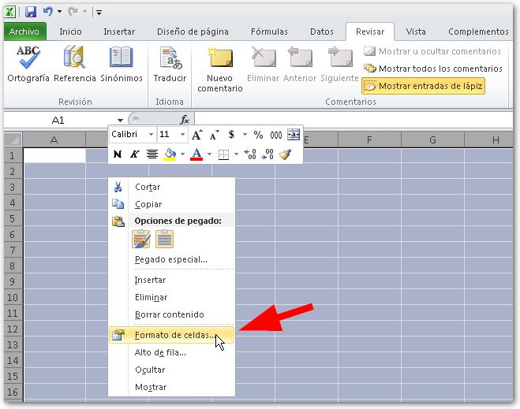
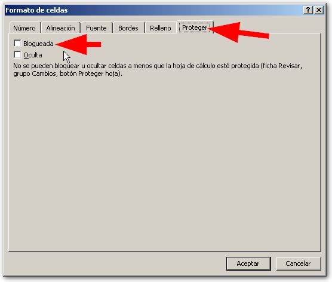
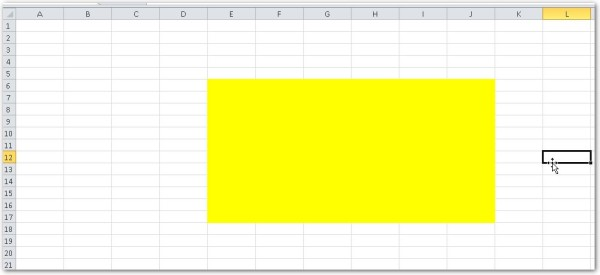
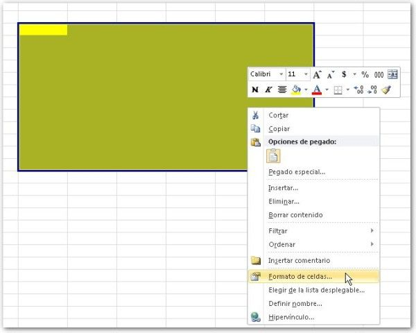
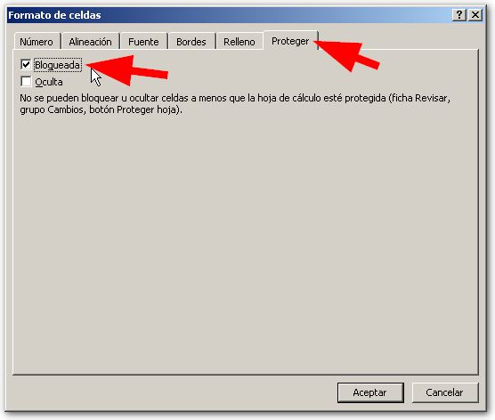
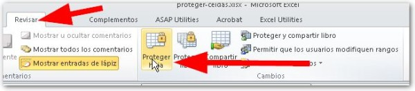
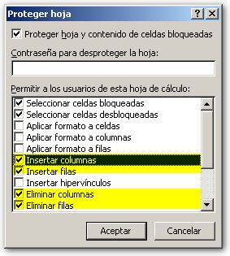

\[quote\]¿Cómo puedo proteger un rango de celdas, dentro de una hoja en Excel?\[/quote\]

Esta es la consulta que recibí el pasado fin de semana de uno de mis suscriptores. La intención es que toda la hoja permita realizar cambios, **menos** en un rango determinado por el usuario.

En Excel es posible establecer un área protegida, de manera que se comporte como me indica la consulta de mi suscriptor.

Vamos a realizarlo en tres sencillos pasos:

1. _Desbloquea todas las celdas._
    1. Selecciona todas las celdas de la hoja y haz un clic derecho. Entonces selecciona “Formato de celdas…” 
    2. En el cuadro que se abre, elige la ficha “Proteger”. Entonces debes dejar de-seleccionada la casilla “Bloqueada”. Hasta aquí, ya has desbloqueado todas las celdas de tu hoja. 
2. Selecciona el área de celdas que quieres proteger.
    1. Selecciona el área o las áreas que deseas proteger. En mi caso, será el área que he pintado de amarillo en la imagen: 
    2. Seleccionada el área deseada, repites el proceso: Clic derecho, formato de celdas… 
    3. En esta ocasión, vas a bloquear este subconjunto de celdas, de la misma forma que hiciste anteriormente: 
3. Protege la hoja.
    1. Ahora sí, ya puedes proteger tu hoja. Para esto te diriges a la ficha “Revisar” y en el apartado “Cambios”, eliges la opción “Proteger hoja”. 
    2. Como tu intención es eliminar filas y columnas, debes indicarle a Excel explícitamente que esto es lo que pretendes. Así que en el cuadro de diálogo que se abrió, marcas las casillas “Insertar columnas”, “Insertar filas”, “Eliminar columnas” y “Eliminar filas”.
        
        Si además deseas agregarle una clave, se la indicas en el casillero de texto de arriba. 
        

¡Y ya está! Puede que no parezca una solución muy directa; pero de que existe la opción, existe. Espero que esto te ayude en tu trabajo y puedas realizar los cambios que necesitas en tu modelo de Excel.

_¡Nos vemos!_
