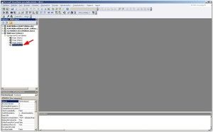
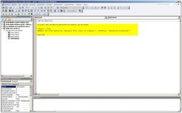
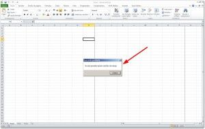

Impedir la impresión en Excel puede ser de tu interés, tal vez por temas de confidencialidad, tal vez para evitar redundancia de información o un largo etc.

\[twitter style="vertical" source="RaymundoYcaza" hashtag="#Excel" float="left" lang="es" use\_post\_url="true"\] Sea cual sea tu motivo, la forma más sencilla de lograr esto es utilizando una macro que sea capaz de cancelar el trabajo de impresión, antes de que este comience.

Hoy te mostraré cómo puedes crear esta macro en Excel en pocos pasos. Si aún no tienes claro lo que son las macros, puedes encontrar más información, [pinchando aquí](http://raymundoycaza.com/macros-en-excel/ "Comencemos con las Macros en Excel."). Si quieres directamente ayuda para escribir tu macro, [pincha aquí](http://raymundoycaza.com/escribe-tu-primera-macro-en-excel/ "Escribe tu primera Macro en Excel.").

## Lo que vas a necesitar

Antes de entrar a escribir código, debes detenerte un minuto y pensar en el posible escenario en el que se encontrará el usuario: Pincha en el botón de imprimir, nada sucede. Intenta una y otra vez, perdiendo tiempo y con la posibilidad de que termine haciendo un gran lío pensando que se trata de algún tipo de error.

\[quote float="none"\]Si el usuario no sabe lo que está sucediendo, podría desesperarse.\[/quote\]

Entonces necesitas avisarle de alguna manera que lo que el usuario está tratando de hacer, no está permitido. Para esto vas a necesitar una caja de mensaje como la que ya hicimos en su momento ([pincha aquí para ver](http://raymundoycaza.com/mensaje-en-excel/ "Mostrar un mensaje en Excel con VBA (Macros)")).

## El código

Ingresa al editor de Visual Basic, [siguiendo los pasos de siempre](http://raymundoycaza.com/escribe-tu-primera-macro-en-excel/ "Escribe tu primera Macro en Excel."), y una vez en la ventana de proyecto, verás el módulo de código de tu libro de trabajo:

Doble clic para abrirlo y en la ventana en blanco que se abre, escribe el siguiente código tal cual está:

\[aviso type="codigo"\]

Private Sub Workbook\_BeforePrint(Cancel As Boolean) Cancel = True MsgBox "No está permitido imprimir este libro de trabajo.", vbOKOnly, "Operación prohibida." End Sub

\[/aviso\]

Una vez que has terminado de escribirlo todo (se vale copiar y pegar, pero es mejor que lo escribas para que practiques ;) ), vas a cerrar la ventana del editor de Visual Basic.

## Probando la macro

Regresa a tu libro de trabajo. Ahora tu macro bloqueará cualquier intento de imprimir el libro de trabajo. ¡Pónlo a prueba!

Trata de imprimir, ya sea por atajos de teclado o accediendo a través del menú. Verás que siempre te dará el mensaje que programaste y, sobre todo, la impresión nunca se dará.

## ¿Quieres más consejos y trucos?

Entonces [suscríbete al boletín](http://raymundoycaza.com/ebook-suscripcion/ "Suscríbete al Boletín de Excel") y únete a otros usuarios que ya tienen acceso a las actualizaciones del blog y contenido exclusivo que no publico en el blog.

No lo olvides: Si quieres dominar Excel, debes practicar y practicar.

¡Nos vemos!
