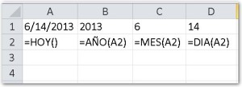

¿Usas mucho las fechas en tus archivos de Excel? Si esto es cierto, lo más seguro es que necesites  segregar estas fechas por mes o incluso por año, usando una columna adicional.

La solución a esto es tan sencillo como usar las fórmulas que Excel nos provee para el efecto. A continuación te muestro rápidamente cómo obtener estos datos desde una fecha en Excel.

## Separando los componentes de una fecha en Excel.

Digamos que tienes en la celda A1 la fecha 6 de junio del 2013. Dependiendo de la configuración que tengas, se escribirá 6/14/2013 o 14/6/2013.

Si quieres extraer el año de esta fecha (el cual sería 2013), puedes hacer uso de la función "Año()". Solo debes escribir la siguiente fórmula en la celda B1

\=AÑO(A1)

En cambio, si lo que deseas es obtener el mes de la fecha indicada, puedes usar la función "Mes()". En la celda C1, escribe la siguiente fórmula:

\=MES(A1)

## ¡Y una más!

Y, si por alguna razón, necesitas solamente obtener el día de la fecha indicada, puedes utilizar la función "Día()". En la celda D1, escribe la siguiente fórmula.

\=DIA(A1)

## Aprovecha estas funciones en tus modelos de Excel.

Al final, debes tener algo similar a lo que te muestro en esta imagen:

En la primera fila, puedes ver el ejercicio que hice yo, mientras que en la segunda fila te muestro las fórmulas utilizadas, para una mejor comprensión del trabajo que debes realizar.

Ahora, **aprovéchate de estas funciones** en tus modelos de Excel y utilízalos en tu día a día, de manera que te ahorren muchas horas de trabajo. Recuerda que el tiempo es oro.

¡Nos vemos!
