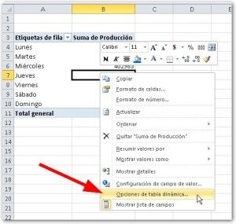
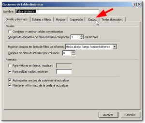
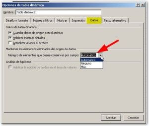

¿Tus tablas dinámicas aún muestran datos antiguos que hace rato tu eliminaste? Si tienes este problema y quieres eliminar esos molestos “datos basura”, aquí te muestro la solución.

\[twitter style="vertical" source="RaymundoYcaza" hashtag="#Excel" float="left" lang="es" use\_post\_url="true"\]

Si te gusta utilizar tablas dinámicas a partir de una plantilla, es decir, copiando la tabla y cambiando su diseño para generar nuevos reportes, es muy probable que a pesar de que actualices tu tabla, los elementos antiguos sigan mostrándose en las listas desplegables de tu tabla dinámica.

Desde la versión 2007 de Excel, esto se facilita mucho, ya que podemos hacer uso de la funcionalidad integrada para conservar elementos en las tablas dinámicas.

## Limpia tu tabla dinámica en 3 pasos

Para hacer uso de esta característica, solo debes seguir estos tres pasos:

1. Clic derecho sobre tu tabla dinámica y selecciona “Opciones de tabla dinámica…” 
2. En la ventana que se abre, selecciona la ficha “Datos”. 
3. Una vez ahí, ubica la lista desplegable “Número de elementos que desea conservar por campo:” y selecciona “Ninguno”. Pincha en “Aceptar” y refresca tu tabla dinámica. Verás que ahora sí, esos datos basura ya no se muestran más en tu reporte y ya puedes trabajar con toda comodidad :) 

## ¿Y que sucede si tengo una versión más antigua?

Si tienes, por ejemplo, Excel 2002 o 2003 y no te funciona esta forma de limpiar tus tablas dinámicas, puedes aplicar unas pocas líneas de código VBA:

\[aviso type="codigo"\]

Sub LimpiarTablasDinamicas() ' Evita que los valores antigüos permanezcan en ' la tabla dinámica luego de ser eliminados.

Dim tabla As PivotTable Dim hoja As Worksheet Dim cache As PivotCache

' Cambio la configuración For Each hoja In ActiveWorkbook.Worksheets For Each tabla In hoja.PivotTables tabla.PivotCache.MissingItemsLimit = xlMissingItemsNone Next tabla Next hoja

' Refresco cada caché de tabla dinámica ' que encuentre. For Each cache In ActiveWorkbook.PivotCaches On Error Resume Next cache.Refresh Next cache

End Sub

\[/aviso\]

\[box type="note"\]Si no sabes cómo usar el código anterior, [pásate por aquí](http://raymundoycaza.com/escribe-tu-primera-macro-en-excel "Escribe tu propia macro") y te muestro cómo puedes hacerlo por tu propia cuenta.\[/box\]

### Mantén limpias tus tablas dinámicas

Y así tienes una forma relativamente sencilla de deshacerte de ese problema que venía dándote dolores de cabeza desde hace un buen rato. A veces, por falta de tiempo, convivimos con estos inconvenientes que no representan un gran problema, pero sí que resultan una molestia que termina por consumirnos algo de tiempo.

Ahora que ya sabes cómo hacerlo, adelante, aplícalo a tu trabajo y mantén limpias tus tablas dinámicas de toda basura que se quede “atorada en el tiempo”. Tus horas con Excel serán más amenas :)

¡Nos vemos!

[Tweet](https://twitter.com/share)
