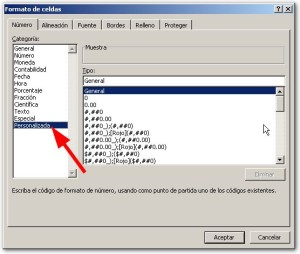
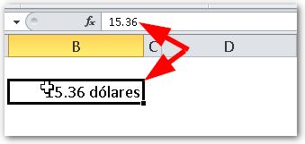

El formato personalizado es una **tremenda herramienta** que podemos utilizar para mejorar la experiencia del usuario, ya que podemos mostrar los datos de casi cualquier forma que necesitemos, aún así, ésta es desconocida o poco entendida.

\[twitter style="vertical" source="RaymundoYcaza" hashtag="#Excel" float="left" lang="es" use_post_url="true"\] Si echas mano del **formato personalizado** en Excel, podrás crear ese reporte que tienes en mente y sorprender a tu jefe o tus clientes con un resultado espectacular en muy poco tiempo. Ya que, en muchos casos, puede evitarte horas de trabajo con fórmulas o macros, creo que es importante que conozcas cómo funciona esta herramienta de Excel.

## ¿Dónde configuro el formato personalizado?

Para asignar un formato personalizado a una celda o rango de celdas en Excel, basta con que hagas clic derecho sobre el área deseada (tiene que estar seleccionada o ‘sombreada’) y selecciona la opción “Formato de celdas”.

Verás que se muestra el siguiente cuadro de diálogo. Ahora dirígete a la opción “Personalizada”, la cual te he señalado en la imagen:

A la derecha, verás un cuadro llamado “Tipo”. Es en este cuadro en el que vas a escribir las ‘reglas’ que se aplicarán sobre el formato del rango de celdas seleccionado.

## Entendiendo el formato personalizado

Tomando en cuenta que en una celda puede habitar un número o un texto, los cuatro posibles valores son los siguiente:

1. Positivo.
2. Negativo.
3. Cero.
4. Texto.

Nota el orden en que los he colocado. No es casualidad. Este es exactamente el orden en que Excel va a tomarlos en cuenta a la hora de establecer tu formato personalizado.

Con esto quiero decirte que puedes asignarle un formato distinto a cada uno de estos posibles valores de tu celda. Es decir, podrías, por ejemplo, asignar un color verde para los números positivos, rojo para los negativos, gris para los ceros y negro para los textos.

¿Y cómo hago para decirle a Excel cuál es el formato para cada uno?

Pues, te cuento que simplemente escribes las condiciones para cada uno, separando cada condición por el caracter punto y coma ( ; ) respetando el orden que ya te comenté. Entonces, usando el punto y coma como separador, el orden seria el siguiente:

En este esquema puedes ver la forma en que debes especificar el formato y así, indicarle a Excel de qué manera tratar a cada uno de los posibles valores de tus celdas.

## ¡Un ejemplo, por favor!

Ahora quiero que te imagines una situación cotidiana. Digamos un reporte financiero, por ejemplo. Tu jefe quiere que en este reporte aparezcan todos los datos de acuerdo a lo siguiente:

- Datos positivos (donde hubo ganancia) en color verde.
- Datos negativos (donde hubo pérdida) en color rojo.
- Datos en cero (donde no hubo ni ganancia ni pérdida) en color negro.
- Datos de tipo texto en color gris.

Entonces, respetando el orden establecido, vas a escribir la siguiente regla:

\[aviso type="codigo"\]\[Verde\]$00.00;\[Rojo\]-$00.00;\[Negro\]$00.00;\[Azul\]General\[/aviso\]

Como puedes ver, entre corchetes (o también llamados paréntesis angulares) he colocado el nombre del color que quiero que aparezca el dato en su respectiva ‘sección’.

Cada regla está separada por un punto y coma ( ; ) y tiene asignado un color de fuente que le asignará a la celda en cada caso:

- En la primera sección (números positivos) tenemos el formato $00.00 luego del color. Esto quiere decir que el número que aparezca en este caso, deberá tener por delante el símbolo de dólar y un formato de dos números enteros, seguido por dos números decimales.
- En la segunda sección (números negativos) tenemos el mismo caso, con la diferencia de que le he puesto el símbolo “menos” ( – ) por delante y, por supuesto el color rojo para que destaque la pérdida sufrida.
- En la tercera sección, el caso es igual que el primero. Es decir que muestra el símbolo de dólar y un formato de dos números enteros, seguido por dos números decimales. La diferencia está en el color negro, ya que no queremos destacar esta parte.
- Por último, en la cuarta sección tenemos el formato “General”. Este es el tipo de formato por defecto en Excel y muestra los datos tal cual, sin hacerle ningún tratamiento. El color asignado es el Azul.

### ¿Qué otros colores puedo usar?

Aparte de los colores usados en el ejemplo, tienes unos pocos mas que puedes usar de la misma forma, es decir, indicando su nombre. En total son ocho y son los siguientes:

- Negro.
- Verde.
- Blanco.
- Azul.
- Magenta.
- Amarillo.
- Aguamarina.
- Rojo.

## ¡Personalización verdadera!

¿Esto te parece muy básico? Ok, mi amigo/a, entonces veamos cómo darle una personalización “de a de veras”.

Supongamos que tienes los datos de un reporte de metas que se mide en porcentaje. Estos pueden ser números redondos o tener decimales y a ti te interesa que cuando sean números redondos no se muestren los decimales. ¿Se puede? ¡Claro que si!

Cuando un número es ‘opcional’, es decir', que puede que aparezca como puede que no, en lugar de usar el cero como viste en el ejemplo anterior, debes usar la almohadilla ( # ).

\[aviso type="codigo"\]#.##%\[/aviso\]

La almohadilla representa la posición de un número y no tiene en cuenta los ceros a la izquierda. Así, cuando tu porcentaje no tenga decimales, estos no se mostrarán.

Queda como ejercicio para ti, completar el formato para los casos en que el número sea negativo y para el caso en que sea cero o texto.

### Aplicando formato personalizado a un texto.

¿Se puede? ¡También se puede!

Imagínate el siguiente caso, sencillo pero útil y te dará una idea para que lo apliques en tus modelos de Excel:

Tienes una celda en la cual aparece la sumatoria de tu factura en números; pero no quieres que aparezca el signo de dólar, sino que al continuación del número aparezca la palabra ‘dólares’.

El formato personalizado para este caso, debería ser el siguiente:

\[aviso type="codigo"\]#.## “dólares”\[/aviso\]

El resultado sería el que ves en la siguiente imagen:

Date cuenta de que la celda en sí misma no tiene la palabra ‘dólares’, sino que está definida dentro del formato personalizado.

Esto quiere decir que el valor, en realidad, sigue siendo un número a pesar de que se muestre como texto. Esto es tremendamente útil en aquellos casos en los que, tengas que [mostrar textos y sumarlos a la vez](http://raymundoycaza.com/diferencia-de-fechas-en-excel/).

## Conclusión

El formato personalizado es una herramienta para presentar datos que resulta muy útil en la generación de reportes y, en muchos casos, puede evitarte hacer un doble trabajo (formato de presentación y cálculos sobre los mismos datos). Si trabajas con esta herramienta en conjunto con el [formato condicional](raymundoycaza.com/tag/formato-condicional/ "Formato condicional"), las posibilidades **se multiplican.**

Entonces, ¿qué piensas? ¿Vale o no vale la pena dedicarle unas horas a aprender a usar el formato condicional? Espero tus comentarios.

¡Nos vemos!
