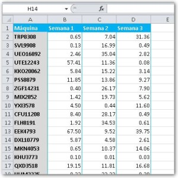
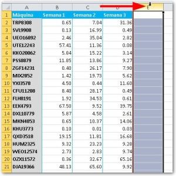
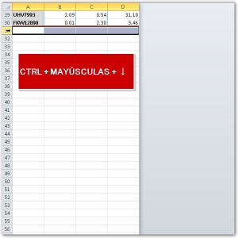
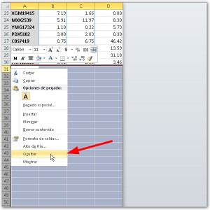
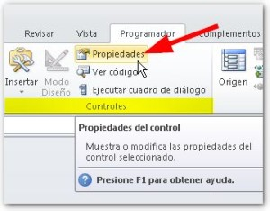
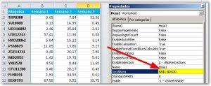

Cuando te hablo de limitar el área de trabajo en Excel, me refiero a definir una zona de tu hoja de trabajo en la que el usuario pueda trabajar, sin poder ver nada más.

## ¿Y para que me interesa limitar el área de trabajo?

Si necesitas esconder fórmulas de la vista de tus usuarios / clientes (especialmente aquellas que realizan cálculos delicados) o si necesitas darle un formato más al estilo formulario, esta técnica te resultará interesante.

## Ocultando lo que sobra

Ya te mostre cómo [proteger ciertas celdas](http://raymundoycaza.com/como-proteger-un-rango-de-celdas-en-una-hoja-de-excel/) de tu hoja de trabajo. Esto también te ayudaría a proteger tus fórmulas; pero las celdas aún quedarian visibles.

La idea es esconder todo lo que sobre, de manera que, vas a elegir aquellas columnas y filas que no te interesa mostrar y procederas de la siguiente forma:

- Seleccionando las primera columna “en blanco” utiliza el atajo **CTRL + Mayúsculas + Flecha derecha**, de manera que se seleccionen todas las columnas de aquí en adelante.  Luego, harás un clic derecho sobre el encabezado de cualquiera de estas columnas y elige la opción ‘Ocultar’. 
- Ahora… Sí, ¡exacto! Harás lo mismo con las filas.  Solo selecciona la primera fila en blanco y, esta vez, con la combinación de teclas **CTRL + Mayúsculas + Flecha abajo**, seleccionarás todas las filas que no quieres mostrar. Con un clic derecho sobre su encabezado y eliges la opción ‘Ocultar’. 

### Y para terminar…

Ya tienes delimitada tu área de trabajo. Con esto es muy difícil que tus usuarios se pierdan en la inmensidad de una hoja de trabajo y también [evitamos accidentes]((http://raymundoycaza.com/10-tips-excel-para-mejorar-tus-archivos); pero… para evitar que puedan moverse de esta área desplazándose con las barras de desplazamiento, vas a decirle a Excel que no se mueva más allá de los límites que tú quieres.

Esto se consigue realizando los siguientes pasos:

1. Dirígete a la ficha programador. Si no la encuentras, [aquí te muestro como obtenerla](http://raymundoycaza.com/ficha-programador).
2. En el apartado ‘Controles’, pincha sobre la opción ‘Propiedades’. 
3. Verás que se abre una pequeña ventana. En ella, busca la propiedad llamada ‘ScrollArea’ y en ella escribe el rango del cual no quieres que Excel se mueva.

Ahora, verás que no puedes desplazarte del área que tú has definido. ¿Interesante, verdad?

### ¡Y ya está!

Con esta técnica y algo de formato, ya estás listo/a para desarrollar tus formularios personalizados en Excel. Imagínate si lo combinas con [algunas macros](http://raymundoycaza.com/macros-de-excel)… ¡El resultado puede ser impresionante!

Ahora te dejo a solas con tus ideas. A partir de aquí, puedes expandir tus opciones para tus modelos en Excel y darle rienda suelta a tu imaginación. No dejes de poner en práctica este consejo.

Si te ha gustado este artículo, ayúdame a difundirlo pinchando en los iconos de las redes sociales.

¡Nos vemos!
