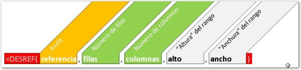
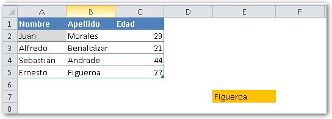
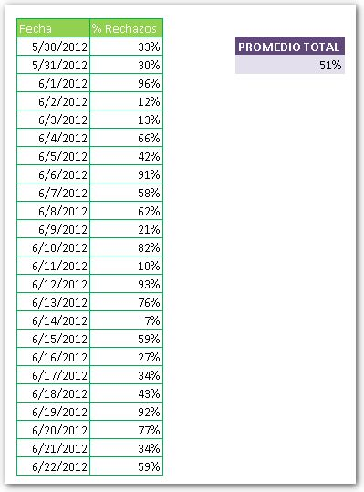
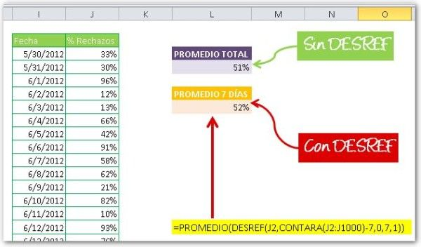

La función DESREF es de esas funciones que uno deja para después, porque no le queda del todo claro para qué sirve, ni cómo se usa. Hoy quiero que te animes a dedicarle unos minutos para que aprendas a utilizarla.

> Quedarse en lo conocido por miedo a lo desconocido, equivale a mantenerse con vida pero no vivir.

De entre todas las funciones de Excel, siempre hay un grupo que solemos ‘_dejar en el tintero_’.

Están ahí, disponibles para nosotros; pero ya sea porque no las entendemos o porque no podemos darnos el **tiempo para investigar** cómo funcionan, no las usamos y terminamos por olvidar que existen.

Pues te digo algo: precisamente esas funciones que estas dejando de lado, son las que necesitas en esos trabajos ‘especiales’ que te aparecen de la nada y que, por lo general, son urgentes.

Si quieres desarrollar soluciones a tu medida, necesariamente deberás utilizar una combinación de esas fórmulas y técnicas disponibles en Excel.  Una de estas fórmulas es, como ya habrás adivinado, la función DESREF:

## Anatomía de la función DESREF.

Como puedes ver en la imagen anterior, esta función puede recibir cuatro [parámetros o argumentos](http://raymundoycaza.com/que-son-los-argumentos-en-excel/ "Argumentos en Excel") de los cuales, los dos últimos, son opcionales (los que están en color gris). Te explicaré rápidamente el rol de cada uno de estos parámetros dentro de la función:

1.  **Referencia**: es el ‘ancla’ de nuestra función. Aquí escribirás la referencia a la celda que será nuestro punto de partida.
2. **Filas**: debe ser un número entero e indica la cantidad de filas que Excel debe ‘desplazarse’.
3. **Columnas**: al igual que el anterior, es un número entero y éste indica la cantidad de columnas que Excel debe desplazarse.
4. **Alto**: parámetro opcional que define el alto que tendrá nuestro rango.
5. **Ancho**: parámetro opcional que define el ancho que tendrá nuestro rango.

## ¿Cómo se utiliza la función DESREF y cuál es su finalidad?

El objetivo de esta función es la de realizar un ‘desplazamiento’, el cual tendrá lugar a partir de la celda que le pasemos como ‘ancla’ en el primer parámetro. Por ejemplo, si tengo un valor en la celda A2; pero quiero mostrar lo que tiene la celda que está 3 filas por debajo y 1 columna a la derecha, escribiría la función:

`=DESREF(a2,3,1)`

En palabras sencillas, la función DESREF es una forma de hacer una referencia indirecta a una celda en particular. Te lo voy a mostrar con un ejemplo para que quede más claro:

En la imagen anterior he utilizado la función DESREF () en la celda **E7**. Como ‘ancla’ le he pasado la celda **A2** que es la celda en color gris.

Ahora te preguntarás ¿por qué muestra el texto ‘Figueroa’ la celda **E7**?

Sí, creo que ya lo has adivinado.

La función DESREF ()ha realizado un desplazamiento desde la celda **A2**, tres líneas hacia abajo y una columna hacia la derecha.

Fíjate que esos son los valores que le he pasado en los parámetros 2 y 3 de la función (recuerda la anatomía de la función Desref)

Como ves, la función DESREF () tiene la finalidad de realizar un desplazamiento **desde la celda que le indiques** y te muestra aquella celda que se encuentre a ‘x’ filas y ‘y’ columnas de ese lugar.

### ¿Y qué pasó con los parámetros ‘alto’ y ‘ancho’?

Estos parámetros, como te dije, son opcionales; de ahí que yo pude olvidarme de ellos y centrarme solamente en el ‘desplazamiento’.

Si yo utilizara los parámetros ‘alto’ y ‘ancho’, la función ya no estaría apuntando a una celda si no a un [rango de celdas](http://raymundoycaza.com/que-es-un-rango-en-excel/ "¿Qué es un rango?"), el mismo que estaría definido por el alto y el ancho que nosotros le pasamos en estos parámetros. Esto lo haría especialmente útil para definir rangos dinámicos. Sigue leyendo y entérate de cómo podrías aprovechar esta característica en tus trabajos.

## ¿Para qué me podría servir?

La utilidad de la función DESREF () tal vez no sea obvia a simple vista; pero sin duda es una **poderosa aliada** si utilizas tu imaginación. Veamos un ejemplo práctico para que te des cuenta de cómo podrías sacarle provecho en tu trabajo.

Imagínate el caso de un pequeño productor de banano. Un índice interesante para él es el porcentaje de cajas de banano rechazadas diariamente, por eso lleva en una hoja de Excel un sencillo control como este:

Ahora bien, al productor no le reporta un gran beneficio ver los porcentajes de cada día, así que lo que en realidad quiere es ver un promedio de los últimos 7 días. Este resumen podría ser un **promedio del porcentaje** de cajas rechazadas _**durante los últimos 7 días**_, tal y como te muestro en la imagen anterior.

Para obtener este promedio, simplemente he utilizado la [función PROMEDIO](http://raymundoycaza.com/funcion-promedio-en-excel/ "La función PROMEDIO") () Pero esta técnica tiene un inconveniente: debo actualizar la función **con cada cambio que realice sobre mis datos.**

Como Analista, debes optimizar estos ‘tiempos muertos’ que podrías utilizar para cosas más provechosas relativas a tu función: el análisis de datos.

Ahora mismo te voy a contar cómo la función  DESREF() puede ayudarte a **automatizar** este cálculo y mostrarte únicamente el promedio de los últimos 7 días. No importa si has ingresado o eliminado datos y sin utilizar macros. ¿Interesante, verdad? Pues **sigue leyendo**.

Ahora, en lugar de usar directamente la función average() voy a servirme de la función DESREF() para crear un rango dinámico. La función que voy a utilizar es la siguiente:

`=PROMEDIO(DESREF(J2,CONTARA(J2:J1000)-7,0,7,1))`

- Como te das cuenta, en lugar de pasarle directamente el rango a la [función PROMEDIO (),](http://raymundoycaza.com/funcion-promedio-en-excel/ "Función PROMEDIO ()") le he pasado el rango a través de la función  DESREF(), pero ¿con qué finalidad?
- Si regresas al gráfico que muestra la anatomía de la función  DESREF(), recordarás que el primer parámetro que se le pasa a esta función es la celda origen o ‘ancla’, mientras que el segundo parámetro es el número de filas que quieres que se desplace.
- En el número de filas, yo no le he puesto un número directamente. En su lugar utilicé una fórmula que cuente los espacios NO vacíos –CONTARA ()-. Esta fórmula me devuelve un número que será igual al número de celdas que tengan un contenido dentro de ellas, es decir, el total de celdas ingresadas en tu tabla.
- A este mismo número le he restado 7, lo que me daría como resultado la primera celda de los últimos 7 días de la tabla. ¿Ya va tomando forma, verdad?
- Luego le he pasado el 0 (cero), esto quiere decir que no necesito que se desplace en las columnas.
- El ‘alto’ tiene un valor de 7, lo que quiere decir que a partir de la celda a la que nos desplazamos, formará un rango de 7 celdas de alto.
- El ‘ancho’ tiene un valor de 1, lo que quiere decir que sólo será una celda de ancho nuestro rango calculado.

¡Listo! Con esto ya tienes una fórmula que automáticamente calcula el promedio de los últimos 7 días, sin importar cuántas veces cambien los datos. Esto es gracias a que con la ayuda de la función  DESREF() hemos conseguido un rango dinámico.

## Ahora te toca a ti.

Estoy seguro de que ya te van llegando decenas de ideas para aplicar la función DESREF() a tus trabajos y **me gustaría saber** si ya has sacado provecho de esta fantástica herramienta.

**Sigue practicando** para que pronto logres dominar esta técnica y así llevar tu productividad al siguiente nivel.

No dudes en dejarme tus comentarios o peticiones de material, yo iré preparando artículos según la temática que vaya generando mayor interés.

¡Nos vemos!
