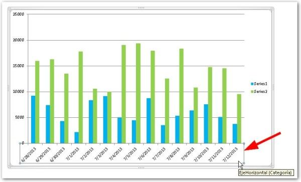
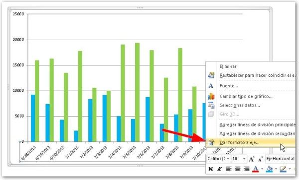
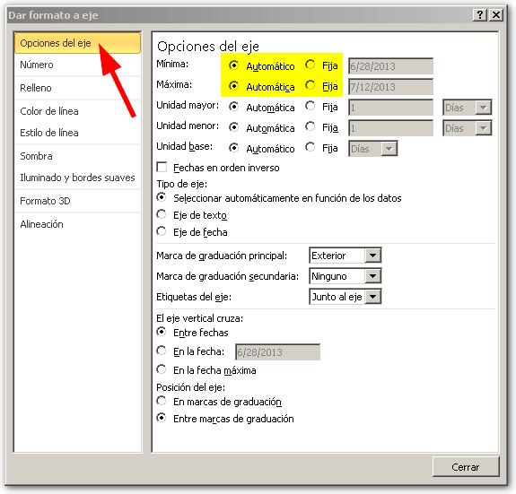
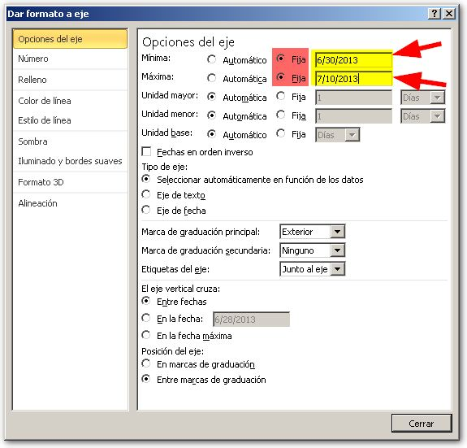
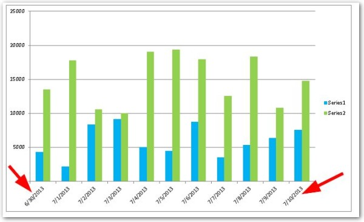

Si lo que ves en el eje horizontal no te deja conforme, puedes personalizar varios parámetros que te ayudaran a dejarlo tal como quieres. Déjame mostrarte cómo hacerlo en pocos pasos:

#### _01_ Selecciona el gráfico que vas a modificar.

Y selecciona con el puntero del ratón la escala horizontal, de manera que quede resaltada como muestra la imagen.

#### _02_ Clic derecho sobre el eje.

#### _03_ Y selecciona la última opción ‘Dar formato al eje…’

#### _04_ En el cuadro que se muestra.

Puedes cambiar los parámetros que se muestran, desde el formato hasta los valores mínimos y máximos o la distancia entre cada escala.

## Si tu escala no comienza desde donde tú quieres…

Si, por ejemplo, tienes un gráfico en el que la escala horizontal muestra fechas y estas no se muestran desde donde tú quieres, debes personalizar el valor mínimo y máximo según tus necesidades.

Nota que el cuadro muestra, en la sección ‘Opciones del eje’, los atributos ‘Mínima’ y ‘Máxima’. Para poder personalizarlos, debes elegir la opción ‘Fija’ y entonces podrás colocar el valor deseado en el cuadro que se habilita a continuación.

Imagina que quieres que tu gráfico muestre la escala horizontal en un rango que vaya desde el 30 de junio (6/30/2013) hasta el 10 de julio (7/10/2013).

Entonces, deberías configurar la escala así:

Una vez que has personalizado estos y otros valores según tu necesidad, Excel mostrará la escala de tu gráfico tal y como lo necesitabas.

## Ahora, ¡a practicar!

No esperes más, ve ahora mismo y ponlo en práctica mientras lo tienes fresco. La mejor manera de aprender es practicar y practicar.

¿Te ha resultado útil este artículo? Entonces ayúdame a difundirlo, usando los botones de las redes sociales que están junto al artículo. Tal vez a otra persona le resulte útil también.

¡Nos vemos!
