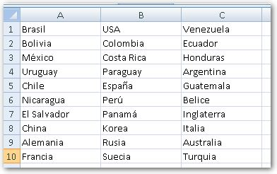
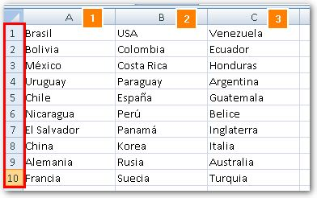
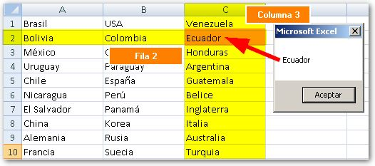

Si has luchado tratando de meter un conjunto de celdas dentro de un array, usando macros, tal vez te pueda ayudar este consejo en el que te muestro cómo puedes hacerlo con una sola línea de código.

En el ejemplo que voy a usar, quiero transferir los datos existentes en el rango A1:C10 a un array o matriz, usando código VBA. Te mostraré tres formas de hacerlo y tú elegirás la forma que mejor se adapte al proyecto que estás realizando. ¿De acuerdo? Muy bien, ¡empecemos!

## Un rango en un array: El método "tedioso"

Tal vez la primera opción que se te venga a la mente, seria la de utilizar un contador con un bucle for/next e ir alimentando la matriz de esta manera.

Este método es completamente válido y en muchas ocasiones el mejor método (o el único) y se realizaría así:

Sub Transferir()
Dim MiMatriz(1 To 10, 1 To 3)
Dim i As Integer, j As Integer
For i \= 1 To 10
For j \= 1 To 3
MiMatriz(i, j) \= Worksheets("Hoja1").Cells(3 + i, j + 1).Value
Next j
Next i
End Sub

Lo que estoy haciendo aquí, es decirle a Excel que tengo una matriz llamada 'MiMatriz' con 10 filas y 3 columnas.

Luego, tengo que recorrer las 10 filas con el primer bucle for y, por cada fila, debo recorrer cada una de las 3 columnas del rango.

En cada iteración (cada vuelta) voy a asignar al elemento actual de mi matriz, el valor de la celda en la que me encuentro y así llenaré toda mi matriz.

¡Fácil! ¿Verdad? Aunque a algunos puede parecerle un poco tedioso.

## Un método 'directo' (en una sola línea de código)

Si te gustan las cosas sin muchas vueltas, el método directo puede resultar de interés para ti.

Si utilizas esta forma de asignar un rango a una matriz, podrás hacerlo en una sola línea de código:

Dim MiMatriz As Variant

MiMatriz \= Range("A1:C10")

### Esta otra forma, también vale...

Dim MiMatriz As Variant

MiMatriz \= \[A1:C10\]

\[resaltar\]Un dato que debes tener en cuenta, es que si declaras la variable MiMatriz como una matriz, el código te dará error.\[/resaltar\]

## ¿Y cómo recupero los valores específicos de una matriz?

Si quisieras, por ejemplo, recuperar el valor que tienes en la fila número 2, columna 3, debes apuntar a esta misma posición en tu matriz, así:

MsgBox MiMatriz(2,3)

Esto mostrará un mensaje con el contenido de la posición deseada, es decir, lo que tenías originalmente en la columna C2 ;)

## Comparte esta entrada.

Ahora ya tienes una nueva forma de acometer tus trabajos con matrices en Excel. Como siempre te digo, pon en práctica lo aprendido **ahora mismo**. Es la mejor forma de aprender.

Si te ha resultado de interés esta entrada, ayúdame a difundirla a través de las redes sociales. Significaría mucho para mi :D

¡Nos vemos!

\[firma\]
