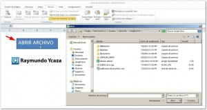
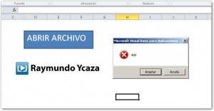
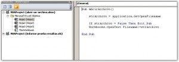

Ya sabes crear macros y has hecho tus primeras pruebas básicas. Es hora de ir haciendo funciones más útiles que nos ayuden en nuestras aplicaciones de oficina. ¿Qué tal una macro que nos permita abrir un archivo?

Alex, uno de mis suscriptores, me consultó acerca de cómo podría abrir un archivo de Excel haciendo uso de macros para poder realizar algunas consultas sobre él. Así que decidí hacer un breve artículo en el que explico el procedimiento paso a paso ;)

## Abrir un archivo con Macros.

La idea de la propuesta que tengo en mente, es que se muestre un cuadro de diálogo que te preguntará por la ubicación de tu archivo y, una vez que lo has seleccionado, ese archivo se abrirá inmediatamente. Así, pues, ¡vamos a ello!

## Crea una función para tu código.

Lo primero que vas a hacer, es crear una función dentro de la cual vas a colocar todo el código que voy a mostrarte a continuación. Si aún tienes dudas de cómo crear una función en VBA, puedes [pinchar aquí](http://raymundoycaza.com/escribe-tu-primera-macro-en-excel/)

La función que vas a crear, para el ejemplo, debe tener el nombre 'abrirArchivo'.

## El nombre del archivo y su ruta.

Primero, necesitas saber el nombre de tu archivo y "recordarlo" en una variable. Así pues, deberás crear una variable llamada 'strArchivo' y en ella almacenarás toda la ruta a tu archivo, incluída la extensión.

En mi caso, el archivo que quiero abrir se llama 'MiArchivo.xls' y la ruta en la que está guardado es 'C:\\MiCarpeta'.

Entonces, si junto todo, la ruta sería: 'C:\\MiCarpeta\\MiArchivo.xls'.

En tu código, deberías de escribirlo así:

strArchivo \= 'C:\\MiCarpeta\\MiArchivo.xls'

Y con eso ya tendrías almacenado el nombre de tu archivo. Pero, ¿y si quisiera abrir un archivo diferente cada vez? Pues entonces, ¡lo haremos interactivo!

### Usando el método GetOpenFilename

Para lograr que esto sea interactivo, necesitarás que el sistema te pregunte dónde está tu archivo cada vez que ejecutas el programa. Pero no haremos todo desde cero, sino que aprovecharemos el método GetOpenFilename que ya se encarga de hacer esto.

Simplemente reemplaza en tu código la parte donde tenías la ruta a tu archivo por lo siguiente:

Application.GetOpenFilename

Al final, el código que tengas, debe verse así:

strArchivo \= Application.GetOpenFilename

## Abriendo el archivo.

Bien, ya tienes la ruta completa de tu archivo. Ahora solo queda abrirlo directamente y, para esto, te ayudarás del método 'OpenText' del objeto 'Workbooks'.

A este método debes pasarle el [argumento](http://raymundoycaza.com/que-son-los-argumentos-en-excel/ "¿Qué son los argumentos?") 'Filename', en el cual asignarás el valor que tenías en la variable 'strArchivo'.

La siguiente línea de código, debes escribirlo tal cual te muestro a continuación:

Workbooks.OpenText Filename: \= strArchivo

Y hasta aquí ya has conseguido tu objetivo. Ahora verás que cuando ejecutas esta macro, se muestra un cuadro de diálogo donde eliges el archivo que quieres abrir y, a continuación, este se abre y se muestra en tu pantalla.

## ¿Y si el usuario cancela la acción?

Bueno, si el usuario cancela la acción se generará un error en tu programa que hará que este se caiga.

Entonces, ¿cómo evitarlo?

La solución está en una simple línea de código:

If strArchivo = False Then Exit Sub

Esta línea debes agregarla justo antes de la línea que se encarga de abrir el archivo, es decir, debe quedar así:

If strArchivo \= False Then Exit Sub
Workbooks.OpenText Filename:\=strArchivo

## ¡Pero ahora quiero cerrarlo!

Tal y como se le ocurrió a Hugo Serrano (en los comentarios) se te puede ocurrir a ti que es necesario cerrar el archivo luego de abrirlo, así que para estos casos, puedes seguir los pasos que indico en esta entrada.

[¿Cómo cerrar un archivo, usando macros?](http://raymundoycaza.com/como-cerrar-excel-desde-una-macro/ "Crrar un archivo con macros")

## ¡Y hemos terminado!

Con estas pocas líneas de código, ya tienes un pequeño programa que se encarga de abrir un archivo de forma interactiva y que podrás integrar en tus nuevas aplicaciones para ampliar sus funcionalidades. ¿Muy útil, no crees? :D

Al final, debe quedarte un código similar a este que te muestro a continuación:

Sub abrirArchivo()
strArchivo \= Application.GetOpenFilename
If strArchivo \= False Then Exit Sub
Workbooks.OpenText Filename:\=strArchivo
End Sub

## Descargar el archivo terminado.

Si quieres descargar el archivo usado en este ejercicio, solo haz clic en cualquiera de los botones de aquí abajo y accede sin costo.

\[l2g name="Descarga el archivo haciendo clic aquí." id="6528"\]

## Déjame tus comentarios y ayúdame a compartir este artículo.

Si te ha gustado este artículo o tienes alguna duda, déjamela en los comentarios. Y si crees que esta información puede ayudar a alguien más, ayúdame a difundirla en las redes sociales, usando los botones que aparecen más abajo. ¡Gracias! :)

¡Nos vemos!
