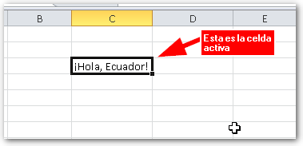
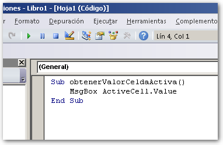
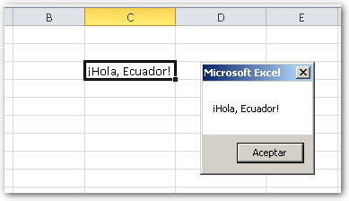

Cuando comienzas a usar macros, una de las primeras cosas que haces, es recuperar el valor de una celda. Aquí te enseño cómo hacerlo. De acuerdo, ya hemos conversado sobre el tema y tienes claro lo que son [las macros en Excel](http://raymundoycaza.com/macros-en-excel/ "Las macros en Excel"). Lo primero que harás, será crear una función y lo harás directamente en el editor de VBA, tal y como [ya te mostré](http://raymundoycaza.com/escribe-tu-primera-macro-en-excel/ "Escribe una macro en Excel"). El nombre de la función será, para el ejemplo: **obtenerValorCeldaActiva()**

## Obtener el valor de la celda activa.

Ahora pensemos un poco: Lo que quieres es obtener el valor contenido dentro de la **celda activa**,   ¿verdad? Pues bien, ya has identificado un objeto, que en este caso es la **celda activa**.

Nota que no estamos hablando de cualquier celda, sino de la celda activa, esto quiere decir que trabajaremos sobre la celda que esté activa en ese momento, sea cual sea esta.

La celda activa es un objeto que ya está preparado para su uso, así que no tendremos que hacer ningún paso previo. Para trabajar con este tipo de objetos, basta con que lo invoquemos, haciendo uso de su nombre. En este caso, el nombre del objeto Celda Activa es **ActiveCell.**

### Siempre en inglés.

Como ya te he comentado, cuando trabajamos con macros, no importa si tenemos el Excel en español, siempre usaremos los nombres e instrucciones **predefinidas** en inglés.

Ahora,  lo que tienes que hacer es acceder a las **propiedades** de este objeto, entre las cuales se encuentra el valor (que es lo que se encuentra en el interior de la celda).

La forma de acceder a las propiedades de un objeto, es escribiendo el nombre de dicha propiedad, a continuación del objeto; pero separado por un punto.

El nombre de la propiedad que almacena el valor de la celda activa es **Value**. Entonces, la forma de acceder a esta propiedad, es esta:

MsgBox ActiveCell.Value

### Pero tenemos que hacer algo con ese valor.

Por ahora, solo vamos a mostrarlo en un cuadro de mensaje, [como te mostré en este artículo](http://raymundoycaza.com/mensaje-en-excel/ "Cómo mostrar un cuadro de mensaje en Excel"). Entonces, vas a escribir la instrucción MsgBox y le pasarás como [argumento](http://raymundoycaza.com/que-son-los-argumentos-en-excel/ "¿Qué son los argumentos?"), el valor de la celda activa, así:

MsgBox ActiveCell.Value

Finalmente, el código debe quedarte así:

## Probando la función.

Finalmente, escribe un texto en la celda C3. Ahora déjala seleccionada y ejecuta tu macro. La verás en acción, mostrándote esto:

 

## ¡Estamos listos!

Ahora sí. Anímate y comienza a practicar con las macros. También me gustaría que me contaras cómo te fue con esta práctica, así que no olvides dejarme tu comentario.

¿Demasiado fácil? Ya vienen otros artículos un poco más avanzados, si andas en busca de algún tema en concreto con las macros, déjame también tu comentario y trataré de abordarlo tan pronto como me sea posible.

¡Ah! Si te ha gustado esta entrada, no dejes de compartirlo en las redes sociales, usando los botones de abajo.

¡Nos vemos!

\[firma\]
