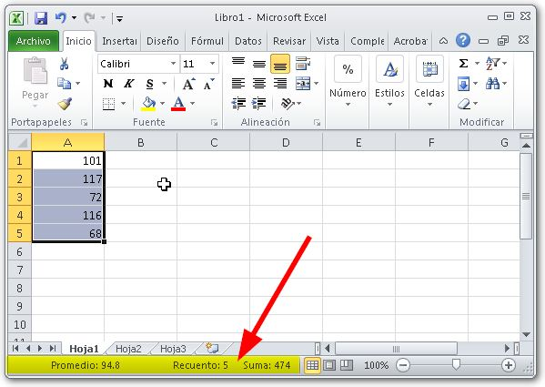
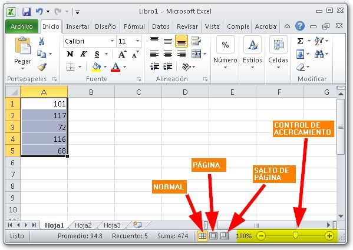
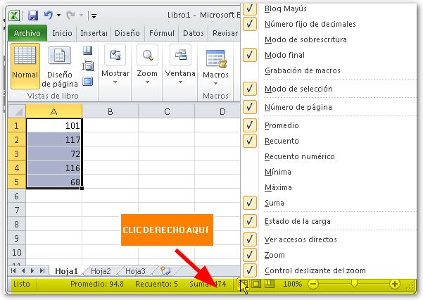

Tú y yo seguiremos con el curso básico de Excel y hoy veremos la barra de estado. ¿Qué es y dónde está?

\[twitter style="vertical" source="RaymundoYcaza" hashtag="#Excel" float="left" lang="es" use\_post\_url="true"\]La barra de estado se encuentra en la parte inferior de la ventana en la que se muestra [nuestro libro de trabajo](http://raymundoycaza.com/celda-hoja-libro/ "¿Qué es el libro de trabajo?"). Por supuesto, no está ahí para nada, tiene una función y ahora te voy a contar cuál es.

## ¿Para qué sirve la barra de estado?

En primer lugar, **la barra de estado** nos proporciona información que puede sernos muy útil, según en qué estemos trabajando. Por ejemplo, en la imagen anterior, podrás ver que he resaltado en amarillo una parte de la barra de estado, en la que se muestra el promedio, recuento y la suma de los valores que tengo seleccionados o "sombreados".

Esto te sirve a ti, para que, rápidamente, puedas calcular sobre un segmento determinado de datos, **sin tener que utilizar fórmulas**. ¿Muy útil, verdad?

Por supuesto, cálculos como suma y promedio solo son posibles cuando los datos seleccionados **son números**.

Pero esa no es la única función de la barra de estado. También tienes unos controles adicionales que te ayudarán en la visualización de la ventana actual. Por ejemplo, tienes un juego de tres botones los cuales te sirven, en este orden, para:

1. Mostrar la ventana en "Vista Normal".
2. Mostrar la ventana en "Vista de Página" (se mostrará como si fueran hojas de Word)
3. Mostrar la ventana en "Vista de Salto de Página" (se mostrará el área que se imprimirá, con los cortes en cada página)

A continuación, te muestro dónde están esos controles:

### Controlando el tamaño de tu hoja.

En la imagen que acabo de mostrarte, he resaltado en amarillo el control de acercamiento. Este tiene la función de permitirte controlar el tamaño en que se muestra tu hoja. Funciona como el acercamiento del lente de tu cámara fotográfica :)

## Personalizando la barra de estado.

Si haces clic derecho sobre la barra de estado, verás que se muestran muchas opciones. Estas opciones te permiten personalizar tu barra de estado al seleccionar los cálculos que quieres que se muestren en ella.

Por ejemplo, puede que no te interese mostrar ni la suma ni el promedio de los datos seleccionados; pero sí quieres que se muestre el máximo y el mínimo. Además, puedes de-seleccionar la opción "Control deslizante del Zoom", para que no se muestre el control de acercamiento. ¡Haz tus pruebas! :)

