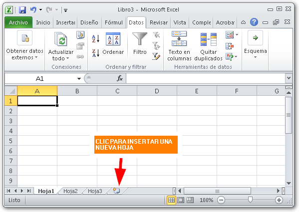
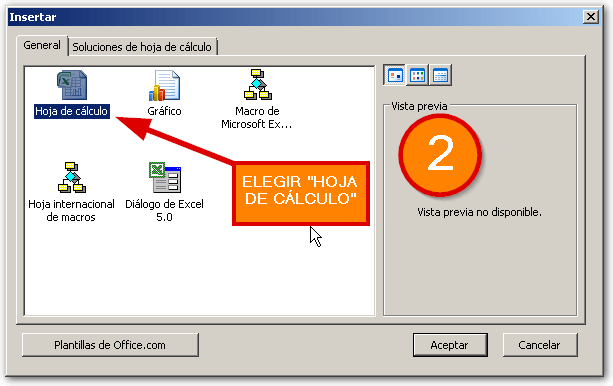
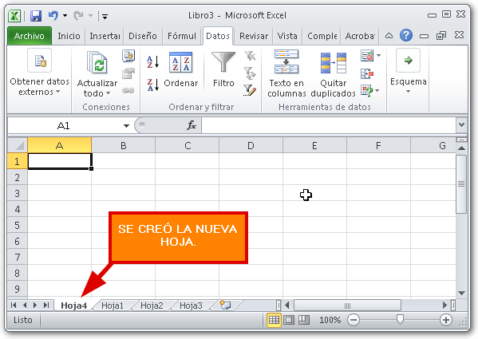
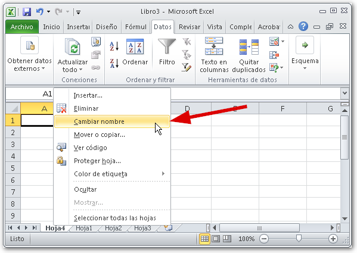
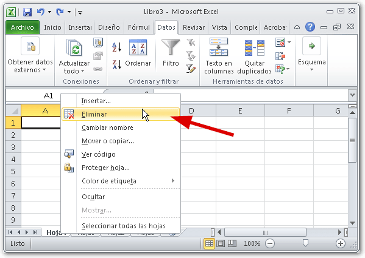

Llegará el momento en el que necesites más hojas de las que aparecen en un nuevo libro. ¿Cómo insertar más hojas? Aquí te lo cuento.

\[twitter style="vertical" source="RaymundoYcaza" hashtag="#Excel" float="left" lang="es" use\_post\_url="true"\]Al crear un nuevo [libro de trabajo](http://raymundoycaza.com/celda-hoja-libro/ "¿Qué es un libro?") en Excel, se mostrará por defecto con tres hojas. Pero esto no quiere decir que estás obligado a trabajar únicamente con estas tres.  Puedes crear nuevas hojas, renombrarlas, reordenarlas y personalizar un par de cosas más.

## Insertar hojas en Excel

Existen varias formas de crear una hoja en Excel; pero te voy a mostrar las dos más utilizadas:

1. La más rápida. Usar el botón de insertar nueva hoja, que se encuentra justo al final de las pestañas que tienen el nombre de cada hoja.
2. La forma "clásica", como la llamo yo, que es haciendo un clic derecho sobre cualquiera de las pestañas y eligiendo la opción "Insertar..." para luego elegir la opción "Hoja de cálculo" en el cuadro de diálogo que aparece:

Después de haber hecho cualquiera de estos dos pasos, verás que se ha creado una nueva hoja, con un nombre que se asigna en secuencia:

## Cambiar el nombre de una hoja.

Esta operación es muy sencilla y también tiene dos formas que son las más utilizadas:

1. La forma rápida: Haces un doble clic sobre la pestaña cuyo nombre quieres cambiar.
2. La forma "clásica": Haces un clic derecho sobre la pestaña cuyo nombre quieres cambiar y eliges la opción "Cambiar nombre" en el menú contextual que aparece.

## Eliminar una hoja.

La tarea de eliminar una hoja, es igual de sencilla que las anteriores. La única precaución que debes tomar, es estar completamente seguro / segura de que quieres eliminar la hoja, ya que no podrás deshacer esto.

\[aviso type="advertencia"\]Eliminar una hoja es una operación que no se puede deshacer. Si eliminaste una hoja por error, lo único que puedes hacer es cerrar tu archivo de Excel sin guardar.\[/aviso\]

Lo único que tienes que hacer es un clic derecho sobre la pestaña de la hoja que quieres eliminar y selecciona la opción "Eliminar" en el menú contextual que aparece.

## ¡Ahora sí!

Ahí lo tienes. Paso a paso. Yo ya hice mi parte, es tu turno de actuar y ponerte a practicar lo aprendido. No olvides compartir este artículo en las redes sociales, usando el botón de abajo, si te ha gustado lo que has visto.

Si tienes algo que decirme, te animo a que lo hagas en los comentarios.

¡Nos vemos!
