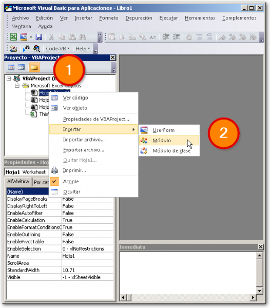
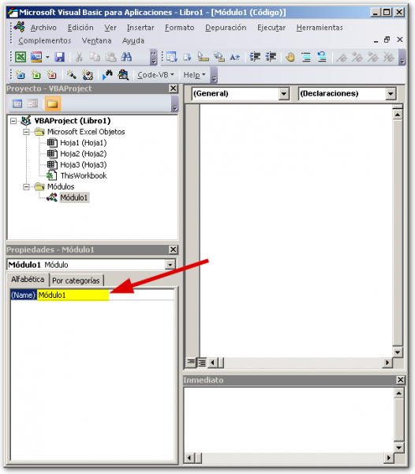

Si ya estás realizando macros un poco más elaboradas, necesitas organizar tu código. Los módulos de Excel te ayudan a este fin.

\[twitter style="vertical" source="RaymundoYcaza" hashtag="#Excel" float="left" lang="es" use\_post\_url="true"\]Si ya has revisado los [tutoriales sobre macros](http://raymundoycaza.com/macros-de-excel/ "Las macros en Excel") anteriores, seguramente estás practicando e implementando lo aprendido (o al menos, eso espero).

Primero definamos rápidamente lo que es un módulo en Excel:

\[quote\]Un módulo es, en palabras no técnicas, un contenedor para los códigos de tu macros que te ayuda a organizar tu trabajo de una mejor manera. Siempre que tengas porciones de código que no tengan nada que ver con los eventos de las hojas o del libro de trabajo, es mejor que lo coloques dentro de un módulo estándar.\[/quote\]

Lo que hoy te voy a mostrar es algo muy sencillo; pero necesario para los próximos capítulos del curso de macros, así que vamos directo al grano:

## Insertar un módulo en Excel.

Para insertar un módulo en Excel, primero debes acceder a la ventana del editor de VBA. Recuerda que este paso ya lo vimos en un [artículo anterior](http://raymundoycaza.com/escribe-tu-primera-macro-en-excel/ "Escribe tu primera macro").

1. Una vez aquí, solo haz un clic derecho en el Panel de Proyecto, sobre cualquiera de los objetos existentes (el libro y las hojas) y elige la opción "Insertar".
2. Ya en el sub-menú que se muestra, elige la opción "Módulo".

¡Y listo! Ya tienes un nuevo módulo creado y listo para colocar tu código en él.

 

\[aviso type="informacion"\]Por defecto, el nuevo módulo tendrá un nombre del tipo \[MóduloX\], donde X es un número secuencial que irá aumentando por cada nuevo módulo, al igual que sucede cuando insertas hojas en Excel.

En la imagen anterior puedes ver, resaltado en amarillo, la propiedad que controla el nombre del módulo. Aquí tú puedes cambiar el nombre de tu nuevo módulo para poder identificarlo rápidamente después.\[/aviso\]

## Hasta la próxima ocasión.

Y eso es todo. Así de fácil y así de sencillo. Este es un paso importante, porque muchas personas trabajan directamente sobre las hojas, lo que no es recomendable ya que se trata de una mala práctica: Desorganizada y sin estructura alguna.

No olvides compartir este artículo en las redes sociales, usando los botones que aparecen más abajo, si te ha gustado lo que has visto :)

¡Nos vemos!
