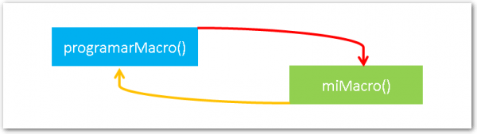
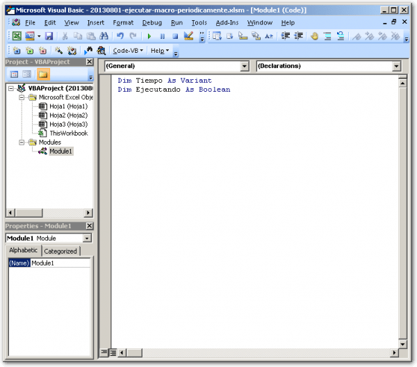
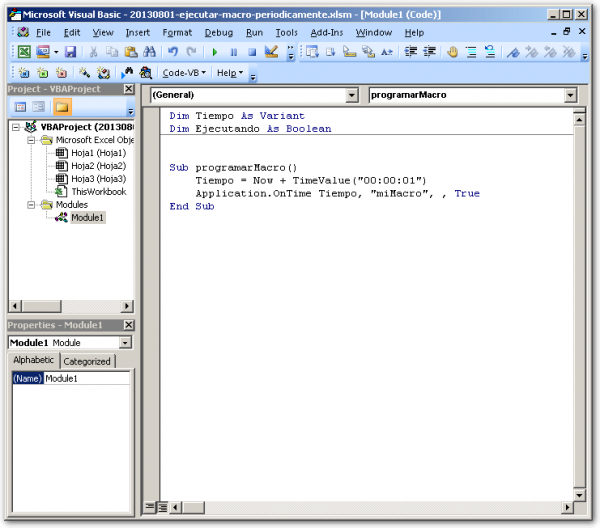
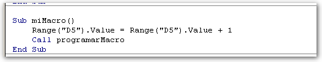
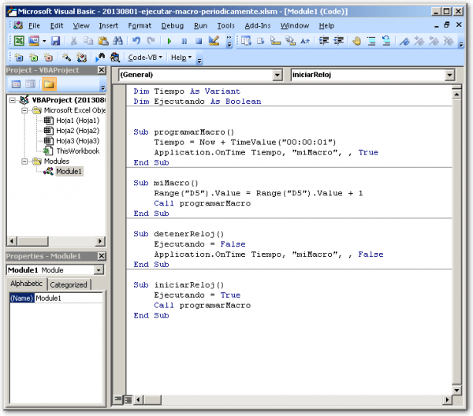
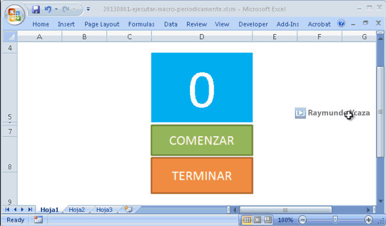

Si tienes una macro y quieres que se repita cada cierto tiempo o que no se ejecute hasta una hora determinada, esto es para ti.

Puede ser que quieras programar un recordatorio en Excel o que necesites ejecutar un proceso que se repita periódicamente en tu trabajo.

Lo cierto es que en ocasiones nos hace falta darle ese toque automático a nuestras macros, es decir, que no necesiten de una persona pinchando el botón cada vez.

## Ejecutar una macro periódicamente: La ausencia del control timer.

En otros ámbitos, como en los que se desenvuelven los programadores de Visual Basic clásico y .NET, contamos con un **timer** que se encarga de este trabajo; pero en nuestro sencillo editor de [VBA](http://raymundoycaza.com/tag/vba/ "VBA") que tenemos en Excel, no existe tal opción.

La idea es "simular" este efecto con un sencillo truco:

Vas a usar dos sub-rutinas: La primera se encargará de "postergar" la ejecución de la segunda, un tiempo determinado. Entonces, cuando se ejecute la segunda macro, va a llamar a la segunda, de manera que ésta se encargue de programar la ejecución nuevamente.

¿Te he enredado? Pues mira, te dejo una imagen que lo aclara un poco:

Esto funcionará así:

1. La primera sub-rutina "programarMacro()", va a ejecutar a "miMacro()"; pero con un tiempo de retraso que tú definirás.
2. Al cabo de ese tiempo se ejecutará "miMacro()" y ésta nuevamente llamará a "programarMacro()". Así el ciclo se repite cada X segundos o minutos **o incluso horas.**

### Preparando el terreno: Insertar un módulo.

Esta macro no funcionará si no la colocas en un módulo. Quiero decir que no puedes colocarla en cualquier hoja, ni en el libro de trabajo. Debes escribir el código dentro de un módulo. ¿Recuerdas que conversamos sobre [cómo insertar un módulo de VBA](http://raymundoycaza.com/como-insertar-un-modulo-en-excel/ "Como insertar un módulo en Excel")?

En este módulo, declararás dos variables para comenzar:

1. Tiempo: Para definir el tiempo que tomará el retraso que deseamos. Declárala como **Variant** para el ejemplo.
2. Ejecutando: Para saber en un momento dado si la macro se está ejecutando o no. Declárala como **Boolean**, porque solo queremos saber si es falso o verdadero su valor.

### Jugando con el tiempo:  Application.OnTime

¿Y cómo puedo hacer que una macro se ejecute con ese retraso del que hablo? Pues con el evento "OnTime" del objeto "Application".

Este evento se disparará cuando se alcance el tiempo determinado por el usuario y ahí es donde tú debes indicar el valor que necesitas, ya sea en segundos, minutos u horas.

Para mi ejemplo, voy a usar el valor de **un segundo**.

Entonces, lo que tendrías que hacer es utilizar una variable y en ella colocar la suma de la fecha/hora actual y el tiempo dentro del cual quieres que se ejecute tu macro, algo así:

Now + TimeValue("00:00:01")

Esto da como resultado la fecha / hora; pero un segundo "en el futuro".

Luego, usaremos el evento **OnTime** del objeto **Application,**  el cual vendría a comportarse como un timer. Este evento se activa cuando se alcanza el tiempo determinado por el usuario.  Lo usarás así:

Application.OnTime Tiempo, "miMacro", , True

Como ves, al evento Application.OnTime, le hemos pasado como primer argumento el tiempo que hemos determinado (un segundo) y como segundo argumento le hemos pasado el nombre de la macro que queremos que se ejecute (entre comillas, porque es un texto). En mi ejemplo, la macro se llama "miMacro".

El tercer argumento, lo dejo en blanco escribiendo solamente la siguiente coma y, finalmente, el cuarto argumento será un "True" (verdadero). Este último argumento especifica que la macro a ejecutar **sí está** en espera de ser ejecutada.

### Colocando el código.

Si juntamos todo el código y lo metemos dentro de una sub-rutina llamada "programarMacro", debería de quedar así:

Sub programarMacro()
Tiempo \= Now + TimeValue("00:00:01")
Application.OnTime Tiempo, "miMacro", , True
End Sub

Con esto, estás diciéndole a Excel que, luego de haber transcurrido un segundo, ejecute la macro "miMacro".

Si quisieras, podrías usar este "truco" para hacer que tus macros se ejecuten después de un tiempo de haber pinchado en un botón. Algo así como una alarma o un recordatorio, etc.

## ¿Y qué hará la segunda sub-rutina?

La segunda sub-rutina, no hará nada complicado, para facilitar el ejemplo. Lo único que quiero que haga, es incrementar un contador (que estará en una celda), de manera que parezca un reloj que va avanzando cada segundo: 1, 2, 3... etc.

¿Sencillo, no?

Bien, ¿y cómo haría eso? ¿Cómo puedo incrementar el valor de una celda?

¡Usando la propiedad "**Value**"!

Elijamos una celda cualquiera, digamos la celda **D5**. En esta celda quiero que se incremente en una unidad su valor. Entonces lo haría así:

Range("D5").Value \= Range("D5").Value + 1

Lo que estás diciéndole a Excel con este código es:

En el rango D5 (la celda D5), al valor actual que tiene, le vas a colocar el resultado de sumarle el mismo valor, más una unidad.

Entonces, si el valor era cero, ahora será uno. Si el valor era uno, ahora será dos... Y así, sucesivamente.

Este código lo vas a poner en otra sub-rutina, la cual se llamará "miMacro", así:

Sub miMacro()
Range("D5").Value \= Range("D5").Value + 1  
End Sub

Ahora, cada vez que se ejecute esta sub-rutina, el valor de la celda D5 se incrementará en una unidad.

## Sí, pero...

Esto sucederá una sola vez, ya que desde la sub-rutina "programarMacro" le dijimos que active la segunda sub-rutina, después de un segundo de haberla ejecutado... Pero esto solo sucede una vez ¡y nunca más!

¿Cómo hacer que la sub-rutina se repita nuevamente, una y otra vez?

Pues, es más sencillo de lo que parece. ¿Recuerdas la primera imagen que coloqué al iniciar este artículo? En ese gráfico puedes ver que las dos sub-rutinas se llaman entre sí. Es una especie de "llamada cruzada". Ahora vamos a hacer que la segunda "le responda" a la primera y así conseguimos un efecto de **recursividad**.

Al final del código de la sub-rutina "miMacro", vas a colocar la línea:

Call programarMacro

Call, es una palabra reservada que sirve para invocar a una sub-rutina o función, desde otra porción de código similar.

Entonces, el código completo, debería de quedar así:

Sub miMacro()
Range("D5").Value \= Range("D5").Value + 1
Call programarMacro
End Sub

Ahora sí, cuando "programarMacro" ejecute a "miMacro", esta última ejecutará de nuevo a la primera, la cual volverá a llamar a la segunda y así, infinitamente.

Y como "programarMacro", tiene un retraso de un segundo, se comportará como un relojito que avanza un paso a la vez, cada segundo.

Además, la sub-rutina "miMacro", va incrementando el valor de la celda D5 en una unidad cada vez. Lo que dará la ilusión de que se trata de un cronómetro digital que va corriendo, segundo a segundo.

¡Interesante! ¿No es verdad?

**Imáginate** las cosas que podrías hacer a partir de este sencillo truco :)

## ¡Perfecto! Pero, ¿cómo hago para iniciar y detener mi nuevo cronómetro?

Pues, hagamos dos sub-rutinas más. La primera se llamará "iniciarReloj" y la segunda... ¡Pues sí! Se llamará "detenerReloj" :D

La primera sub-rutina, "iniciarReloj", solo va a llamar por primera vez a la sub-rutina "programarMacro". Será como nuestro motor de arranque.

Sub iniciarReloj()
Ejecutando \= True
Call programarMacro
End Sub

Nota que también he colocado el valor "True" a la variable "Ejecutando", para que nuestra aplicación 'sepa' que el cronómetro se está ejecutando.

Ahora, la segunda sub-rutina, "detenerReloj", también será sencilla y tendrá dos líneas de código.

Sub detenerReloj()
Ejecutando \= False
Application.OnTime Tiempo, "miMacro", , False
End Sub

Aquí también he usado la variable "Ejecutando" y le he asignado el valor "False", para indicar que nuestro cronómetro **ya no** se está ejecutando.

Como puedes ver también, he configurado nuevamente el evento "OnTime" del objeto "Application". El código es casi idéntico, pero con la diferencia de que en lugar de colocar "True" en el último argumento, ahora uso el valor "False".

### ¿Y qué quiero decir al colocar "False"?

Pues que ahora, esa sub-rutina ya no está en espera de ser ejecutada. Así que, si por alguna razón le faltaba una ejecución por realizar, esta se cancela.

Este paso es útil cuando tienes períodos de tiempo más largos que un segundo como por ejemplo, una espera de una hora, y quieres cancelar esa ejecución futura.

## El código completo.

Al final, el código completo debería de quedarte así:

## Toques finales.

Como paso final, vas a asignar las macros a un par de botones con los nombres apropiados y pasarás directamente a probar tu flamante aplicación :D

### ¿Qué no recuerdas cómo asignar macros a un botón?

Pues mira, aquí te dejo un artículo en el que ya lo hicimos. Solo [pincha aquí](http://raymundoycaza.com/como-cerrar-excel-desde-una-macro/ "Ejecutar macro con un botón.").

## Descarga el archivo terminado.

Pues después de tanto trabajo, solo nos falta ver el código terminado, ¿verdad? ¡Pues sí! Entonces, aquí te dejo el enlace al archivo terminado para que pruebes en tu casa y compares con lo que tienes, por si acaso te encuentras con algún inconveniente mientras practicas lo aprendido.

Solo haz clic en el botón y sigue las instrucciones. ¡Es Gratis!

## Eso es todo.

Ahora te toca a ti. Pon en práctica lo aprendido o vas a olvidarlo muy pronto. Si no tienes en qué usar este ejemplo... ¡pues invéntatelo! No dejes que la procrastinación se apodere de ti, o el tiempo te va a sorprender algún día.

Si te ha gustado este artículo, no dejes de compartirlo en las redes sociales, usando los botones de abajo. Así ayudamos a que más personas aprendan a dominar Excel, paso a paso :D

¡Nos vemos!

\[firma\]
