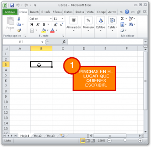
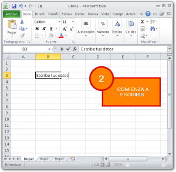
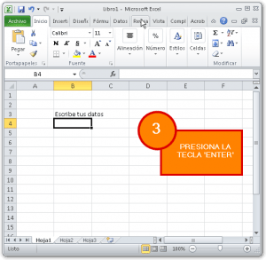

Siguiendo con el curso de introducción a Excel, hoy te mostraré cómo introducir datos a una hoja.

\[twitter style="vertical" source="RaymundoYcaza" hashtag="#Excel" float="left" lang="es" use\_post\_url="true"\]¡Muy bien! Ya has visto [qué es Excel](http://raymundoycaza.com/que-es-excel/ "¿Qué es Excel?") y de qué se trata todo esto de [la celda, la hoja y el libro](http://raymundoycaza.com/celda-hoja-libro/ "La celda, la hoja y el libro."). Ahora, pasemos a darle uso a nuestra hoja de cálculo y, como no, la forma de hacerlo es introduciendo datos en ella para su posterior tratamiento.

Una vez que ya has abierto  Excel y puedes ver tu hoja de cálculo, ésta se encuentra lista para recibir cualquier dato que quieras ingresar. Hacerlo no es para nada complicado; pero déjame acompañarte en tu primera experiencia con el ingreso de datos y así le pierdes el miedo de una vez por todas :)

## Introducir datos a una hoja de Excel

Debes saber que se pueden ingresar datos en Excel, de varias formas y desde muchos "lugares"; pero hoy veremos la forma "tradicional" o la más básica para empezar desde cero.

Esta forma de la que te hablo es... ¡Sí! Estás en lo correcto. Hacerlo desde el teclado.

Si estás leyendo esto, lo más probable es que ya sepas ingresar datos en la computadora, usando el teclado. Exactamente igual será con Excel:

1. Pinchas con el ratón, en el lugar en el que quieras ingresar tus datos.
2. Y luego simplemente, comienzas a escribir.

### ¿Eso es todo?

Sí.

O bueno, casi. **No debes olvidar** un pequeño gran detalle: **Debes presionar la tecla "enter"**, cada vez que termines de escribir en una celda, o corres el riesgo de que lo que acabas de escribir o bien se borre, o suceda alguna cosa rara.

Y ahora sí, eso es todo.

¡Nos vemos!
