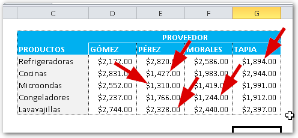
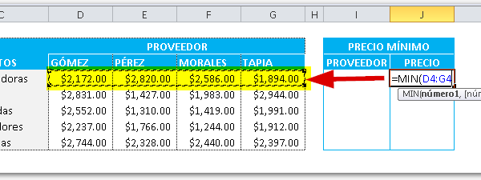
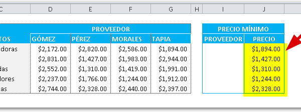
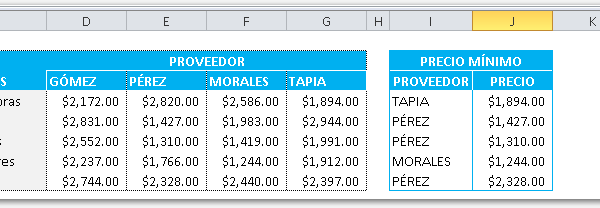
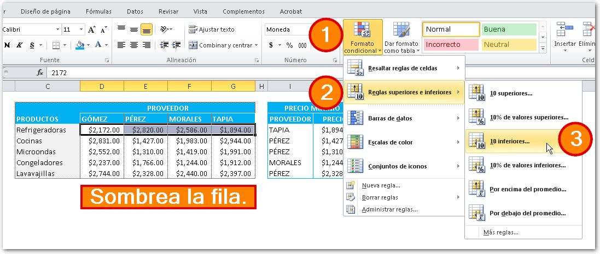
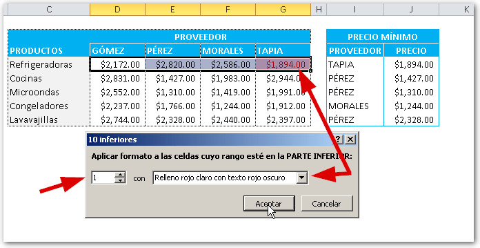
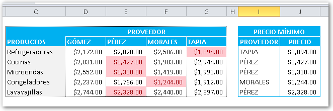

Imagina que tienes tu negocio propio y cuentas con varios proveedores.

Estos proveedores te envían su catálogo de productos con sus precios y... ¡Son un montón! ¿Cómo harías para detectar los precios más convenientes?

Pues sí, todos estamos muy ocupados hoy en día. Ir a la oficina, papeleos, la Universidad, compromisos personales... ¿Cómo darse cabida para una tarea más?

Imagínate ahora el pasarte horas buscando los precios más bajos entre los catálogos de tus diferentes proveedores. ¡Colapso total!

Por eso hoy quiero compartirte un pequeño truco que puede ayudarte a realizar esta tarea de una forma rápida, limpia y sencilla: Usando fórmulas de Excel.

## Encontrar el mínimo con Excel.

Digamos que tienes la siguiente tabla (muy sencilla, lo sé) que usaré para mostrarte cómo lo harías con tu propio catálogo:

Fíjate como he señalado con flechas los valores más bajos en cada caso. Para las refrigeradoras, el valor más bajo es el de $1,894.00 y le corresponde al proveedor "TAPIA".

Así, en cada caso puedes ver encontrar el precio más bajo en cada artículo / proveedor.

Hacer esto "al ojo" por supuesto que es posible; pero más demorado y sujeto a errores. Solo piensa en cómo sería esta tarea si el catálogo fuera 100 veces más grande :o

Para realizar esta tarea rápidamente, vas a hacer uso de la fórmula MIN().

Solo debes seleccionar el rango de cada producto, entre los diferentes proveedores, tal como se muestra en la imagen. Esto te dará automáticamente el valor más bajo para el producto, de entre todos los proveedores, así:

## Un paso más allá.

Hasta aquí, ya tienes listo tu pequeña herramienta para detectar las mejores ofertas entre tus proveedores; pero si vamos un paso más allá y te interesa que, junto al precio, aparezca el nombre de tu proveedor, entonces **sigue leyendo**.

Si haces uso de la función COINCIDIR(), podrás detectar en qué columna se encuentra el valor más bajo, si usas como referencia el precio mínimo que ya tenemos en la columna J:

`COINCIDIR(J4,D4:G4,0)`

Esto te dará el número de columna en el que se encuentra el precio más bajo.

Para poder recuperar el nombre del proveedor, solo deberás de complementar la fórmula con la función INDICE(). Esto se hace, de la siguiente forma:

`=INDICE($D$3:$G$3,1,COINCIDIR(J4,D4:G4,0))`

Nota que he usado el rango D3:G3, que es donde se encuentran los nombres de los proveedores. Además, si te fijas, también notarás que he usado las "anclas" (el símbolo $) para evitar que la referencia se mueva, al copiar las fórmulas hacia abajo.

Si yo copio toda esta fórmula hacia abajo, hasta el último producto, entonces ya tendré lista mi súper herramienta :D

## ¿Quieres más? ¿Qué tal un consejo adicional?

¡Pues sí! Aún podemos mejorar nuestra herramienta. Solo debes utilizar el formato condicional (estoy usando Excel 2010; pero también funciona con 2007)

Esta es una forma realmente rápida de detectar los mínimos en tu rango.

En el cuadro de diálogo que se abre, debes colocar los siguientes valores:

Entonces pinchas en el botón 'Aceptar" y... ¿adivina qué? Si repites este paso para cada fila, tendrás una completa herramienta que te ayudará a detectar las mejores ofertas de tus proveedores de forma automática y sin utilizar las susodichas Macros de Excel. :D

## ¿Quieres descargarte el archivo terminado?

Pues aquí te dejo el enlace, sigue las instrucciones para descargarlo:

[Descargar ahora.](http://raymundoycaza.com/wp-content/uploads/20130820-encontrar-el-minimo-con-excel-terminado.xlsx "Descargar")

Así podrás seguir con mayor facilidad el tutorial y comprobar si tienes algún error que se te haya pasado ;)

## ¡Y eso es todo!

Ahí lo tienes, tu propia herramienta para controlar tu inventario y hacer comparaciones entre proveedores de forma fácil y amena. Solo falta que tú le agregues ciertas mejoras que la convertirán en una de tus mejores aliadas.

Si te ha gustado el artículo o crees que a alguien más puede servirle, no dejes de compartirlo en las redes sociales, usando los botones que aparecen más abajo.

¡Nos vemos!
