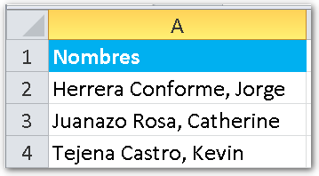
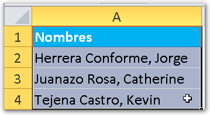
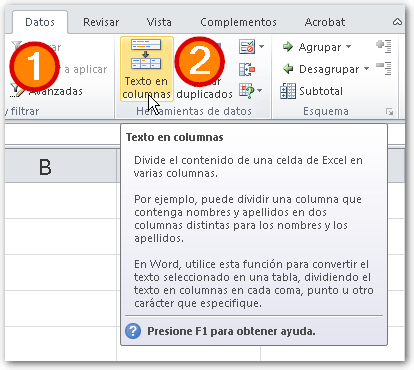
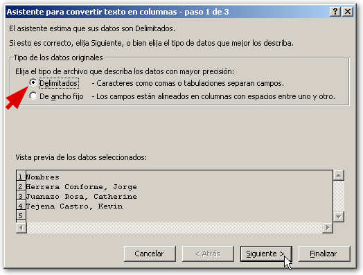
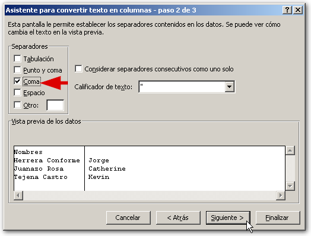
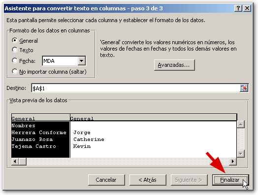
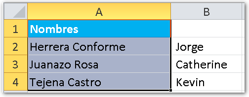

¿Tienes los nombres del personal en nómina, 'pegados' con los apellidos? ¿Buscas una forma fácil y rápida de separarlos? Excel cuenta con un asistente que te ayudará a realizar precisamente esto y aquí te cuento cómo usarlo.

El objetivo de este asistente es colocar en una columna cada dato que esté separado por un carácter específico, como podrían ser: coma, punto, espacio, números, letras, etc.

Normalmente, nos encontramos con casos de nóminas en los que los nombres y apellidos están en una misma columna y, generalmente, estos están separados por una coma (,) aunque también podría ser cualquier otro carácter.

## Pasos para utilizar el asistente Texto en Columna

Como te comentaba, los datos a separar con esta opción pueden ser nombres, apellidos, edad, números, letras, etc. En el ejemplo que te mostré, se trataba de una pequeña nómina de empleados en la que los nombres y los apellidos están separados por una coma, así que usaré el mismo ejemplo para la demostración.

### #1 Seleccionas los datos.

### #2 En la pestaña 'Datos' escoges la opción 'Texto en Columnas'.

### #3 Aparecerá el siguiente cuadro de diálogo.

Aquí debes escoger la opción 'Delimitados', ya que esta opción va a separar los datos por el carácter que le especifiques, mientras que la opción 'De ancho fijo', los va a separar en grupos de N caracteres (de cinco en cinco, de ocho en ocho, de diez en diez... etc.)

Pinchas en el botón 'Siguiente'.

### #4 Aparecerá la siguiente pantalla del asistente.

Aquí debes escoger los separadores, que como te decía pueden ser una coma, un espacio, un guión, etc.

Con esto vas a definir cómo se van a separar los datos en cada columna, una vez escogido el separador, que en nuestro caso es la coma.

Pinchamos en el botón 'Siguiente'.

Para ir terminando, pinchas en el cuadro de destino y luego escoges en qué fila quieres colocar  los datos. Lo normal es que lo dejes tal como está, para que todo quede a la misma altura.

Y pinchas en el botón 'Finalizar'.

Al final, los datos quedaran así:

Una vez hecho esto, te darás cuenta que la coma desaparece, ya que esta fue utilizada como separador de columna, haciendo que los datos entre cada coma, se conviertan en una  columna independiente.

##  Ahora, ¡a practicar!

No importa que ahora mismo no lo necesites, ponlo en práctica con una hoja de pruebas que tengas de tu trabajo (no olvides trabajar sobre una copia de los datos originales) y repite estos pasos. Verás cómo lograrás dominar este asistente en poco tiempo.

Y eso es todo por hoy. Si tienes algo que decirme, puedes hacerlo en los comentarios. ¡Ah! No olvides ayudarme compartiendo esta entrada en las redes sociales, usando los  botones que aparecen más abajo.

¡Nos vemos!
