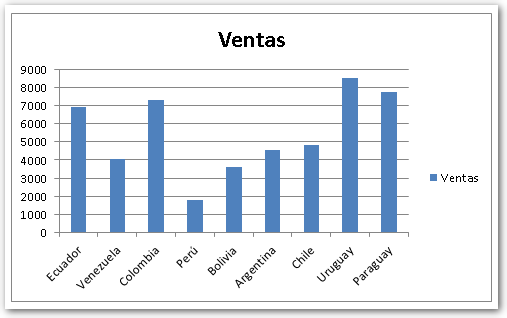
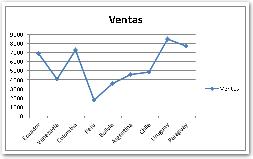
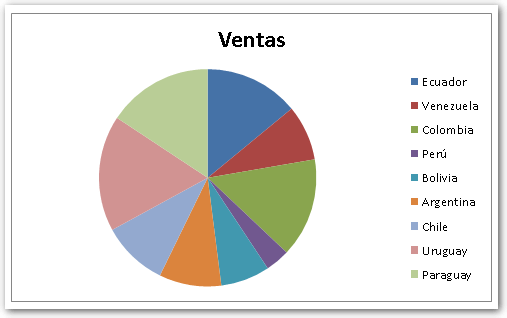
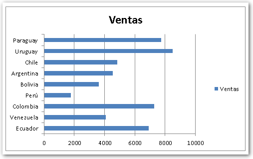
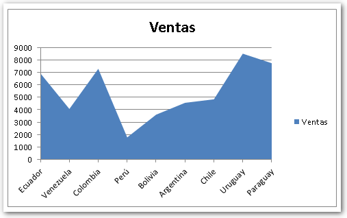
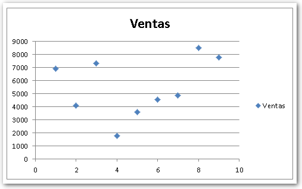
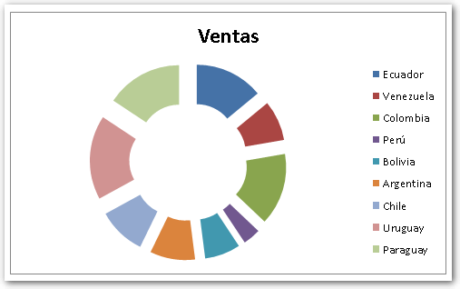
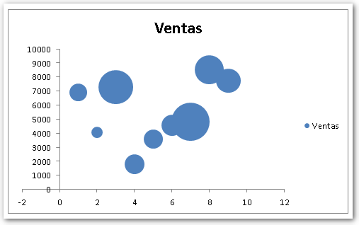
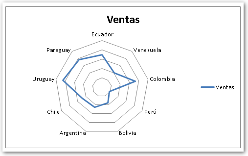

Excel admite el uso de gráficos, los cuales sirven para mostrar visualmente la distribución de los datos en el tiempo o por categorías. Es muy útil para crear reportes y resumir gran cantidad de datos, haciéndolos más fácil de interpretar.

Existen varios tipos de gráficos en Excel, como los que te muestro a continuación:

**Gráficos de columna**.-Utilizada para mostrar variaciones de datos en un periodo de tiempo con mayor facilidad y entendimiento, generalmente las categorías van en el eje horizontal y los valores en el eje vertical.

**Gráficos** **de lineas**.- Utilizado comúnmente para representar grandes cantidades de datos que varían en un periodo continuado de tiempo, datos de categoría en el eje horizontal, y datos de valores eje vertical, para cada categoría hay un color de linea que se quiebra al cambiar de valor para la siguiente variación de valor.

**Gráficos Circulares**.- Su utilización se la requiere en datos de porcentajes, ya que este gráfico es uno solo, pero su 100% esta repartido según la cantidad de categorías que se este utilizando.

**Gráfico de Barras**.- Implementado para hacer comparaciones entre elementos individuales, tales como: magnitudes, evolución en el tiempo, etc. Son semejantes a los gráficos de columnas.

**Gráfico de Áreas**.- Al igual que los gráficos de líneas, comúnmente se los utiliza en las variaciones de datos de periodos continuos.

**Gráficos de tipos XY Dispersión**.- Este tipo de gráfico se lo recomienda utilizar cuando hay muchos puntos de datos en el eje horizontal, hay tres tipos de gráficos de dispersión: gráfico XY de dispersión, dispersión con puntos de datos conectados por líneas y dispersión con puntos de datos conectados por líneas suavizadas.

**Gráfico de Superficie**.- Este tipo de gráfico visualiza mejor la evolución entre dos o más categorías siempre y cuando existan diferencias.

**Gráfico de anillos**.- Muestra un porcentaje del total similar al gráfico circular, aquí podemos enfocar según el número de datos el tamaño del compartimento del anillo.

**Gráfico de Burbuja**.- Es como un gráfico de líneas en donde los puntos son remplazados por burbujas; pero en este caso, para la interpretación de los datos, también cuenta el tamaño de cada burbuja.

**Gráfico Radial**.- Se lo utiliza como herramienta de comprobación de datos, a diferencia de los demás, este utiliza la circunferencia del gráfico como eje X.

## ¿Qué gráfico usas más?

Existen unos cuántos gráficos más en Excel y, por supuesto, [los gráficos avanzados](http://raymundoycaza.com/graficar-en-excel-una-manera-distinta/ "Graficar en Excel: Gráfico en Forma de Cigarrillo [Archivo]") que puedes crear con algo de imaginación; pero, cuéntame, ¿qué gráfico es el que usas más para tus trabajos? Me gustaría saberlo.

¡Nos vemos!
