Crear un gráfico de columnas es una de las tareas que más hacemos en nuestros reportes en Excel. Si es la primera vez que realizarás uno, o hace tiempo que hiciste el último, esto te interesará.

Ya te [mostré anteriormente](http://raymundoycaza.com/como-crear-un-grafico-en-excel/ "Cómo crear un Gráfico en Excel") la forma fácil y rápida de crear un gráfico en Excel y lograste culminar tu primera práctica, ¿verdad?

Pues bien, ahora no será mucho más complicado; pero sí tendrás que realizar un par de pasos adicionales, así que ganemos en tiempo y vamos al grano.

## Crear un gráfico de columnas.

El gráfico que haremos tú y yo, al final, va a verse así:

[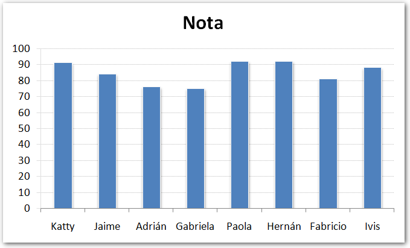](http://raymundoycaza.com/wp-content/uploads/20130908-crear-un-grafico-de-columna-000097.png)

Más adelante, te mostraré cómo hacer para que luzca mejor, con unos retoques estéticos; pero por ahora nos concentraremos en el cómo crear el gráfico, ¿de acuerdo?

### Los datos.

Imagina que tienes un resumen de los resultados de las pruebas entre 7 aspirantes a una beca y quieres realizar un gráfico de columnas, para exponer los resultados de una forma un poco más agradable que simplemente mostrando números.

Los resultados, supongamos, son estos:

[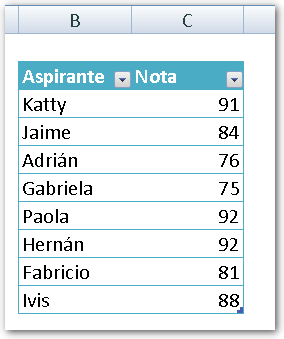](http://raymundoycaza.com/wp-content/uploads/20130908-crear-un-grafico-de-columnas-000098.png)

### Los pasos para crear un gráfico en Excel.

Recuerda que ya creaste tu primer gráfico, de la manera sencilla en un [artículo anterior](http://raymundoycaza.com/como-crear-un-grafico-en-excel/ "Cómo crear un Gráfico en Excel").

Ahora, para variar un poco, crea tu gráfico de columnas, realizando los siguientes pasos:

#### _01_ Pincha en la pestaña "Insertar".

Sin tener los datos seleccionados, pincha en la pestaña "Insertar", que aparece después de la pestaña "Inicio".

[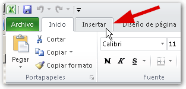](http://raymundoycaza.com/wp-content/uploads/20130908-crear-un-grafico-de-columnas-000099.png)

#### _02_ Pincha en el tipo de gráfico "Columna".

En el apartado "Gráficos", selecciona la categoría "Columna".

[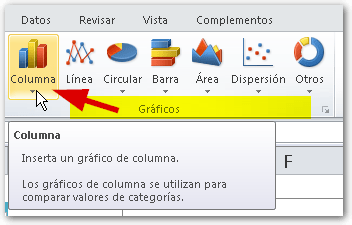](http://raymundoycaza.com/wp-content/uploads/20130908-crear-un-grafico-de-columnas-000100.png)

#### _03_ Selecciona el sub-tipo "Columna Agrupada en 2D".

En el menú que aparece, selecciona el sub-tipo llamado "Columna Agrupada en 2D". Este es el tipo de gráfico de columnas más utilizado, según mi experiencia, y es el que vamos a utilizar para este ejemplo.

[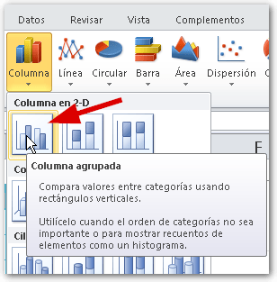](http://raymundoycaza.com/wp-content/uploads/20130908-crear-un-grafico-de-columnas-000101.png)

#### _04_ Aparecerá un rectángulo en blanco.

Si el resultado de todo esto es un rectángulo en blanco, vacío, no te preocupes; es precisamente lo que pretendíamos.

Pincha con el botón derecho sobre el rectángulo.

Pincha con el botón derecho sobre el rectángulo blanco y elige la opción "Seleccionar Datos..."

[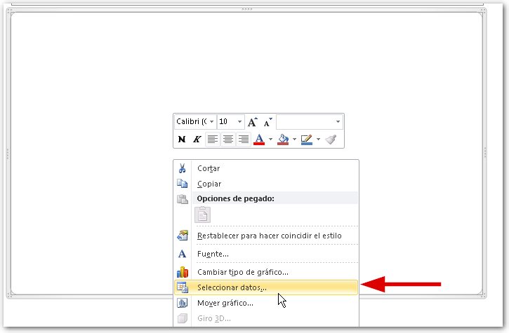](http://raymundoycaza.com/wp-content/uploads/20130908-crear-un-grafico-de-columnas-000103.png)

#### _06_ Arma tu gráfico, a gusto de consumidor.

[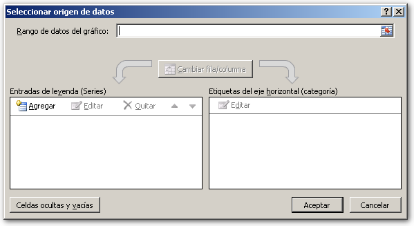](http://raymundoycaza.com/wp-content/uploads/20130908-crear-un-grafico-de-columnas-000104.png)

Es en esta parte, donde **vamos a detenernos un minuto**, para mostrarte cómo se opera este cuadro de diálogo. Para empezar, este está formado por:

1. Un campo llamado "**Rango de datos del gráfico:**"Este campo recibe el rango que conforma la tabla de datos que pretendemos graficar.
    
    Si lo que deseas es hacer un gráfico rápido, sencillo y que respete las recomendaciones que te di en el artículo sobre _**[cómo crear un gráfico](http://raymundoycaza.com/como-crear-un-grafico-en-excel/ "Cómo crear un Gráfico en Excel")**_, solo debes pinchar sobre este recuadro y luego vas a seleccionar (o "sombrear") el _**[rango de datos](http://raymundoycaza.com/que-es-un-rango-en-excel/ "Entonces, ¿qué es un rango en Excel?")**_.
    
2. Un pequeño **panel a la izquierda**, en el que solo encontrarás habilitado el botón "**Agregar**".Si tu gráfico, por alguna razón, no te resulta usando la técnica anterior o seleccionando directamente el Rango de Datos del gráfico en el campo anterior, puedes hacerlo manualmente agregando cada serie una por una, al pinchar en este botón.
    
    1. Al pinchar sobre este botón, verás aparecer un nuevo cuadro de diálogo en el que aparecen solo dos campos:
        
        [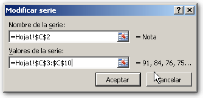](http://raymundoycaza.com/wp-content/uploads/20130908-crear-un-grafico-de-columnas-000105.png)
        
        \- "**Nombre de la Serie**", en el que tú le vas a escribir un nombre cualquiera, que identificará a la serie en el gráfico. Es como la etiqueta que identifica a esta serie de datos. También puedes seleccionar la celda en la que se encuentra el título de la columna. Yo lo hice así, como puedes ver en la imagen. :D
        
        \- "**Valores de la serie**", donde vas a insertar el rango en el que se encuentran los datos de la serie que vas a graficar.
        
        **¿Y cuál es la serie?** La serie que vas a graficar, es la columna de datos, donde están los valores que quieres representar en tu gráfico. En este ejemplo se trata de la columna cuyo nombre es "**Nota**".
        
        Cuando crees la serie, debes seleccionar todo el rango de datos de esta columna, a excepción del título.
        
        **RECUERDA:** En un gráfico de Excel, una serie, es un grupo de datos normalmente relacionados, y que representa una fila o columna en una hoja de cálculo.
        
    2. Una vez hecho esto, solo debes pinchar sobre el botón "**Aceptar**" para cerrar este cuadro de diálogo.
        
    3. Volverás al cuadro de diálogo anterior, donde podrás repetir el proceso cuantas veces necesites.
        
        [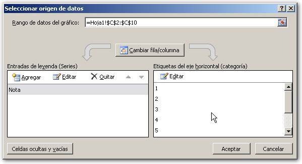](http://raymundoycaza.com/wp-content/uploads/20130908-crear-un-grafico-de-columnas-000106.png)
3. A la derecha, encontrarás un segundo panel llamado "**Etiquetas del eje horizontal (categorías)**". Aquí encontrarás un botón llamado "**Editar**".
    
    Pinchando en este botón podrás elegir el rango donde se encuentran las categorías, es decir, aquellos valores que aparecerán como etiquetas.
    
    [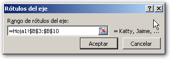](http://raymundoycaza.com/wp-content/uploads/20130908-crear-un-grafico-de-columnas-000107.png)
4. Una vez hecho esto, solo debes pinchar en el botón "**Aceptar**" y aparecerán los nombres de las categorías.
    
    [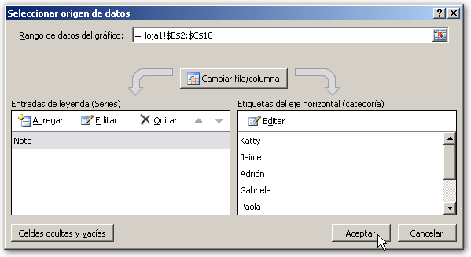](http://raymundoycaza.com/wp-content/uploads/20130908-crear-un-grafico-de-columnas-000108.png)
5. Pincha nuevamente en el botón "**Aceptar**" y tu gráfico quedará listo.
    
    [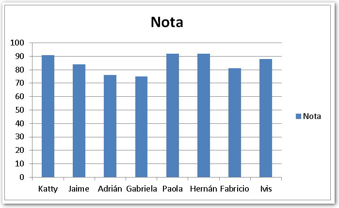](http://raymundoycaza.com/wp-content/uploads/20130908-crear-un-grafico-de-columnas-000109.png)
6. Ahora que ya has visto estos elementos y editado sus parámetros, el botón "**Cambiar fila/columna**" se encuentra habilitado.
    
    Nuevamente haz un clic derecho sobre el gráfico y elige la opción **"Seleccionar datos...**".
    
    [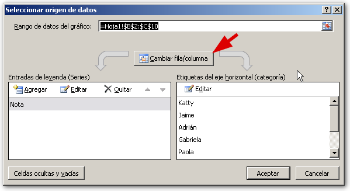](http://raymundoycaza.com/wp-content/uploads/20130908-crear-un-grafico-de-columnas-000110.png)
    
    Verás el botón **"Cambiar fila/columna**" en la parte superior, debajo del campo  "**Rango de datos del gráfico".** Si pinchas sobre él, verás que tu gráfico cambia, porque se intercambian las filas por las columnas.
    
    [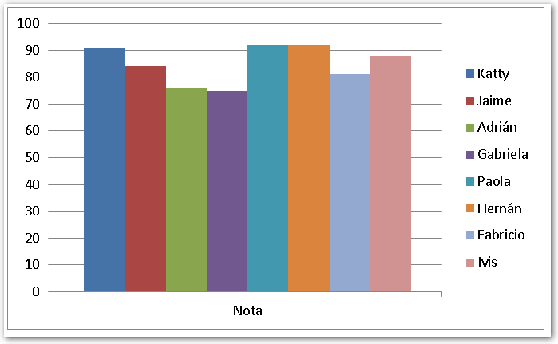](http://raymundoycaza.com/wp-content/uploads/20130908-crear-un-grafico-de-columnas-000111.png)
    
    Esto es el equivalente de hacer una [transposición a tu tabla de datos](http://raymundoycaza.com/como-transponer-en-excel/ "Cómo transponer en Excel (de vertical a horizontal)") y, por eso verás que ahora, cada columna representa un nombre y tiene su propio color, como una serie independiente.
    
    Ahora, repite estos pasos y deja tu gráfico como estaba antes, para que podamos seguir. Si no hiciste la transposición con el botón **"Cambiar fila/columna**", entonces no toques nada más.
    

#### _07_ Ponle tu estilo.

Finalmente, vamos a darle un poco de color a nuestro gráfico. Para hacerlo, solo debes seleccionar el gráfico y, en la [ficha contextual](http://raymundoycaza.com/que-son-las-fichas-contextuales-en-excel/ "¿Qué son las Fichas Contextuales en Excel?") "**Herramientas de gráficos**", elije la ficha "**Diseño**".

En esta ficha, en el apartado "**Estilos de diseño**", verás varios estilos predefinidos que podrás utilizar para hacer tu gráfico más colorido en solo un par de clics.

[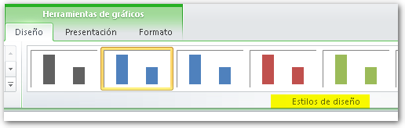](http://raymundoycaza.com/wp-content/uploads/20130908-crear-un-grafico-de-columnas-000112.png)

## ¿Y si ninguno de estos colores me gusta?

Pues no hay problema, _porque si seleccionas una serie de tu gráfico_ y, esta vez, te vas a la ficha "**Inicio**"; verás en el apartado "**Fuente**" que todas las herramientas están deshabilitadas, a excepción de la herramienta "**Color de relleno**".

Pincha sobre este botón desplegable y elige el color de tu preferencia. Ahora ya tienes un color totalmente personalizado y tu gráfico está listo para ser utilizado en tu presentación de esta tarde.

Ahora, ponte en marcha y no dejes de practicar lo aprendido. Esta es la única forma de _[**avanzar con Excel**](http://raymundoycaza.com/cursos-gratuitos-de-excel/ "Curso de Excel")_.

Y recuerda, si te ha gustado esta entrada, no dejes de compartirla en las redes sociales, usando los botones que aparecen junto al artículo.

¡Nos vemos!
