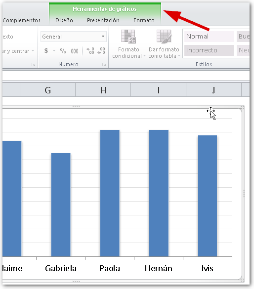
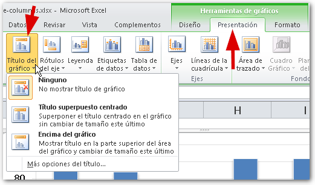
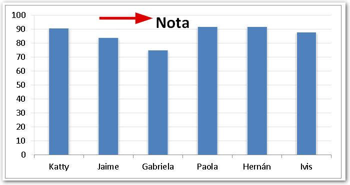
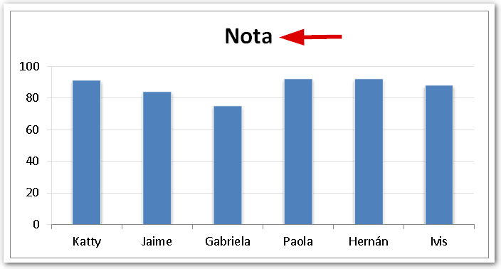
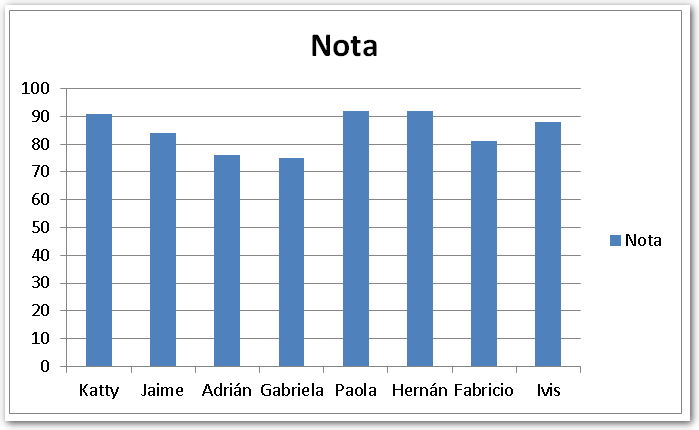
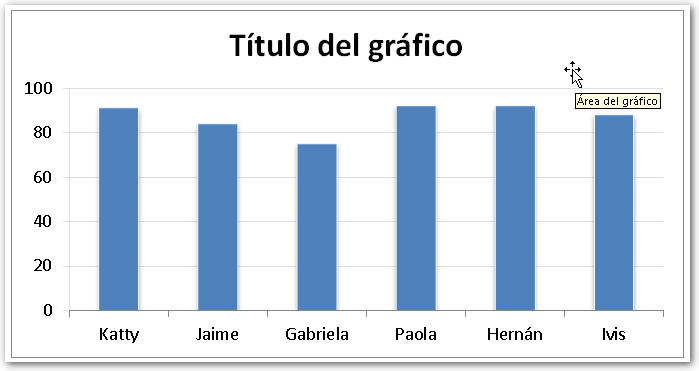
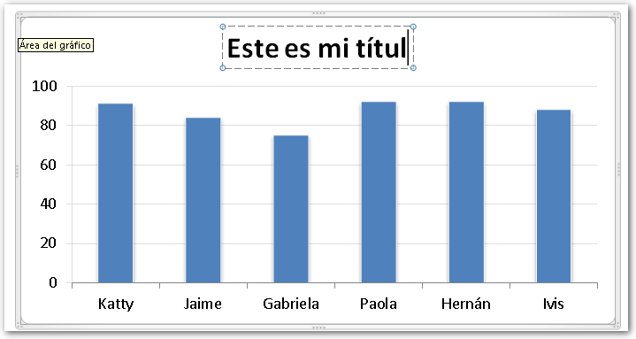
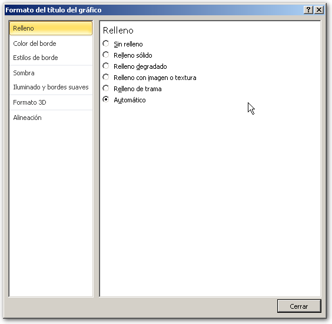

De acuerdo, ya te he mostrado cómo crear un gráfico y estás practicando todos los días ¿no es verdad? ¡Eso está muy bien! Pero, ¿qué hay acerca de cómo colocar un título en nuestro gráfico?

## Pasos para agregar un título al gráfico.

Entiendo que ya tienes claro cómo crear un gráfico y, si ese no fuera el caso, recuerda que ya vimos [la forma rápida](http://raymundoycaza.com/como-crear-un-grafico-en-excel/ "Cómo crear un Gráfico en Excel") y la [forma "dedicada"](http://raymundoycaza.com/crear-un-grafico-de-columnas-en-excel/ "Crear un gráfico de Columnas en Excel") de crear un gráfico en Excel.

Ahora te mostraré cómo puedes ir complementando tu gráfico para que se parezca más a lo que tú tienes en mente.

#### _01_ Selecciona tu gráfico.

Ahora, para agregar tu título, lo único que tienes que hacer es pinchar sobre tu gráfico (se vale pinchar en cualquier parte del gráfico) y aparecerá la [ficha contextual](http://raymundoycaza.com/que-son-las-fichas-contextuales-en-excel/ "¿Qué son las Fichas Contextuales en Excel?") "Herramientas de gráficos".

#### _02_ Inserta la etiqueta.

Dentro de esta ficha contextual que recién apareció, ubica la ficha "Presentación" y pincha sobre ella. Dentro de esta ficha, pincha sobre el botón de comando "Titulo del gráfico", que se encuentra en el apartado "Etiquetas".

Una vez hayas pinchado sobre este comando, te aparecerá un pequeño menú con las siguientes opciones:

1. **Ninguno**.- Si la eliges, el gráfico no mostrará ningún título. Esta opción te sirve cuando tienes un gráfico que ya cuenta con título y tú lo que quieres es quitárselo.
2. **Título superpuesto o centrado**.- Esta opción coloca el título centrado en la parte superior y "flotando" sobre tu gráfico (te sirve para no perder espacio del área de tu gráfico).
3. **Encima del gráfico**.- Esta opción coloca el título centrado en la parte superior y, a diferencia de la opción anterior, el título no "flota" sobre el gráfico, ocupando su propio espacio y restando dicho espacio a tu gráfico.

#### _03_ Escribe el título de tu gráfico.

Si has hecho todos los pasos que te he detallado, aparecerá un pequeño cartel sobre tu gráfico, el cual **tendrá escrito el nombre de la serie de tu gráfico**, en el caso de que solo tengas una serie.

En cambio, si tienes más de una serie, el cartel aparecerá con el texto "**Título del gráfico**".

Es aquí donde tú tienes que hacer un doble clic sobre el gráfico y escribir lo que quieras que aparezca aquí.

Si pinchas sobre el título de tu gráfico, con el botón derecho del ratón, y eliges la opción "Formato del título del gráfico", aparecerá el cuadro de diálogo de formato, que te permitirá cambiar cosas como el color de tu título, color de fondo, borde, sombras, alineación, etc.

## ¡Has terminado!

¿Ves lo fácil que resulta agregar un título a tu gráfico?

¡Pero no te quedes en esa silla!

Ponte a practicar todas las semanas y verás cómo avanzas en tu camino a dominar Excel. Si tienes alguna duda déjamela saber en los comentarios.

¡Ah! Y no olvides ayudarme a compartir este artículo en las redes sociales, usando los botones que aparecen junto al artículo.

¡Nos vemos!
