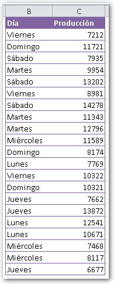
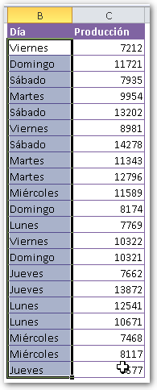
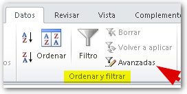
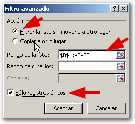
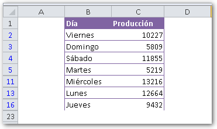
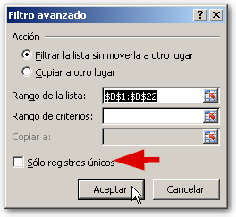
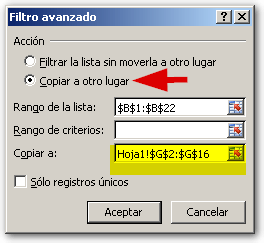

Seguramente en más de una ocasión te has visto frente a una lista en forma de tabla, en la que hay varios datos que están repetidos y te gustaría poder resumirlos de una forma rápida. ¿No es verdad? Pues aquí te muestro cómo hacerlo en tres pasos.

### #1 Selecciona tu rango de datos.

Una solución para este tema, es filtrar valores únicos, a través de la herramienta de filtro de Excel. Si ya tienes todo listo y tus datos están dispuestos como te muestro en la figura, entonces debes seleccionarlos o "sombrearlos" para que Excel sepa sobre qué segmento de datos va a trabajar.

### #2 Aplica el filtro.

Una vez seleccionado tu [rango de datos](http://raymundoycaza.com/que-es-un-rango-en-excel/ "Entonces, ¿qué es un rango en Excel?"), ahora vas a dirigirte a la ficha "Datos" y en el apartado "Ordenar y Filtrar", encontrarás un botón grande llamado "Filtro".

Junto a este botón, está el botón "Avanzadas". Este botón es el que debes pinchar, para que se abra el cuadro de diálogo "Filtro avanzado".

Fíjate que la opción seleccionada en primer lugar es la que dice "Filtrar la lista sin moverla a otro lugar".

Más abajo, verás que se encuentra especificado el rango que has seleccionado, en mi caso, este rango es $B$1:$B$22

Ahora, solo debes asegurarte de que la opción "Sólo registros únicos" esté marcada. Todo debe estar tal y como te muestro en la figura.

### #3 Disfruta del resultado.

Pincha en el botón "Aceptar" y verás cómo tus datos se han resumido de tal manera que sólo se muestran los valores únicos y sus repeticiones se han eliminado.

Lo único que tienes que hacer, es copiar esos valores y llevártelos a donde tú quieras y hacer tu reporte semanal.

No podrás negar que se trata de una opción muy útil. ¿O qué opinas tú?

### ¿Y qué pasa si quiero dejarlo todo como estaba?

Bueno, pues como te comentaba, esto se trata de un simple filtro. Así que no hemos eliminado nada.

Si te fijas en los números de filas, te darás cuenta de que faltan algunos. Esto es porque están escondidos ya que se ha aplicado un simple filtro aquí, pero con condiciones avanzadas.

Así que lo único que tienes que hacer para dejarlo todo como estaba, es quitar ese filtro.

Entonces, pincha de nuevo en el botón "Avanzadas" y ahora quita la marca de "Sólo registro únicos". Pincha en aceptar y todo habrá vuelto a la normalidad.

### ¿No quieres trabajar sobre tus datos originales?

Si por alguna razón quieres trabajar fuera de tu rango de datos original, puedes filtrar y copiar en un solo paso.

Lo que tendrías que hacer para lograr esto, es elegir la opción "Copiar a otro lugar", en el cuadro de diálogo "Filtro avanzado".

Se habilitará el cuadro "Copiar a" donde deberás especificar el rango en el cual quieres que se copien tus datos. ¡Y listo!

Asegúrate de elegir un rango lo suficientemente grande para pasar tus datos, o no se copiarán todos.

### ¡Ahí lo tienes!

Una técnica sencilla para resumir datos sin usar tablas dinámicas. Muy rápido y muy efectivo. Seguramente va a ayudarte a crear tus reportes en menos tiempo.

 ¿A qué estás esperando? ¡Ponlo en práctica ahora mismo!
