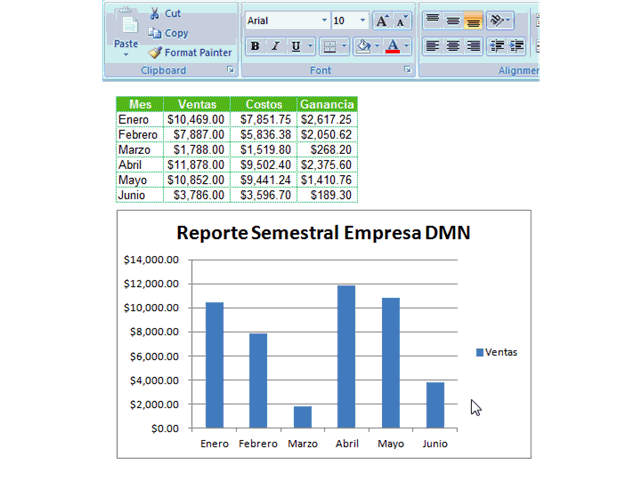

Hoy quiero darte un consejo que te permitirá agregar datos a tus gráficos de forma rápida y amena. ¿Te lo vas a perder?

En el ejemplo que te muestro la empresa DMN está realizando su Reporte Semestral, en el cual muestra sus ventas, sus costos y sus ganancias.

El gráfico que se ha realizado muestra el total de ventas para cada uno de los primeros seis meses. Pero ¿Y si quiero agregar los costos? ¿O las ganancias?

Sigue leyendo que a continuación te muestro cómo hacer para agregar estos datos usando el método rápido.

## Agregando datos a tus Gráficos de Excel

Selecciona el rango deseado y cópialo (Puedes presionar CTRL + C) Selecciona el gráfico. Pega los datos (Puedes presionar CTRL + V) ¡Listo!

### Un paso más allá.

1. Si utilizas el Pegado Especial (Puedes usar CTRL + ALT + V o puedes usar ALT + E + S) tienes la opción de indicarle a Excel si quieres pegar los datos como una nueva serie o como un nuevo punto y otros detalles.
2. Para remover rápidamente una serie de tu gráfico, sólo selecciona la serie con el puntero del ratón y presiona la tecla DEL (Delete o Borrar)
3. Si quieres extender el alcance de una serie (ampliar el rango de datos a graficar) sólo tienes que seleccionar la serie. Ahora verás que Excel ha marcado el rango de celdas de donde vienen los datos. Únicamente debes pinchar con el ratón en la esquina inferior derecha y arrastrar para ampliar o disminuir el área, según tus necesidades.

### ¿Cuáles son tus Tips de Excel para gráficos?

En lo personal, me gusta esta característica para agregar datos rápidamente a un gráfico armado. Así como éste, yo tengo varios trucos que utilizo a la hora de trabajar con gráficos.

¿Qué me dices tú? ¿Tienes tu propio listado de trucos para trabajar con gráficos?

Me gustaría conocerlos.

¡Buen inicio de semana!
