Son muy comunes las historias en las que nuestro jefe o un compañero de trabajo ha estropeado (sin querer) alguno de nuestros archivos. Y estos accidentes en Excel, suceden generalmente **después de toda una tarde trabajando en él**.

¿Te ha sucedido alguna vez? ¡A mi también!

Estos casos suelen suceder por nuestra falta de precaución para evitar que el usuario altere las fórmulas o el formato (tal vez debido a una incomodidad generada por los colores que has elegido)

La buena noticia es que podemos disminuir (y en algunos casos, eliminar) la posibilidad de que un usuario nos estropee la planilla que hemos diseñado.

**Sigue leyendo**, porque enseguida te muestro **10 tips que te ayudarán** a proteger tus trabajos de los “accidentes laborales” :)

### #1 Bloquea las celdas con fórmulas y protege la hoja de trabajo.

Las fórmulas son definitivamente el punto más vulnerable en un archivo de Excel.

Éstas no deben quedar expuestas al usuario, ya que podrían ser alteradas accidentalmente y ocasionar errores de cálculo graves.

Para hacerlo, debes seleccionar todas las celdas de la hoja y dar un clic derecho. En el menú, seleccionas la opción 'Format Cells...'

Luego, en la ventana que aparece, eliges la pestaña 'Protection' y te aseguras que la opción 'Locked' esté habilitada.

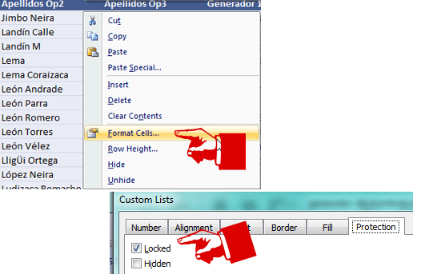

#### Protege la hoja.

Para hacerlo, debes ir a la sección 'Review' y pinchas sobre el ícono llamado 'Protect Sheet'. En el cuadro de diálogo que se abre, puedes asignarle una contraseña para que nadie más que tú pueda 'desproteger' la hoja.

Si no quieres usar contraseña, sólo déjala en blanco.

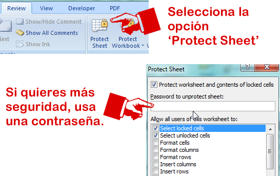

### #2 Limita el área de trabajo.

Es cierto que muchos de nuestros trabajos en Excel tienen cientos y hasta miles de filas; pero la mayoría de reportes se presentan en un espacio relativamente pequeño.

Entonces ¿Por qué mostrar 65.000 líneas y 256 columnas (o más), si tu trabajo tan sólo ocupa 50 líneas y 20 columnas?

Esto, obviamente es tan sólo un ejemplo. La idea es mostrarte que estamos dejando un espacio innecesario en nuestro reporte. Recuerda: Menos es más.

Tan sólo debes seleccionar las filas y / o columnas, hacer un clic derecho y seleccionar la opción 'Hide' (Esconder)

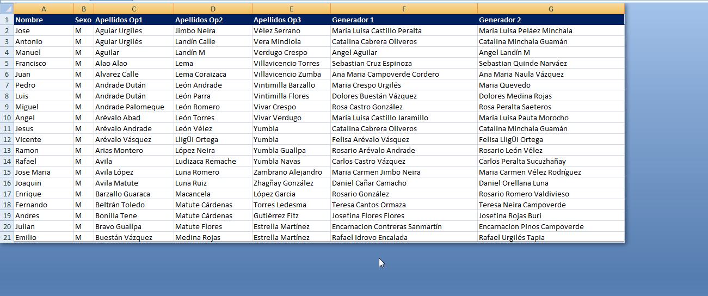

### #3 Inmoviliza los paneles.

La posibilidad de inmovilizar los paneles, nos ayuda mucho en la visualización de los datos. Podemos desplazarnos hacia abajo, manteniendo los nombres de la cabecera siempre en la misma posición.

Esto puedes hacerlo tanto para filas como para columnas.

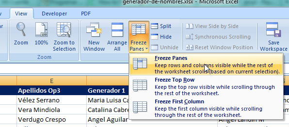

### #4 Esconde las hojas que sólo realizan cálculos.

Es práctica común tener varias hojas que se encargan de realizar cálculos. Estas hojas generalmente sólo son intermediarias y no forman parte del reporte final.

Entonces ¿Por qué mostrarlas? Por un lado, contribuye a la confusión del usuario al ver tantas hojas innecesarias para su trabajo; pero aún más importante, estás dejando expuestas una vez más tus fórmulas.

Es mejor que esas hojas queden escondidas.

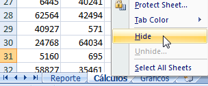

### #5 Esconde filas y/o columnas.

Existe la posibilidad de que, por alguna razón, no sea posible esconder las hojas en las que realizamos los cálculos, tal como te indiqué en el punto anterior.

Si éste es tu caso, puedes probar escondiendo las filas y/o columnas donde tengas fórmulas ‘largas’ o complicadas. Ésta es una buena forma de evitar accidentes que provoquen un mal funcionamiento de tu archivo.

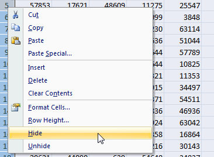

### #6 Incluye comentarios: Ayuda al usuario.

Todos, especialmente los jefes, pasan por esos momentos en los cuales la mente está tan llena de información, que no es posible tener presente cada pequeño detalle.

Por eso te sugiero que incluyas comentarios y mensajes de ayuda **que orienten** al usuario para que pueda usar tu archivo.

Mensajes como “Ingrese aquí el total de ventas del mes.” pueden ser muy útiles.

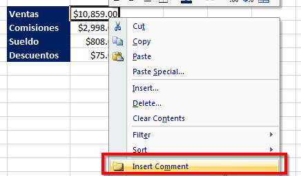

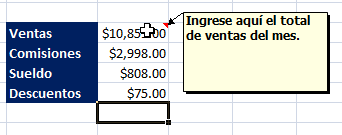

### #7 Usa colores consistentes.

Esto es muy importante.

Cualquier cosa luce mejor cuando lo diseñamos de forma consistente. Tu archivo de Excel no es la excepción.

Si usas colores apropiados (nada de colores estridentes) tu jefe se sentirá más relajado, tu usuario se sentirá menos intimidado por tu archivo y tú te sentirás satisfecho por el deber cumplido. ¡Todos Ganan!

### #8 Usa nombres y colores apropiados para las pestañas.

Usar nombres apropiados para las pestañas le harán más fácil la vida al usuario al momento de entenderse con tu archivo. Lo mismo aplica para el uso de colores.

Esto ayudará al usuario a ubicar más rápidamente la hoja que necesita, ya que primero ‘escaneará’ con la vista el color y luego ubicará la hoja con el nombre buscado.

Puedes incluso hacer uso de los colores para ‘agrupar’ ciertos tipos de hojas.

### #9 Usa validación de datos y mensajes de advertencia.

Asumir que el usuario sabrá qué tipo de datos ingresar en cada celda, es tomar demasiados riesgos.

Si tu archivo de Excel necesita algún tipo de dato específico en determinadas celdas, utiliza la validación de datos. Su implementación es sencilla y sus beneficios, enormes.

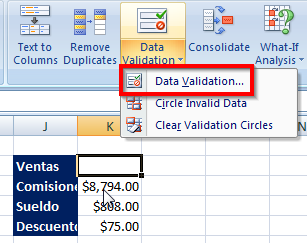

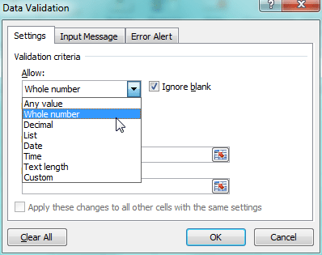

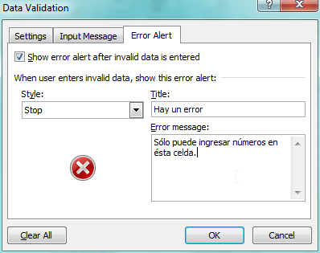

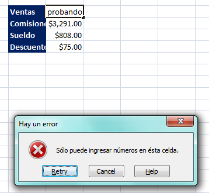

### #10 Antes de cerrar el libro, ubícate en la celda A1 de la hoja correcta.

Éste es tal vez el más pequeño de los tips, pero precisamente por ello, el que más se suele pasar por alto.

Una vez que has terminado de trabajar en tu archivo de Excel, coloca el cursor en la celda A1 de la hoja donde el usuario debería iniciar al abrir tu libro de trabajo. Esto le ahorrará varios segundos de posible confusión.

#### ¡A trabajar!

Y ahí lo tienes. Unos cuántos consejos que podrás sacarte de la manga para impresionar a tu jefe.

¿Te ha gustado el artículo?

Entonces ayúdame compartiéndolo en las redes sociales usando botones que encontrarás más abajo.

¡Nos vemos!
