En mi época de empleado, tenía un muy buena relación con mi jefe. Y en nuestras conversaciones sobre los reportes, el solía decir:

> ### De tanto ver lo mismo, terminamos dejando de ver.

¡Y tenía razón!

Generalmente nos pasamos el día [haciendo gráficos](http://raymundoycaza.com/aprendiendo-excel/como-crear-un-grafico-en-excel "Cómo crear un Gráfico en Excel") de barras, columnas y uno que otro de pastel.

Pero ¿por qué no hacer gráficos diferentes?

Nuestros clientes están acostumbrados a ver los mismos tipos de gráficos día tras día. A lo sumo, le cambiamos los colores y poco más.

De tanto ver lo mismo, dejan de prestarle atención a tus gráficas y, en resumen, dejan de ver los datos. Muchas veces es así.

Por eso hoy te voy a mostrar una forma sencilla de hacer un gráfico distinto, de entre las muchas que podemos inventarnos, para que sorprendas a tu jefe y/o a tus clientes internos. ¡Comencemos!

## Graficar en Excel como todos los días.

Una forma de conseguir resultados totalmente distintos, es reemplazando los colores por imágenes que, con un truco o dos, refuercen el mensaje que queremos hacer llegar a quienes vean nuestros gráficos.

Para el ejemplo, voy a utilizar un reporte de ventas de una fábrica de cigarrillos ficticia. La intención es mostrar la **cantidad de unidades vendidas por mes**, durante los primeros cinco meses del año.

Es así que el Analista de Ventas de la fábrica "Tabacos Matasano" está generando un reporte, muy resumido, de las ventas de cigarrillos (expresadas en millones) durante el periodo comprendido entre enero y mayo. Luego de extraer los datos, tenemos una tabla como esta:

[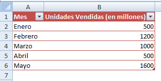](http://raymundoycaza.com/wp-content/uploads/2012120732431.png)

Bien, nada del otro mundo, ¿verdad?

Ahora, si creamos un gráfico rápido para estos datos, nos quedaría algo similar a esto:

[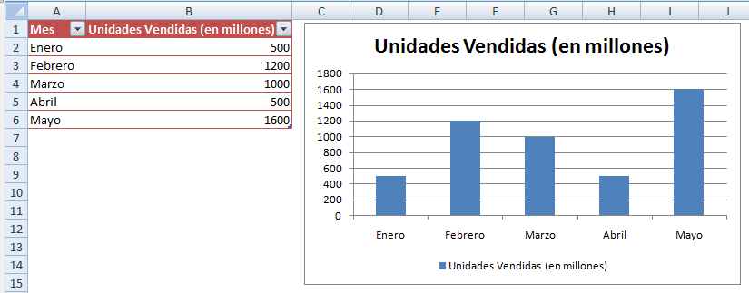](http://raymundoycaza.com/wp-content/uploads/2012120738131.png)

Y hasta aquí todo se desarrolla como un día más en nuestra vida laboral. Pero, ¿qué hacer para darle ese toque diferente a nuestro gráfico?

## Graficar en Excel de un modo diferente

#### _01_ Ajustes iniciales.

Vamos a insertar un nuevo gráfico, pero en lugar de usar uno de columnas, ahora vas a utilizar uno de barras apiladas:

[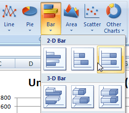](http://raymundoycaza.com/wp-content/uploads/2012120716131.png)

Una vez que hayas creado el gráfico, te quedará algo como esto:

[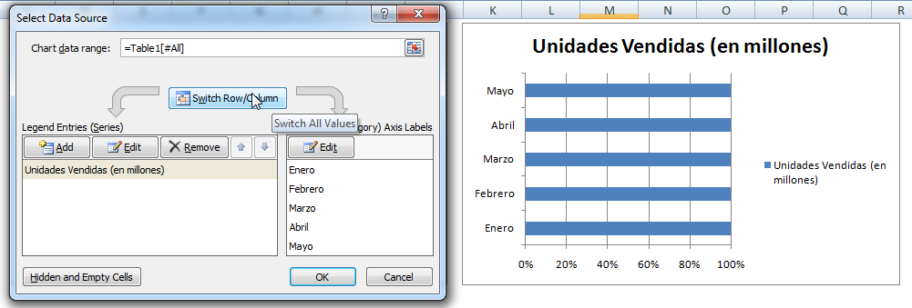](http://raymundoycaza.com/wp-content/uploads/2012120745271.png)

#### _02_ Transponiendo los datos.

Para que la técnica funcione, en este caso deberás intercambiar las filas por las columnas, presionando en el botón "Switch Row/Column" que te muestro en la imagen (en español el botón está en la misma ubicación, así que no hay pierde)

Una vez hayas realizado este paso, te quedará el gráfico que puedes apreciar a la derecha:

[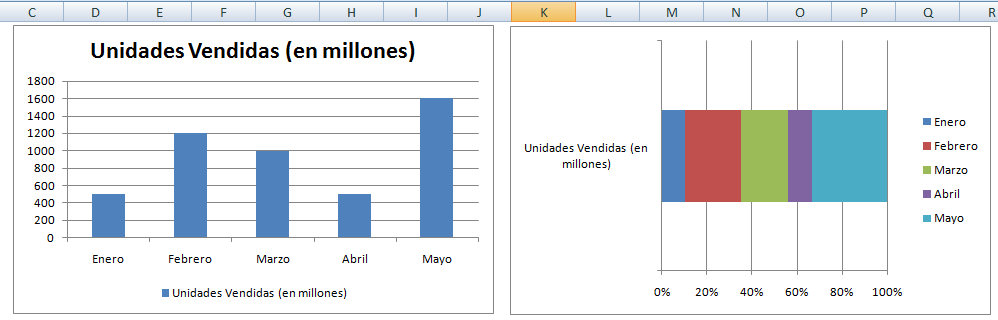](http://raymundoycaza.com/wp-content/uploads/2012120750231.png)

Sí, lo sé. Se ve algo feo. No te preocupes, apenas comenzamos.

#### _03_ Colocando la imagen de fondo.

El siguiente paso, es utilizar una imagen de fondo. Para hacerlo, pincha sobre la parte interna del gráfico (donde están las líneas verticales de la grilla), clic derecho y selecciona la opción "Format Plot Area"

[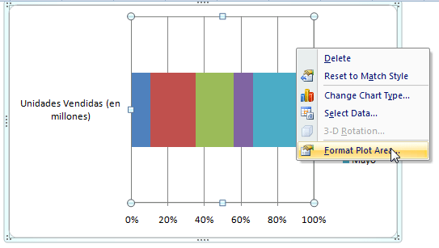](http://raymundoycaza.com/wp-content/uploads/2012120728191.png)

En la sección "Fill" (Relleno) elige la opción "Picture or texture fill" (1) y luego pincha en el botón "File..." para que elijas la imagen de tu preferencia (2).

[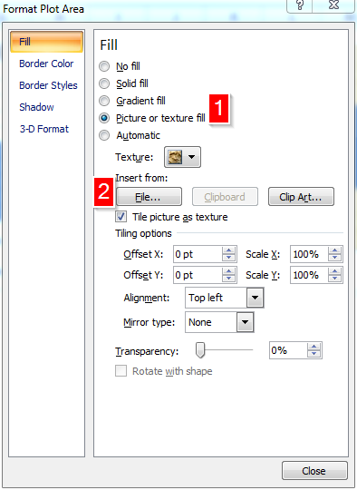](http://raymundoycaza.com/wp-content/uploads/2012120730271.png)

Como ves, yo elegí la imagen de un cigarrillo para mi gráfico. Ya te vas dando una idea de lo que pretendo, ¿no es verdad?

[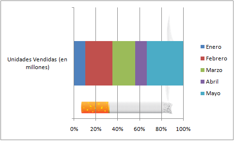](http://raymundoycaza.com/wp-content/uploads/2012120737181.png)

#### _04_ Rellenando con las series.

Ahora, pincha con el botón derecho sobre una de las bandas de colores y selecciona la última opción "Format Data Series"

[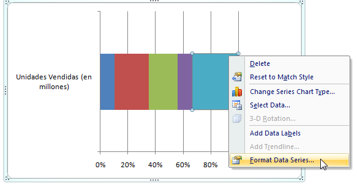](http://raymundoycaza.com/wp-content/uploads/2012120721401.png)

En la ventana de diálogo que verás a continuación, mueve el slider "Gap With" hacia la izquierda, hasta que quede en 0%

[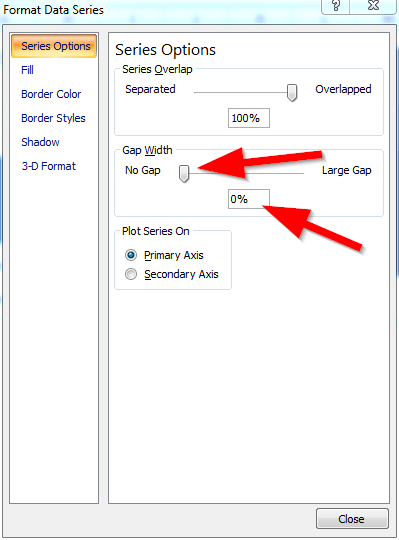](http://raymundoycaza.com/wp-content/uploads/2012120723532.png)

Hecho esto, solo cierra la ventana y tu gráfico habrá cambiado una vez más. Ahora lucirá como ves en la siguiente imagen:

[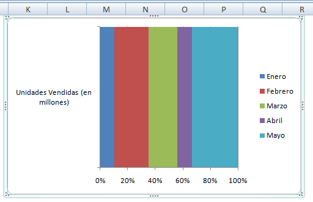](http://raymundoycaza.com/wp-content/uploads/2012120726501.png)

Se ha cubierto el cigarrillo. No importa. Es parte del truco ;)

#### _05_ Hazlas transparentes.

Ahora vas a realizar un paso más. Vas a pinchar con el botón derecho sobre una de las bandas de colores y selecciona la opción "Format Data Series".

[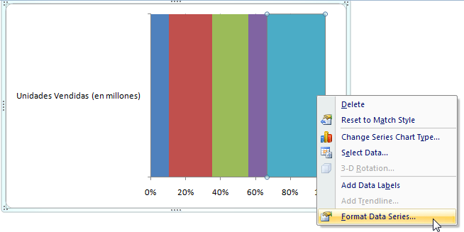](http://raymundoycaza.com/wp-content/uploads/2012120741481.png)

En la ventana de diálogo, vas a seleccionar la sección "Fill" (1) y eliges la opción "No Fill" (sin relleno) (2)

[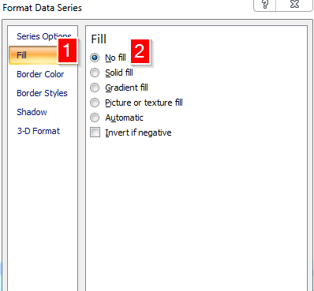](http://raymundoycaza.com/wp-content/uploads/2012120743121.png)

Y luego seleccionas la sección "Border Color" (1), eliges la opción "Solid Line" (2) y seleccionas el color gris(3)

[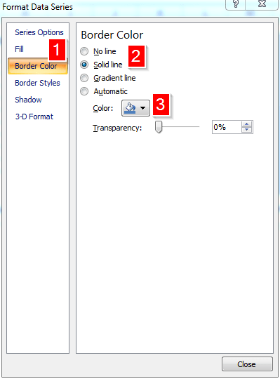](http://raymundoycaza.com/wp-content/uploads/2012120747251.png)

Como paso final, seleccionas la sección "Border Styles" y en el parámetro "Width" eliges el valor 3.

[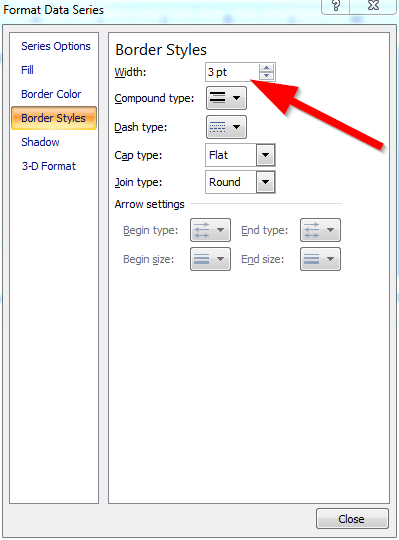](http://raymundoycaza.com/wp-content/uploads/2012120748361.png)

Esto debes repetirlo por cada una de las secciones de tu barra apilada. Al final, debe de quedarte un gráfico como este:

[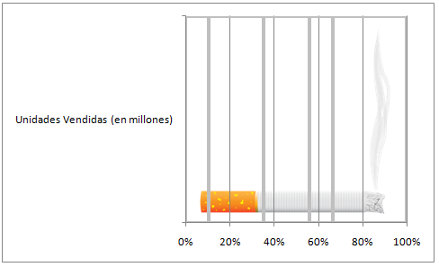](http://raymundoycaza.com/wp-content/uploads/2012120753221.png)

#### _06_ Ajustes finales.

Ahora, quitaré las líneas verticales de la grilla. Eliminaré el eje vertical y le pondré el mismo color gris de fondo al gráfico, quedándome algo como esto:

[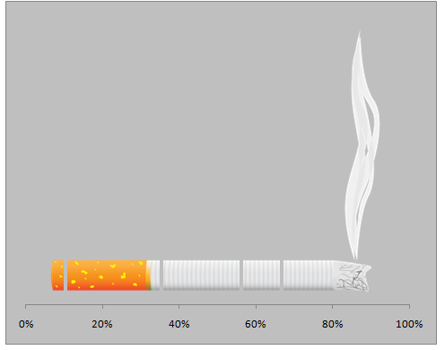](http://raymundoycaza.com/wp-content/uploads/2012120755422.png)

¡Y ya está! Hemos logrado el efecto visual de un cigarrillo dividido en partes proporcionales a las ventas de cada mes. Ahora le pondrás las decoraciones que acostumbras para que se vea más chulo.

[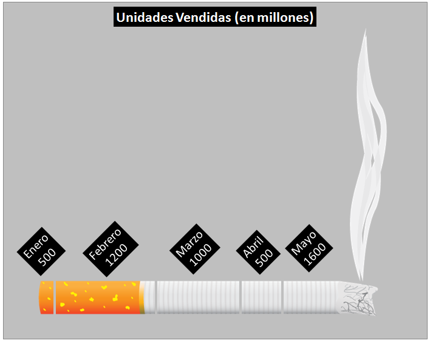](http://raymundoycaza.com/wp-content/uploads/2012120814371.png)

¿Qué te parece? Has realizado tu "infografía" utilizando la herramienta de toda la vida: Excel. No me dirás que no resulta chulo un gráfico de estos :P

Además, con imaginación y algo de trabajo, podrás realizar casi cualquier variante. El límite es la imaginación.

En este ejemplo he dejado un escenario sencillo para centrarnos sobre la técnica y que ésta sea más fácil de asimilar.

Si quieres resaltar más la separación de los segmentos del cigarrillo, puedes utilizar un valor más alto que 3 en el ancho del borde cuando edites el formato de cada segmento de la barra apilada.

¡Hasta la próxima!
