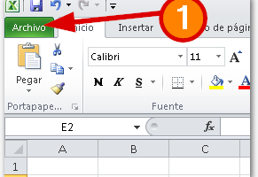
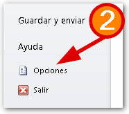
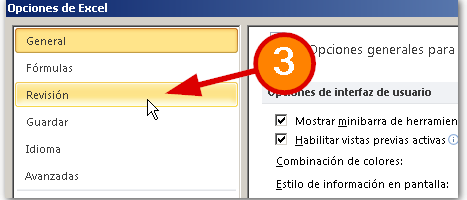
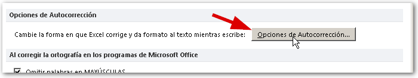
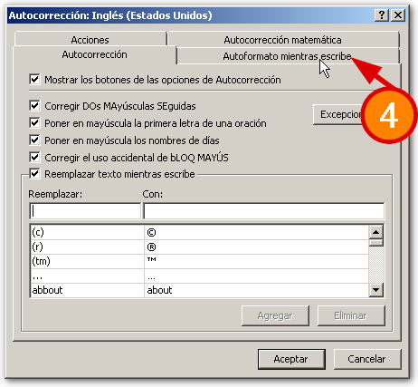
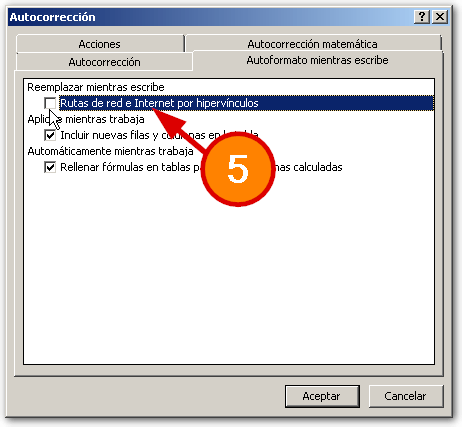
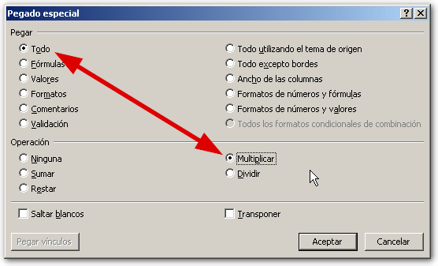

A veces estamos trabajando con Excel y tenemos que copiar un enlace o una dirección de correo. Entonces nuestro querido Excel, muy servicial, **convierte automáticamente ese texto en un enlace** sobre el que podemos hacer clic. Pero **¿y si no queremos que esto suceda?** Sigue leyendo y te cuento.

La creación automática de hipervínculos en Excel puede ser muy útil, no se puede negar; pero cuando nos interesa que esto no suceda, este pequeño detalle puede hacernos perder varios minutos de investigación.

Por eso hoy te contaré rápidamente cómo puedes hacer para evitar que Excel nos juegue en contra en éstos casos:

#### _01_ Si estás en Excel 2010, sólo debes seguir éstos pasos:

a) Pincha en la pestaña "Archivo" y luego pincha en la sección "Opciones".

b) En la ventana de "Opciones de Excel" que se muestra, debes ir a la sección "Revisión" y pincha sobre el botón "Opciones de Autocorrección...".

c) En la nueva ventana que se abre, pincha sobre la pestaña "Autoformato mientras se escribe".

d) Quita la marca donde dice "Rutas de red e Internet por hipervínculos".

e) Pincha en "Aceptar" y cierra los cuadros de diálogo.

#### _02_ Si estás en Excel 2007, el procedimiento es muy similar:

a) Pincha en el botón de Office y luego pincha sobre el botón "Opciones de Excel".

b) En las opciones elige la sección "Revisión" y pincha en el botón "Opciones de autocorrección".

c) En la pestaña "Autoformato mientras escribe" quita la marca donde dice "Rutas de red e Internet..."

#### _03_ En Excel Clásico (Excel 2003) la cosa no cambia mucho:

Sólo debes de ir al menú Herramientas->Opciones->Ortografía->Opciones de Autocorrección-Autoformato mientras escribe…

Y seguir los mismos pasos.

## ¡Y lo has logrado!

Ahora Excel ya no crea hipervínculos automáticos. ¡No lo hará más! Hasta que tú decidas que quieres que todo quede como antes :D

En este caso tendrás que repetir el proceso y esta vez marcar la casilla para que Excel se comporte como antes con los hipervínculos.

## ¿Otra forma de hacerlo? ¡Claro!

Si tu caso es diferente y no puedes o quieres hacer estos pasos, también hay posibles soluciones que te darán una mano. Aquí te las dejo para que te sirvas tú mismo/a.

#### _04_ CTRL + Z

Imagina que sólo estás trabajando con una dirección web o de correo y no te interesa hacer toda esta vuelta... Simplemente después de escribirla, verás que se convirtió en hipervínculo (cuando pasas el puntero del ratón se convierte en una manito y al pinchar te envía al navegador o a tu cliente de correo) ¿verdad?

No hay problema. Inmediatamente después de que suceda esto, tú debes de presionar el atajo CTRL Z y verás que el text sigue ahí; ¡pero el hipervínculo desapareció!

#### _05_ Macros everywhere

Aquí las macros también pueden salvarte el día. Sólo debes de crear una pequeña rutina como ésta:

Sub EliminarHipervinculos()

Cells.Hyperlinks.Delete

End Sub

Ahora ejecútala y verás cómo desaparecen los hipervínculos que se han creado en tu hoja de Excel. Si tienes muchos en tu hoja de trabajo, ésta solución seguramente va a ser un gran alivio para ti :D

#### _06_ ¡Multiplícalos!

Otra forma de lograr eliminar esos hipervínculos no deseados, es apoyándonos en un sencillo truco:

Escribe un número, puede ser el 1 en una celda. Ahora selecciona esa celda y cópiala.

Luego, selecciona o "sombrea" todo el rango donde tienes los hipervínculos. Pincha con el botón derecho del ratón y elige la opción "Pegado Especial".

En el cuadro que se muestra, sólo elige la opción "Multiplicar" y pincha en aceptar.

Verás cómo ahora los hipervínculos han desaparecido como por arte de magia.

## ¡Ahora, a practicar!

Mis consejos son el 20% de tu aprendizaje. El 80% restante lo pones tú, practicando todos y cada uno de ellos. Así que ahora ponte a practicar lo aprendido y no olvides crear tu cuaderno de apuntes para que no olvides trucos como este. Sencillos pero útiles.

¡Nos vemos!
