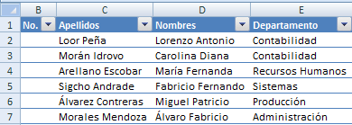
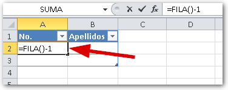
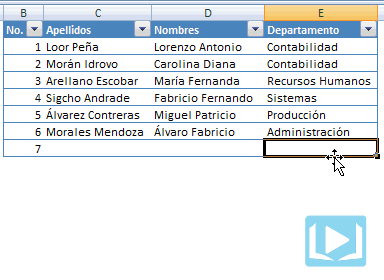

## El escenario

Cuando realizamos una tabla en Excel que nos sirva como base de datos (por ejemplo un listado de los empleados de nuestra empresa), podemos vernos en la necesidad de numerar cada línea, ya sea por orden, o para asignarle un identificador único a cada registro para su posterior uso durante la recuperación de datos.

## El problema

Esta numeración tendríamos que hacerla manualmente: la podemos escribir directamente o podemos utilizar la técnica de auto-relleno, arrastrando con el mouse cada vez que ingresemos un nuevo número; pero sigue siendo un proceso manual.

Podrías escribir en la primera línea el número 1 y a partir de la segunda utilizar la fórmula:

\=B2+1

Arrastrando esta fórmula conseguimos el efecto deseado pero, una vez más, no conseguimos que sea automático.

Al insertar una nueva línea en la tabla, la fórmula no se copia automáticamente. Esto se debe a que la fórmula no es consistente en todas sus líneas, es decir que en la primera fila no tiene fórmula y por eso Excel no auto completa esa columna.

_Recuerda: para lograr la automatización de tus modelos en Excel, debes comenzar por identificar los puntos de ingreso que no deberían ser manuales._

## La solución

Para superar este inconveniente, una solución es utilizar la función FILA()

La función FILA() no recibe parámetros y su finalidad es la de devolver el número actual de la fila en la que está ubicada la fórmula. Esto significa que si la fórmula está en la fila 2, FILA() devolverá el número 2.

Aquí surge otro inconveniente: necesariamente nuestro primer registro siempre estará, por lo menos, en la fila 2. Esto ocasionará que la función row() indique el número de registro 2, cuando estamos en el primero.

Como te muestro en el gráfico, la forma de ajustar esto sería restándole el número de filas ‘excedente’ directamente en la fórmula. En el ejemplo que te muestro tengo una fila por encima de mi primer registro, por lo tanto, le resto una unidad (1)

Ahora sí, Excel ha completado automáticamente la columna copiando mi fórmula en todas sus celdas y, lo que es mejor, cada vez que insertes un nuevo registro aparecerá con su correspondiente número de línea.

## El ejemplo en acción

En la siguiente animación puedes ver el ejemplo funcionando tal y como lo queríamos. Cada vez que insertes un nuevo registro, Excel se encargará de asignarle un nuevo número que será único para cada uno.

**Importante**: Debes utilizar una tabla para que el rango se actualice automáticamente.

## ¿Y tú, ya usas la técnica de auto-numerar registros en Excel?

Puede ser una técnica sencilla, pero dentro de un contexto de automatización puede ahorrarnos un par de molestias al evitarnos el cálculo del siguiente número y su asignación.

¿Qué otras técnicas se te ocurren para un escenario como este? Me encantaría conocerlas y que podamos enriquecer esta entrada.

#### _Créditos_

_Foto cortesía de:_ [http://www.flickr.com/photos/rbowen/4136648237/](http://www.flickr.com/photos/rmgimages/4882451468/)

#### _**Más información:**_

[http://office.microsoft.com/es-es/excel-help/crear-o-eliminar-una-tabla-de-excel-en-una-hoja-de-calculo-HA010013764.aspx](http://office.microsoft.com/es-es/excel-help/crear-o-eliminar-una-tabla-de-excel-en-una-hoja-de-calculo-HA010013764.aspx)

¡Ah! Se me olvidaba… No dejes de compartir esta entrada en las redes sociales usando los botones de Facebook y Twitter.

¡Nos vemos!
