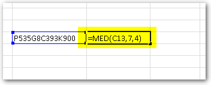

La función MED, es de esas funciones que nos quitan de encima mucho trabajo aburrido, cuando un dato se encuentra dentro del texto de una celda.

Imagínate lo desesperado que te verás cuando se trate de un montón de celdas a las que tienes que sacar un dato específico.

La función MED en Excel nos devuelve los caracteres de entre una cadena de texto, con solo proporcionar la posición inicial y el número de caracteres que deseamos extraer.

Esta función es un salvavidas cuando, luego de importar tus datos a Excel, te das cuenta de que el dato que necesitas extraer, está dentro de otro dato.

Me explico.

Imagina que tienes un listado de códigos de productos. Dentro de cada código de producto se encuentran los códigos de las categorías de éstos productos. Digamos, algo así:

_P535G8**C393**K900_

Como ves, tienes el código P535G8C393K900, pero tú quieres extraer sólo el código de la categoría, el cual está resaltado en el cuadro anterior.

En este caso es el C393. ¿Cómo lo sacas de ahí, sin tener que hacerlo manualmente?

¡Pues con la función MED!

## Sintaxis de la función MED

_MED(texto, posición\_inicial, núm\_de\_caracteres)_

1. **texto**: La cadena de texto original que contiene el dato que necesitamos extraer.
2. **posición\_inicial**: la posición del primer carácter que se desea extraer.
3. **núm\_de\_caracteres**: número de caracteres a extraer.

Todos los argumentos son obligatorios.

Si por alguna razón indicamos una posición inicial mayor que la longitud de la cadena de texto original, entonces la función MED nos devolverá una cadena de texto vacía.

## Vamos con el ejemplo.

Usando el mismo ejemplo que te di hace un momento, vamos a llevarlo a Excel y aplicaremos la función de acuerdo a la sintaxis que ya te expliqué.

Como ves, escribí la función MED y en sus argumentos puse:

1. La referencia a la celda donde se encuentra el **texto completo**.
2. El número de carácter desde donde quiero empezar (en este caso, el código buscado empieza desde la posición 7)
3. El número de caracteres que quiero tomar (en este caso, el código tiene 4 caracteres de longitud)

De esta manera la función MED nos ayuda a extraer uno o varios caracteres que se encuentren en medio de una cadena de texto.

**Para tener en cuenta:**

La función MED, antes tenía el nombre de EXTRAE. Así que si no te aparece MED, búscala como EXTRAE. Se utiliza exactamente igual.

## Ahí lo tienes

Ahora, sí, ya tienes un salvavidas para esos casos en los que tienes que sacar datos de entre más datos. Pon en práctica el uso de esta función y hazla parte de tu arsenal para tus trabajos con Excel.

¡Nos vemos!
