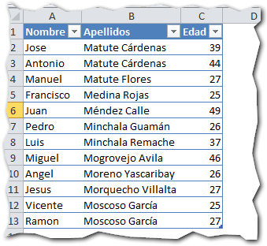
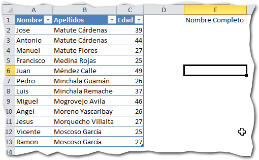
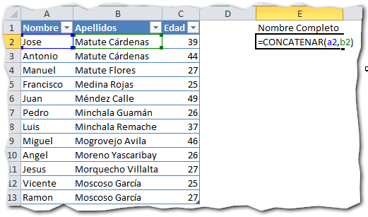
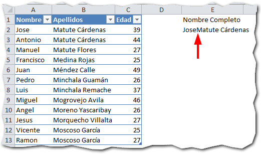
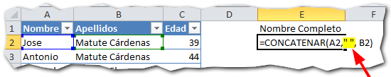
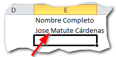
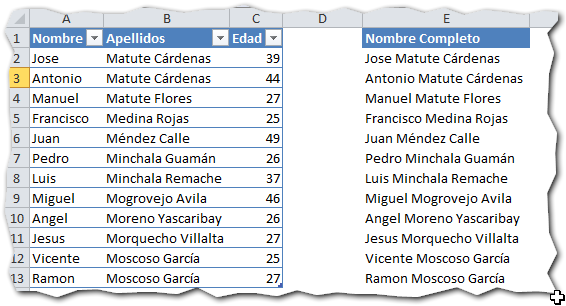

## ¿Qué hace?

**La función Concatenar en Excel**, pertenece al grupo de funciones de texto y su misión es la de unir, pegar, juntar, **concatenar** dos o más porciones de texto en una misma celda.

## ¿Para qué sirve?

Concatenar texto es una tarea a la que, tarde o temprano, terminaremos dedicando tiempo si trabajamos muy seguido con Excel.

Imagina pues, que tienes una base de datos con los nombres de los empleados de la nómina en una columna y sus apellidos en otra.

Ahora, te ha surgido la necesidad de mostrar en una columna estos dos datos juntos. ¿Cómo lo harías sin tener que estar copiando y pegando, línea a línea por cada empleado?

¡Exacto! Con la función Concatenar.

## ¿Cómo se usa?

La función Concatenar requiere de al menos un parámetro como mínimo hasta un máximo de 255. En la siguiente imagen puedes ver un ejemplo de la función con tres parámetros o cadenas de texto:

 \[aviso tipo="red" titulo="Límite de parámetros"\]Tanto en **Excel 2007** como en **Excel 2010**, el límite de parámetros o argumentos que utiliza la función Concatenar, es de 255.

Si aún utilizas la versión **Excel 2003**, te encontrarás con que el límite está en 30 argumentos.\[/aviso\]

### Ejemplo práctico.

Siguiendo con el ejemplo de los nombres y apellidos, vamos a utilizar la función Concatenar en un ejemplo real.

En la siguiente imagen verás que tengo los nombres en una columna y los apellidos en otra.

Ahora, me interesa tenerlos en una sola columna a la que llamaré "Nombre Completo":

Utilizando la función Concatenar, voy a juntar cada nombre con sus respectivos apellidos, siguiendo la sintaxis que te mostré en la primera figura de esta entrada:

Como ves, he realizado la concatenación del nombre con los apellidos, con solo indicarlos como parámetros de la función Concatenar y en el orden en el que quiero que aparezcan en el resultado final.

Ahora, al ingresar tu fórmula te darás cuenta que el resultado no es el esperado.

El nombre y el primer apellido están "pegados". Lo que nos interesaría es que exista un espacio entre ambos, por estética y para facilitar su lectura.

Usando el mismo principio, vamos a concatenar el nombre con un espacio, seguido de los apellidos, como te muestro aquí:

Y ahora sí, se muestra un espacio justo entre el nombre y los apellidos con lo que el resultado se ajusta a lo que esperábamos.

Solo te resta copiar y pegar esta fórmula hacia abajo y tendrás lista tu nueva columna en menos de lo que canta un gallo.

## Posibles alternativas

Una forma de concatenar de manera más simple en Excel, es utilizando el operador "&".

Así, en el caso de que quisieras concatenar solo dos celdas, podrías hacerlo de la siguiente forma:

`¡A1**&**A2`

`=A1**&**" "**&**A2`

Esto podrías utilizarlo como una versión rápida de la función Concatenar. ¡Siempre hay más de una forma!

¡Nos vemos!
