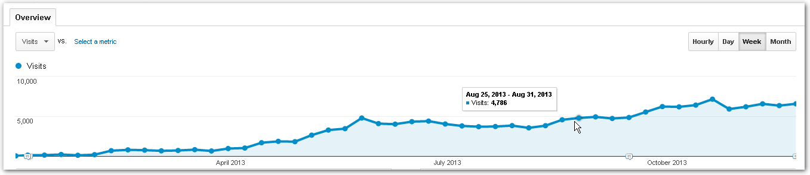

Detrás de todos los tutoriales de Excel, hay tras bambalinas mucho trabajo y un montón de tráfico que administrar. Ahora mismo estoy cerca de los **30,000 visitantes cada mes**.

Es por esto que has visto un cambio en el diseño de mi blog, así como una leve mejoría en **la velocidad de la página**. He migrado a un mejor plan de alojamiento, para poder palear las consecuencias del relativo éxito de éste sitio web.

En realidad, me ha gustado el resultado obtenido hasta ahora y por eso he invertido muchas horas de mi tiempo para realizar estos cambios de los que te comento y así poder mejorar tu experiencia desde ese lado.

Aquí te muestro un resumen del año:

De un total de 53 visitantes semanales, en enero, he llegado a recibir un total de **7,135** visitantes en una semana. Lo que representa un aproximado de **28,000 visitantes mensuales**.

Nada mal, ¿no crees?

Éstos números sencillos no dicen mucho; pero me dan una idea de que el blog va despegando y que el tema de Excel gusta y gusta cada vez más.

Y no es para menos. Cada día, Excel demuestra ser **una herramienta imprescindible en la oficin**a :D

Quiero aprovechar el post para agradecerte, por adelantado, éste año en el que me has acompañado leyendo cada entrada y participando en los comentarios.

Un año en el que no voy a negar que hubieron dificultades; pero mi contrato personal me impide abandonar y ser parte de las estadísticas (los blogs generalmente mueren dentro del rango de uno a tres años -ya vamos dos- :D )

Gracias por esos correos de apoyo, de agradecimiento y de sugerencias. Ten la seguridad de que éste blog seguirá creciendo y desarrollando nuevo contenido cada semana, para lograr nuestro objetivo: **Dominar Excel, paso a paso**.

¡Nos vemos!
