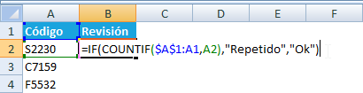
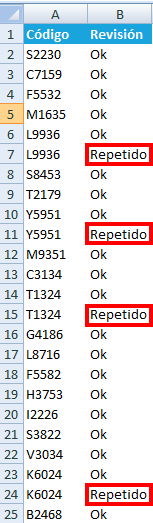
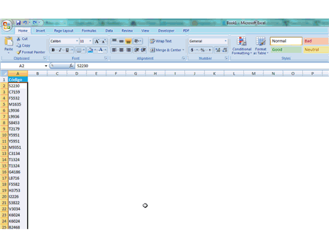

Seguramente has trabajado con alguna columna en nuestra Hoja de Trabajo, en la que **no se deben repetir datos**. Por supuesto que llevar este control "al ojo" es tedioso y muy poco confiable.

Para ayudarte con este tema, hoy te muestro **dos técnicas** para detectar valores duplicados en Excel.

### Forma #1

Utilizando una columna auxiliar, utiliza la siguiente fórmula para detectar los valores que están repetidos.

Fórmula en inglés:

\=IF(COUNTIF($A$1:A1,A2), "Repetido", "Ok" )

Fórmula en español:

\=SI(CONTAR.SI($A$1:A1;A2);"Repetido";"Ok")

Supongamos que tienes tus datos en la columna A. Para poder detectar los duplicados, utilizarás la columna B como auxiliar e ingresarás la siguiente fórmula en la celda B2.

Ahora copiarás la celda B2 hacia abajo, hasta donde te sea necesario:

**Nota:** Para adaptarlo a tu archivo, debes cambiar $A$1:A1,A2 por la ubicación de tus datos a validar.

### Forma #2

Utilizando Formato Condicional.

Si no quieres utilizar una columna auxiliar, puedes hacer uso del **Formato Condicional** para resaltar con color aquellas celdas que están duplicadas.

Para ésto, utilizaremos una variante de la fórmula anterior:

Fórmula en inglés:

\=COUNTIF($A$1:A1,A2)

Fórmula en español:

\=CONTAR.SI($A$1:A1;A2)

Utilizando el mismo caso, en que tienes tus datos en la columna A, seleccionaremos todas las celdas de dicha columna y aplicaremos el Formato Condicional, utilizando la fórmula indicada, tal y como te muestro en la siguiente imagen:

**Nota:** Para adaptarlo a tu archivo, debes cambiar $A$1:A1,A2 por la ubicación de tus datos a validar.

¡Listo! Ahí tienes dos formas para detectar duplicados en Excel. Espero que lo apliques a tu archivo y te resulte de utilidad.

Créditos foto: http://www.flickr.com/photos/popilop/331357312/
