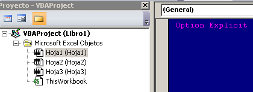
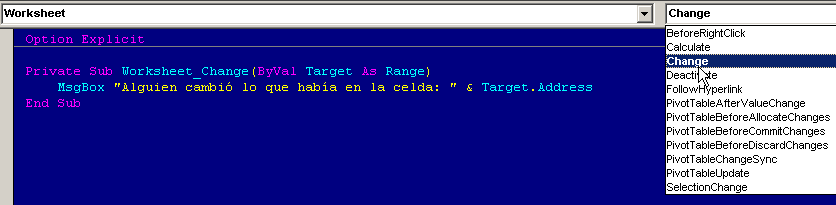
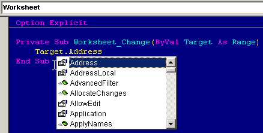
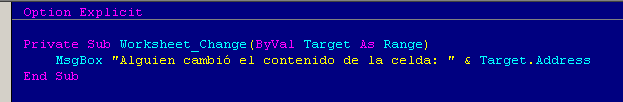
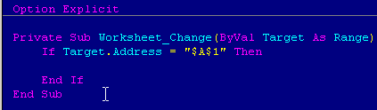
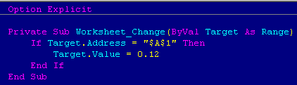

Cuando trabajas en tus proyectos de Excel, muchas veces sueñas con reducir un poco ese tiempo que te gastas haciendo tareas repetitivas. ¿Verdad que sí?

No es que sean grandes cosas, solo te das cuenta que no tiene sentido **estar haciendo la misma cosa, de la misma forma todos los días**, cuando podrías usar ese tiempo "perdido" para hacer tu trabajo.

Y una de esas cosas que te gustaría hacer, es que tu aplicación pueda detectar el cambio en una celda de Excel.

Pero ¿cómo hacerlo?

¿Macros? ¡Ni idea!

Es sencillo, una vez que te cuentan cómo se hace. Sigue leyendo, porque aquí te muestro el código base, para **detectar cuando el usuario realiza un cambio** en cualquiera de las celdas de una hoja de cálculo.

## El evento Worksheet\_Change

Tranquilidad. Simplemente cada cosa tiene su nombre y cuando tienen nombres largos, parece más complicado de lo que realmente es.

El evento **Worksheet\_Change**, simplemente es la forma de decir:

`Cada vez que "Alguien" cambie algo en la hoja actual, sucederá lo que digo a continuación.`

Para trabajar con este evento, sólo debes acceder al editor de **VBA** y dar doble clic sobre el nombre de la hoja donde vas a crear tu código.

Si no recuerdas cómo ingresar al editor de VBA, [lee esto y vuelve enseguida](http://raymundoycaza.com/escribe-tu-primera-macro-en-excel/).

¿Todo listo? Bien. Sigamos.

### Cómo detectar el cambio en una celda.

Una vez dentro del objeto hoja, se mostrará la ventana en blanco, tal como te explico en el artículo que acabas de leer. En las dos listas que te aparecen,deberás elegir las siguientes opciones:

1. Worksheet, en la primera lista.
2. Change, en la segunda lista.

Al unirse estas dos palabras, forman el evento **Worksheet\_Change**.

La primera lista, hace referencia al objeto sobre el cual debe suceder el evento, mientras que la segunda lista hace referencia al tipo de evento que se dará sobre dicho objeto.

¿Sencillo, verdad?

### El argumento target : El secreto de la receta.

Por defecto, es decir, automáticamente, verás que se asigna un [argumento o parámetro](http://raymundoycaza.com/que-son-los-argumentos-en-excel/) llamado "Target".

Esto vendría a significar "Objetivo". Es decir, cuál es la celda objetivo en el cambio que se está dando.

Dicho de otra forma, Excel reconoce automáticamente cuál es la celda que cambió y manda su [referencia](http://raymundoycaza.com/que-es-la-referencia/) a través de este argumento.

### ¿Y cómo puedo "sacar" la dirección que tiene esa referencia?

Con la propiedad "Address".

Esta propiedad contiene la dirección del rango contenido en el argumento "Target". Así, para mostrar cuál es la referencia de la celda que cambió, puedes usar un [cuadro de mensaje](http://raymundoycaza.com/mensaje-en-excel/), así:

`MsgBox "Alguien cambió lo que había en la celda: " & Target.Address`

siguiendo todos los pasos, tu código debería quedar, más o menos así:

## Y en qué ocasiones esto me resultaría útil?

Bueno, vamos a utilizarlo en ejemplos reales más adelante; pero para que te hagas una idea, te mostraré una forma de evitar que alguien cambie sin querer un valor de una celda.

Por ejemplo, imagina que el **porcentaje de comisiones** de venta que manejas en tu archivo de control, es de un 12 % y lo colocas en una celda para realizar tus cálculos.

¿Qué pasaría si por error se altera ese dato?

¡Sí! Eso y mucho más.

Entonces, ¿cómo podría evitar que suceda?

Primero, debemos detectar que alguien cambió la celda. Para esto, usarás lo que acabas de aprender y "preguntarás" cuál es la dirección de la celda que cambió, así:

Entonces, si es verdad que alguien cambió la celda A1, lo que harás será asignarle el porcentaje correcto, así:

De este modo, cualquiera que quiera cambiarle o que por error le cambie el valor de esta celda, verá cómo retoma el valor original y tus cálculos estarán siempre a salvo.

¡Muy útil! ¿No lo crees?

Ahora ve y pon en práctica lo aprendido. Incluso si ahora mismo no lo vas a necesitar, es la mejor forma de dejarlo "archivado" en tu memoria.

No dejes de compartir este artículo en Facebook o Twitter, usando los botones que encuentras junto al mismo.

¡Nos vemos!
