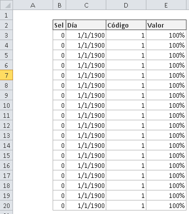
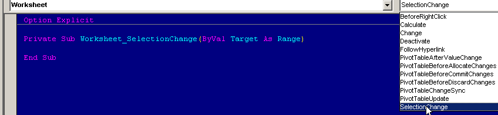
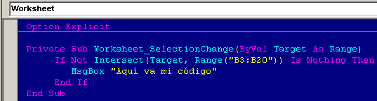
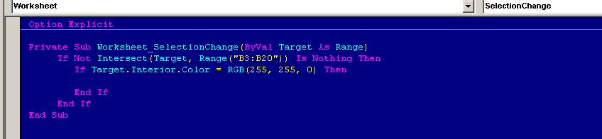
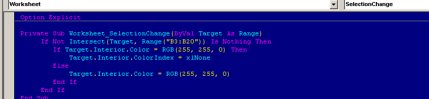
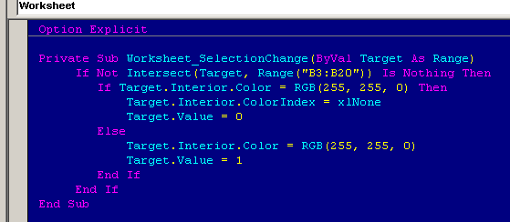
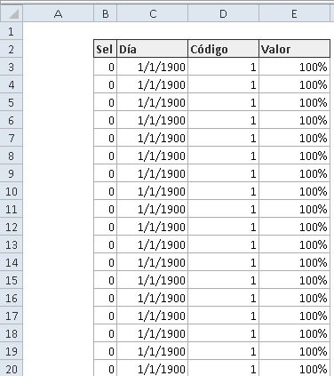

Muchas veces extrañamos la forma de trabajar de otra aplicación, o quisiéramos darnos un pequeño capricho con Excel, para poder darle a nuestros usuarios esa comodidad que necesitan para realizar su trabajo diario.

Por ejemplo, una **forma fácil de seleccionar un conjunto de celdas** para realizar una operación sobre ellas, sería hacer clic sobre ellas mientras se van marcando (incluso sin necesidad de tener la tecla Control presionada)

Aunque la mayoría de las veces, la solución pasa por cosas tan sencillas como ésta, no necesariamente es tan obvio. Por eso, he querido traerte este resumen para mostrarte cómo marcar una celda con un clic, usando VBA.

## ¿Para qué yo querría algo así?

Cuando te cuento algo como esto, seguramente la primera pregunta que te haces es:

> "¿Y yo para qué querría hacer esto?"

La intención en esta idea, es poder realizar una selección más cómoda de las celdas que de alguna manera quieres "activar".

Lo que quiero decir, es que será una muy buena forma de facilitarle a tus usuarios el manejo de tu hoja de cálculo, especialmente si no son personas con mucho dominio de la herramienta.

Además, con ésto evitamos el uso de controles adicionales en tu hoja de cálculo, evitando tener que lidiar con un objeto adicional, que tal vez no sea necesario usar (o tal vez sí, depende de tu caso)

¿Una razón más? Sí. Para aprender más sobre las macros en Excel y saber cómo trabajan los eventos. Estos ejercicios son la mejor manera de ponerte en forma con las macros en Excel. Dicho esto... ¡Comencemos!

## ¿Cómo funciona?

Lo primero que haremos, será detectar el momento en que el usuario ha hecho clic sobre una de las celdas que nos interesan.

Para esto, aprovecharemos el evento **Worksheet\_SelectionChange**, de la misma forma que hicimos con [otro evento en el artículo anterior](1).

Una vez que hemos sido capaces de saber que se ha seleccionado la celda con el ratón o usando el teclado, el siguiente paso será verificar el estado de la la celda seleccionada.

Es decir, nos preguntamos: ¿La celda está "encendida" o está "apagada"?

Cuando tengamos la respuesta a esta pregunta, el siguiente paso será asignarle el estado correspondiente. Esto es, si está apagada, hay que encenderla, en caso contrario, hay que "apagarla".

Claro y sencillo, vas directo al punto. Ahora, ¿cómo lo haremos con el código?

Sigue leyendo y te lo cuento.

## Creando el código.

Primero, vamos a crear un pequeño listado que servirá de base para nuestro primer experimento. Algo así estará bien:



Como acabo de decirte, primero debemos detectar que una de las celdas de interés ha sido seleccionada.

En nuestro caso, las celdas que nos interesa revisar, son las de la columna B, así, el rango que usaremos será

```
`B3:B20`
```

Al igual que hicimos en el [artículo anterior](1), vamos a colocar nuestro código en un evento, pero en esta ocasión usaremos el evento:

```
`Worksheet_SelectionChange`
```

Cada vez que el usuario selecciona una nueva celda, este evento se activará y se ejecutará todo el código que se encuentre dentro de él.



Ahora, como no nos interesa que se active en cualquier celda, vamos a poner una condición para discriminar a todas las celdas que no se encuentren en el rango `B3:b20`



Una vez que ya tenemos controlada la situación del cuándo, ahora vamos a hacer la "pregunta": ¿La celda está "encendida" o está "apagada"?

Para esto, podemos preguntar por su valor o por su color. En mi caso, voy a preguntar por su color, así:



El código `255, 255, 0` representa al amarillo, si la celda está pintada de amarillo, entonces le quito el color (lo dejo en transparente), en caso contrario, la pinto de amarillo, de esta forma:



En este mismo código, podrías también asignarle un valor a la celda que se enciende, para usarlo de acuerdo a tu conveniencia, usando un código como éste:



## El ejemplo trabajando.

Como puedes ver, nuestra aplicación funciona correctamente y realiza exactamente lo que queríamos. Ahora, nada más falta que le agreguemos alguna funcionalidad adicional, para personalizarlo según tus necesidades.



## Descarga el archivo terminado.

¿Te ha gustado el trabajo? Si te interesa descargar el archivo terminado, para comparar o para guiarte, solo sigue las instrucciones (es gratis).

\[sociallocker id="5276"\][Pincha aquí para descargar el archivo.](http://raymundoycaza.com/wp-content/uploads/20140121-como-marcar-una-celda-con-un-clic-usando-vba.xlsm "Pincha aquí para descargar el archivo.")\[/sociallocker\]

**Nota:** En este ejemplo, no he realizado ninguna validación, por lo que no están considerados todos los posibles errores. Dependiendo de lo que necesites, deberás adecuarlo a tu realidad.

## Conclusión

Con pequeños trucos como este, podemos diseñar aplicaciones en Excel que brinden facilidad al usuario, al momento de trabajar con ella, en lugar de convertirse en una pesadilla que desea evitar a toda costa.

Esto, nos permite crear soluciones reales a los problemas de nuestro negocio, sin recurrir a soluciones más costosas, todo está en la imaginación y dedicarle algo de tiempo para diseñar esa solución que estás necesitando.

¡Nos vemos!
