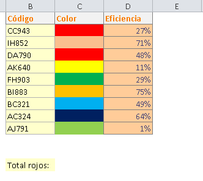
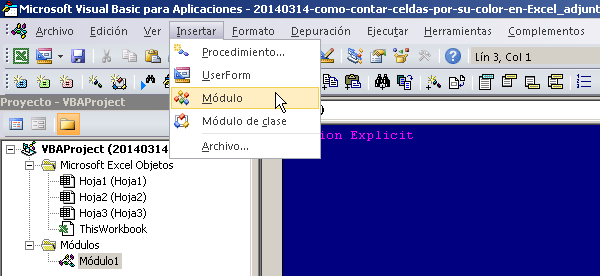
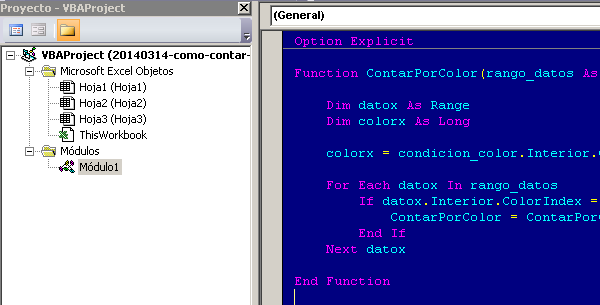
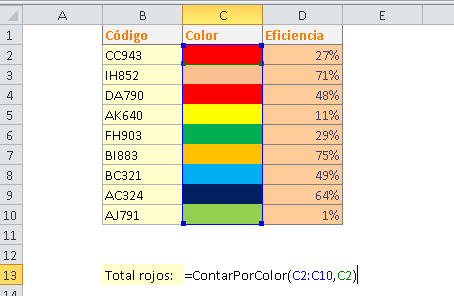
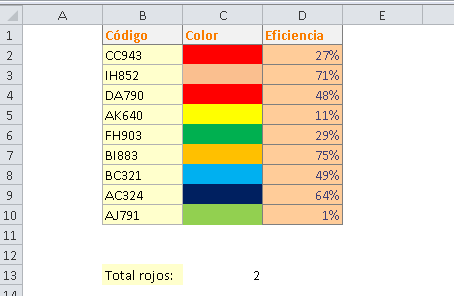

Tenemos un sinfín de situaciones en nuestros trabajos diarios, necesidades que surgen en nuestro negocio de la noche a la mañana y ya no sabes qué traerá el siguiente día. Incluso puedes encontrarte que, por alguna razón, es necesario poder **contar el número de celdas por su color**.

**Imagina** que tienes un archivo parecido al que te muestro en la imagen:

Como ves, no siempre es posible simplemente usar un valor escrito directamente en la celda o en las de su alrededor. Entonces ¿Cómo hacerlo?

## Contar el número de celdas por su color, en tres pasos.

Este es un consejo rápido, así que voy a mostrarte directamente cómo conseguir esta funcionalidad, usando macros, en tres pasos:

1. Crea una nueva macro en tu libro de trabajo. Si no recuerdas cómo era, [refresca tu memoria haciendo clic aquí.](http://raymundoycaza.com/escribe-tu-primera-macro-en-excel/ "Crear una macro en Excel")
2. Ya que estés dentro del editor de VBA, inserta un nuevo módulo. Recuerda que es necesario tener organizado nuestro código desde el principio. [Haz clic aquí si quieres ver cómo se hace.](http://raymundoycaza.com/como-insertar-un-modulo-en-excel/ "Cómo insertar un módulo en VBA")
3. Una vez que ya tengas tu nuevo módulo, sólo copia y pega este código que te dejo a continuación: \[codigo\]Function ContarPorColor(rango\_datos As range, condicion\_color As range) As Long Dim datox As range Dim colorx As Long colorx = condicion\_color.Interior.ColorIndex For Each datox In rango\_datos If datox.Interior.ColorIndex = colorx Then ContarPorColor = ContarPorColor + 1 End If Next datox End Function\[/codigo\]

## ¡Y ya está!

Ahora sólo debes cerrar el editor de VBA y regresar a tu archivo. Seguramente ya quieres probar tu flamante función y es eso lo que vamos a hacer ahora.

En la celda que tú quieras, escribe la función: ContarPorColor(C2:C10, C2)

Donde el rango C2:C10 es el que contiene las celdas donde quiero contar por color. Tú deberías poner el rango que necesitas contar.

Por otro lado, C2, es la celda que tiene el color que me interesa contar. Por ejemplo, en este caso yo quiero contar cuántas celdas rojas hay en mi rango C2:C10.

El resultado será el siguiente (en mi caso):

## ¿Quieres descargar el ejemplo terminado?

\[sociallocker id="5276"\][Haz clic aquí para descargar el archivo.](http://raymundoycaza.com/wp-content/uploads//20140314-como-contar-celdas-por-su-color-en-Excel_adjunto.xlsm "Descargar el archivo.")\[/sociallocker\]

## Hemos terminado.

Y eso es todo, ahora simplemente debes usar la función ContarPorColor y pasarle los argumentos necesarios para que VBA haga el trabajo por ti. Verás cómo te ahorras horas de trabajo y dolores de cabeza con esta simple función.

¡Nos vemos!
