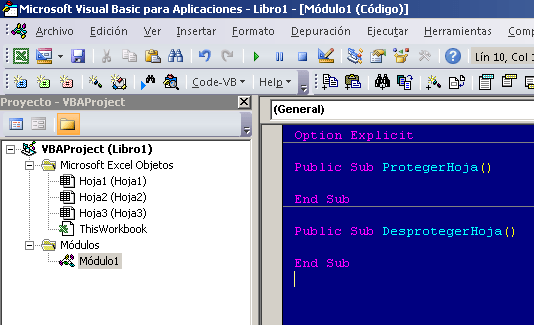
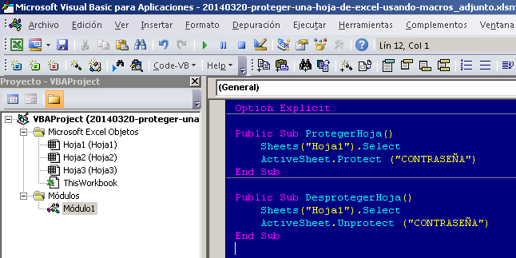
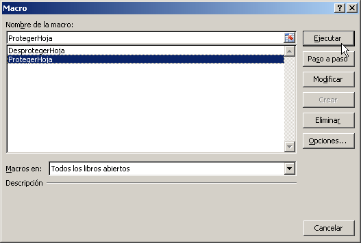
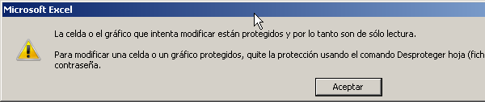

Sí, ya te conté acerca de cómo puedes [desbloquear una hoja de Excel](http://raymundoycaza.com/al-fin-puedes-desbloquear/ "Desbloquear una Hoja de Excel usando Macros"), usando macros, si te has olvidado de la contraseña. Pero ¿y qué si quiero hacer lo contrario?

Es decir, si quisiera proteger una hoja de Excel usando Macros.

###### ¿Y para qué?

Bueno, pues para permitir el acceso a una hoja solo cuando nosotros lo indiquemos dentro de nuestro código.

Imagina que, por ejemplo, tienes una hoja de registro de ventas, pero no quieres que nadie pueda escribir allí, hasta que hayan registrado una factura en la hoja de facturación.

Entonces, con este sencillo "truco", puedes impedir que el usuario escriba nada en esa hoja hasta que se cumpla el requerimiento: Des-proteges, escribes y proteges de nuevo. Así de sencillo.

Interesante ¿o no?

Déjame mostrarte cómo hacerlo:

\[pasos paso=1\][Inserta un módulo de VBA](http://raymundoycaza.com/como-insertar-un-modulo-en-excel/ "Cómo insertar un módulo en Excel") y escribe dos funciones, una para proteger y otra para des-proteger la hoja:\[/pasos\]

\[pasos paso=2\]Escribe el código para proteger y des-proteger la hoja\[/pasos\]

\[pasos paso=3\]Ejecuta tu macro y observa la magia\[/pasos\]

Ahora solo debes ejecutar tu macro, tal y como lo haríamos [con una macro grabada](http://raymundoycaza.com/como-grabar-macros/ "Cómo grabar Macros"). Ejecuta primero la macro "ProtegerHoja".

Si ya ejecutaste la macro "ProtegerHoja", entonces trata de hacer un cambio en tu hoja. Verás que no te lo permite y te muestra un mensaje como este:

Necesariamente vas a tener que ejecutar la macro "DesprotegerHoja", si quieres escribir o hacer cualquier cambio. Tienes el control sobre posibles "errores" en el ingreso de datos.

\[aviso titulo="Importante:" tipo="red"\]Ten en cuenta que esta no es una protección total, ya que en el [artículo anterior](http://raymundoycaza.com/al-fin-puedes-desbloquear/ "Cómo desbloquear una hoja de Excel"), te demostré que es posible saltarse esta protección. La idea es evitar esos datos erróneos que, nuestros usuarios involuntariamente, pudieran ingresar en las bases de datos.\[/aviso\]

## ¡Misión Cumplida!

Y así has conseguido tu objetivo, has protegido tu hoja usando macros y con una contraseña que el usuario no necesita saber. ¡Fácil y sencillo!

¿Te imaginas el provecho que le podrías sacar a este "truco"?

### ¿Quieres descargar el archivo de ejemplo?

[Haz clic aquí y descarga el archivo.](http://raymundoycaza.com/wp-content/uploads//20140320-proteger-una-hoja-de-excel-usando-macros_adjunto.xlsm "Haz clic y descarga el archivo.")

Ahora que tienes la idea de cómo hacerlo, cuéntame, ¿de qué forma piensas aprovechar esta técnica?

¿Crees que puede serte de alguna utilidad?

Te espero en los comentarios.

¡Nos vemos!

\[firma\]
