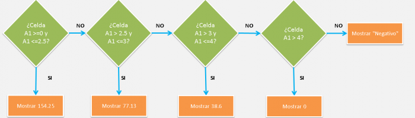

\[resumen\]En esta entrada te muestro con un ejemplo real de uno de mis lectores, cómo usar la función SI anidada; para que tengas más claro cómo se comporta dicha función en la vida real.\[/resumen\]

José, en [el artículo que escribí sobre la función SI](http://raymundoycaza.com/funcion-si-anidada/ "La función SI"), me preguntaba sobre cómo se puede utilizar dicha función en su archivo, sabiendo que las condiciones que debe cumplir, son las siguientes:

\[aviso titulo="José escribió:" tipo="purple"\]

Las condiciones que debe cumplir son:

- Hasta 2,5 =154.25
- De 2,5 a 3=77,13
- De 3 a 4=38,6
- Mayor a 4=0

\[/aviso\]

Con esto, José quiere decir que si una celda tiene un valor entre `0` y `2.5` entonces debe mostrar el valor 154.25 Así mismo, si la celda tiene un valor mayor a `2.5` y hasta `3`, entonces deberá mostrar el valor 77.13.

Si es mayor que `3` y hasta `4`, mostrará 38.6. Y, finalmente, si es mayor que `4` deberá mostrar el valor 0.

Y para el ejemplo, vamos a suponer que el dato a evaluar se encuentra en la celda A1. Entonces la fórmula solución, debería escribirse en el lugar que más te convenga. Podría ser en la celda D3, por ejemplo.

### Entendiendo el caso.

- En la figura anterior, te estoy mostrando el esquema que utilizaremos en este ejemplo, como una de las posibles soluciones para este requerimiento. Cada rombo, representa a una función SI o, lo que es lo mismo, una condicional.
- En el caso de devolver verdadero, es decir, de que sea cierta la condición que evalúa cada una de las condicionales, entonces mostrará el valor correspondiente al requerimiento de nuestro amigo José.
- En caso de ser falso, o que no sea cierta la condición, la función SI le dará paso a la siguiente para que haga la próxima evaluación y el proceso se repite una y otra vez, hasta llegar a la última.
- Para cerrar esta estructura, en la última función SI, lo que hago es mostrar la leyenda "Negativo".

¿Por qué?

Porque la única forma de que no se cumplan ninguna de las condiciones propuestas es que el valor de la celda A1 sea menor que cero, esto es, un valor negativo.

## Pasemos a la fórmula.

Ahora que ya tú y yo tenemos más claro cómo es que vamos a trabajar con nuestra fórmula, podemos comenzar a escribirla en nuestra hoja de trabajo.

¿Te das cuenta de lo sencillo que resulta trabajar con una fórmula si primero la desarrollas en una hoja de papel?

Sí.

Nuestro cerebro y nuestra mano gozan de una conexión especial tal que, si los ponemos a trabajar juntos sobre una hoja de papel, las ideas comienzan a fluir con una facilidad pasmosa.

\[aviso titulo="" tipo="twitter"\]\[tuitealo\]Antes de sentarte a escribir una fórmula compleja en Excel, primero piénsala en papel. \[/tuitealo\]\[/aviso\]

### La función SI anidada, podría no ser suficiente.

Luego del rápido análisis que hicimos en papel, nos dimos cuenta de una cosa: Tenemos rangos abiertos por un lado y cerrados por el otro, lo que nos obliga a considerar dos condiciones.

Por ejemplo, el valor debe ser mayor o igual que cero **Y** debe ser menor o igual que 2.5

¿Cómo evaluar las dos cosas al mismo tiempo, con una sola función SI?

De ley que tendremos que utilizar otra función que nos auxilie en este caso.

¿Pero cuál?

### La función Y.

La función Y, nos devuelve verdadero cuando las dos condiciones que evalúa son verdaderas (si quieres entender un poco más de esto, no dejes de leer sobre las tablas de verdad.

Entonces para decir que, por ejemplo, un valor 1.5 está dentro del primer rango, la función Y preguntará lo siguiente:

¿Es 1.5 mayor o igual que 0? Sí, es mayor. El resultado es **verdadero**.

¿Es 1.5 menor o igual que 2.5? Sí, es menor. El resultado es **verdadero**.

Como ambos resultados son verdaderos, entonces: verdadero + verdadero = verdadero.

Por lo tanto, la condición es verdadera y entonces el valor 1.5 corresponde al primer rango.

¿Ves? Así es como utilizaremos la función Y, en conjunto con la función SI anidada. El resultado es **potente**.

La fórmula quedaría más o menos así:

\=SI(Y(A1\>=0,A1<=2.5),154.25,SI(Y(A1\>2.5,A1<=3),77.13,SI(Y(A1\>3,A1<=4),38.6,SI(A1\>4,0,"Error"))))

### Fórmula lista.

Como ves, hemos construido nuestra fórmula siguiendo el diagrama que pensamos en papel, y ahora sin mucho esfuerzo, hemos conseguido nuestro objetivo.

¡Realmente estupendo! ¿No crees?

### ¿Quieres descargar el archivo de ejemplo?

Si quieres descargar el mismo archivo que utilicé al momento de escribir esta nota, sigue las instrucciones. Es gratis.

\[sociallocker id="5276"\][Haz clic aquí para descargar el archivo.](http://raymundoycaza.com/wp-content/uploads//20140326-funcion-si-ejemplo-real_adjunto.xlsx "Descargar el archivo de ejemplo.")\[/sociallocker\]

## El resto está en tu cancha

Yo ya te he dado el empujón que necesitabas para resolver ese problema que tenías entre manos.

Ahora queda pendiente de tu parte que lo pongas en prática y uses lo aprendido para formular tus propias soluciones. Recuerda que estas son las bases para resolver problemas (o requerimientos) más complejos.

#### Comparte con los demás

No dejes de ayudarme a compartir estos contenidos con todo el mundo, de manera que más personas se beneficien de la información y cada día seamos más los que dominamos Excel.

\[aviso titulo="Compartir está a un solo clic" tipo="twitter"\]\[tuitealo\]Mira lo que me encontré por ahí: Cómo usar la función SI anidada, un ejemplo práctico. http://raymundoycaza.com/la-funcion-si-anidada-ejemplo-de-uso-en-la-vida-real/\[/tuitealo\]\[/aviso\]

¡Nos vemos!
