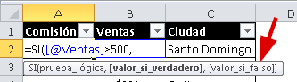
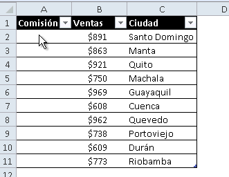

\[resumen\]En este consejo rápido, te muestro un sencillo truco que te servirá para editar tus fórmulas de una manera más cómoda, cuando éstas son un poco más largas.\[/resumen\]

Excel siempre trata de ofrecerte alguna ayuda, incluso cuando utilizas las funciones te muestra una pequeña caja en la que te ofrece una guía sobre la sintaxis de la función que estás escribiendo o, lo que es lo mismo, de qué forma ésta se debe escribir.

Y aunque no podemos negar que se trata de una ayuda muy útil, puede darse el caso de que te estorbe mientras estás editando tus fórmulas. Especialmente, si lo que has escrito es muy extenso.

¿Te ha pasado alguna vez?

A mi también.

¿Tiene solución?

¡Más sencilla de lo que crees!

Esto es lo que puedes hacer: \[pasos paso="1"\]Coloca el puntero del ratón sobre el borde de la caja con el texto de ayuda.\[/pasos\] \[pasos paso="2"\]El puntero cambiará a la forma de cuatro flechas.\[/pasos\] \[pasos paso="3"\]Pincha y arrastra la caja de ayuda, tan lejos como necesites.\[/pasos\]

Así, podrás seguir trabajando cómodamente aunque tu fórmula sea algo extensa. Simplemente ¡quítalo de ahí!

### Tu ratón también puede hacer magia

No todo se [resuelve con el teclado](http://raymundoycaza.com/11-atajos-de-teclado-para-excel/ "11 Atajos de Teclado para Excel"), el ratón también tiene sus trucos guardados bajo la manga, en Excel. Lo que tienes que hacer, es descubrirlos, probarlos y hacerlos parte de tu arsenal de productividad.

¡Nos vemos!
