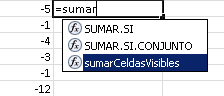

Imagen cortesía de [SXC](http://www.sxc.hu/photo/1365220 "SXC")

\[resumen\]Si usar las función subtotales no es suficiente para ti, en esta entrada te muestro cómo utilizar una función hecha a medida para que puedas sumar celdas visibles (únicamente), aún si la cosa está más complicada.\[/resumen\]

En una [entrada anterior](http://raymundoycaza.com/sumar-celdas-visibles-en-excel/ "Cómo sumar celdas visibles en Excel"), te comentaba acerca de la forma de sumar únicamente las celdas visibles en tu hoja de Excel.

Sin embargo, existen situaciones como la que me expresa [Miguel en su comentario](http://raymundoycaza.com/sumar-celdas-visibles-en-excel/comment-page-1/#comment-385 "Ver pregunta de Miguel"), en las que el uso de la función SUBTOTALES, no es suficiente para cumplir con la misión.

Hoy te traigo una alternativa, usando macros, para que puedas obtener esos datos que necesitas, dejando por fuera todo lo que esté oculto.

## ¿Por qué sumar celdas visibles solamente?

Y bueno, eso me lo puedes decir tú, que eres quien lo necesita. Pero si estás leyendo esto por mera curiosidad, te cuento que a veces uno tiene listados en los cuales toda la información está bien organizada, pero en algún momento quieres filtrarlos (ya sea por fecha o por categoría) y estos registros que no cumplen con el criterio de tu filtro, simplemente se esconden.

Ahora bien, ¿por qué seguir sumando todas las celdas si solo se están mostrando unas cuántas?

Tengo que hacer un montón de cobros; pero quiero filtrar todos los que corresponden al último semestre. Filtro los datos y ¡voilá! Se muestran únicamente las sumatorias de esos registros que acabo de filtrar.

¿Cómo lo consigo?

Exacto. Usando una función. Ya sea propia de Excel, o una que hayas creado tú.

## ¿Puedo hacerlo sin macros?

¡Por supuesto que sí!

De hecho, ya había escrito algo acerca de cómo sumar las celdas visibles, usando una función de Excel, [en esta entrada](http://raymundoycaza.com/sumar-celdas-visibles-en-excel/ "Cómo sumar celdas visibles").

## ¿Por qué hacerlo con macros?

Como te comenté al inicio de esta entrada, existen situaciones en las cuales la función SUBTOTALES, no se adapta exactamente a nuestros requerimientos. Esto puede deberse a que queremos sumar entre columnas, como el caso  de [Miguel](http://raymundoycaza.com/sumar-celdas-visibles-en-excel/comment-page-1/#comment-385 "Ver pregunta de Miguel").

Incluso pueden haber otras variables en juego, que no nos permitan usar SUBTOTALES. En estos casos, hay que echar mano de las macros.

## Quiero el código.

Option Explicit

Public Function sumarCeldasVisibles(rngRango As Object)

    Dim total As Long
    Dim celda

    Application.Volatile

    For Each celda In rngRango
        If celda.Rows.Hidden \= False Then
            If celda.Columns.Hidden \= False Then
                total \= total + celda.Value
            End If
    End If

    Next

    sumarCeldasVisibles \= total

End Function

## Utiliza un Módulo.

Este código no debes de pegarlo en cualquier lugar. Debes usar un módulo para que la función sea accesible desde tu hoja (y por orden, vamos, que ya te he insistido en eso).

¿No recuerdas cómo se inserta un módulo?

Ok, aquí te dejo una vez más el [procedimiento para insertar un módulo VBA](http://raymundoycaza.com/como-insertar-un-modulo-en-excel/ "Cómo insertar un Módulo VBA"), no lo pierdas. Vas a necesitarlo en los próximos ejemplos.

\[aviso tipo="red" titulo"Advertencia"\]Si no utilizas un módulo, es más seguro que no funcione el ejemplo y te marque un error si tratas de llamar a la función desde una celda de tu hoja de trabajo.\[/aviso\]

La función trabajando:

## Un consejo adicional como bono.

¿Te gustó la idea de tener una función como ésta?

¿Qué te parece la idea de tener esta y otras funciones disponibles siempre?

¡Exacto! Ya no tendrías que escribirla una y otra vez, en cada libro, para poder usarla.

Para poder lograr esta maravilla, solo debes de guardar tus macros en el **libro Personal de macros**. Así, siempre estarán disponibles.

## La pelota está en tu cancha.

Como siempre, te dejo a ti la responsabilidad de hacer uso del conocimiento compartido y que lo adaptes a tus necesidades puntuales. Siempre habrán detalles que no sean 100% compatibles con tu realidad; pero con tu propio conocimiento puedes hacer los ajustes necesarios.

Ahora, ayúdame tú a compartir esta entrada en Twitter. Será de mucha ayuda para la difusión del blog.

\[aviso tipo="twitter" titulo="Haz clic y comparte en Twitter"\]\[tuitealo\]Usar macros no es tan difícil como me dijeron. Mira esto: http://raymundo.me/2r\[/tuitealo\]\[/aviso\]

¡Eh! ¡Gracias por compartir con los demás!

¡Nos vemos!
