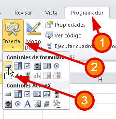
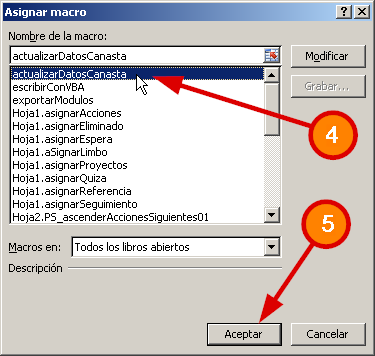
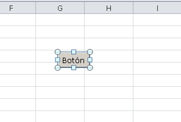

\[resumen\]Si ya estás escribiendo tus primeras macros, puede que te preguntes cómo ejecutarla cuando se haga clic en un botón específico. En esta entrada te cuento Cómo asignar una Macro de Excel a un botón.\[/resumen\]

Seguramente no tuviste ningún problema cuando trabajamos [grabando nuestra primer macro en Excel](http://raymundoycaza.com/como-grabar-macros/ "Cómo grabar Macros en Excel"), ¿verdad?

Luego, cuando pasaste a [escribir tu primera Macro VBA](http://raymundoycaza.com/escribe-tu-primera-macro-en-excel/ "Escribe tu primera Macro en Excel"), ya la cosa se puso más interesante y las posibilidades de todo esto comenzaron a pasar frente a tus ojos.

Pero ¿qué hay si quieres que la macro se ejecute cuando el usuario haga clic sobre un botón?

Vamos a verlo rápidamente.

\[h2\]Asignar una macro a un botón.\[/h2\]

1. Ve a la ficha "Programador".
2. Haz clic sobre el botón "Insertar".
3. Selecciona el control de Formulario "Botón".
4. Haz clic en tu hoja de trabajo, en el lugar que quieras colocar el botón y en el cuadro que aparece, selecciona el nombre de la macro que quieres que se ejecute al hacer clic sobre él.
5. Clic sobre el botón "Aceptar".

Ahora tu botón estará listo para trabajar. Solo falta que le cambies el texto por el que tú quieras y estarás listo para el próximo.

¡Nos vemos!

\[firma\]
