Foto corsesía de [Freeimages](http://www.freeimages.com/photo/293530 "Freeimages")

\[resumen\]¿Tienes problemas con los cursos de Excel? ¿No recuerdas esas aburridas lecciones que muestran temas dispersos y rara vez relacionados entre si? \[/resumen\]\[resumen\]Entonces tienes que comenzar a involucrarte en tus propias lecciones.\[/resumen\]

## ¿Qué haremos?

Una sencilla agenda en Excel que podremos usar para controlar nuestros eventos e inclusive recordarnos de aquellos cuya fecha / hora programada ya se ha alcanzado o, lo que es lo mismo, aquellas tareas que ya han expirado.

## ¿Para qué lo haremos?

Para aprender haciendo.

La idea de este paso a paso, es que combines las diferentes técnicas básicas de Excel, en un solo trabajo que te demuestre cómo puedes realizar proyectos cada vez más complejos si usas el conocimiento adquirido con un enfoque claro y específico.

\[aviso tipo="purple" titulo="Para todo público"\] Si recién comienzas con Excel y te aburren las largas explicaciones que pasan por ver cada elemento, uno por uno, sin llegar a ningún lugar en concreto, entonces puedes comenzar con este breve tutorial. \[/aviso\]

## ¿Qué hará la agenda?

Como te dije, lo haremos sencillo y la agenda contendrá las siguientes columnas:

1. Actividad
2. Fecha hora inicio
3. Fecha hora fin
4. Duración

Tendrá también una columna para marcar como realizada la tarea y mostrará a la misma con un tachado para fácil y rápidamente darnos cuenta de qué tareas están ya realizadas.

Otra funcionalidad de nuestra mini-agenda, será la de mostrarnos un aviso cuando llegue la fecha/hora del evento, para no olvidarnos de nada.

Para realizar todo esto, vamos a usar formularios de control, formato de celdas, formato condicional y varias fórmulas y funciones. Además, aprenderás a trabajar con las fechas para tus propios futuros modelos de Excel.

### ¿Te gusta la idea?

Entonces ayúdame a difundirlo y avísale a los demás a través de Twitter. Solo haz clic en el enlace de abajo.

\[aviso tipo="twitter" titulo="Compártelo en Twitter"\]

\[tuitealo\]¡Mira! Estoy aprendiendo Excel de forma fácil y divertida. Tú no te lo puedes perder: http://raymundo.me/2u\[/tuitealo\]

\[/aviso\]

\[pasos paso="1"\]Planificando las columnas.\[/pasos\] En este paso me voy a detener a **pensar en papel** lo que voy a hacer en Excel, antes de tomar el ratón y empezar a hacer clics a mansalva.

Pienso en lo que voy a hacer.

Esta parte ya la he pensado, quiero una agenda sencilla en la que llevaré el control de las **actividades**,  que me indique a qué **hora inicia** y a qué **hora termina.** Me interesa también **programar el tiempo que durará cada tarea**.

¿De eso se trata la gestión de tareas, no? Planificar o programar.

También quisiera una forma fácil de "tachar" las tareas realizadas y por último, que me muestre de un vistazo las tareas o eventos cuya fecha / hora ya ha expirado.

Bien, ya tengo claro lo que quiero, lo he apuntado en una hoja de papel y hasta hice unos garabatos.

Ahora, el siguiente paso.

\[aviso tipo="twitter" titulo=""\]\[tuitealo\]Antes de lanzarte a trabajar en tu hoja de Excel, primero piénsalo en papel.\[/tuitealo\]\[/aviso\] \[pasos paso="2"\]Dibujando el borrador.\[/pasos\]

Bien, en este momento lo que haremos tú y yo, será reflejar en Excel eso que tenemos en nuestra mente y en esa hoja de papel.

Como va a ser una agenda sencilla, esta manejará un día a la vez y, generalmente, cada día manejamos un solo gran evento. Este gran evento puede estar compuesto de varios eventos más pequeños o depende de éstos.

He identificado los elementos que necesito:

- Tarea a realizar o el gran evento (como la boda de mi prima)
- La fecha / hora de inicio de mi jornada.
- La actividad a realizar.
- A qué hora inicia.
- Cuánto durará la actividad.

Como dato adicional y para calcular la hora de la siguiente actividad, tendremos la hora final de cada una.

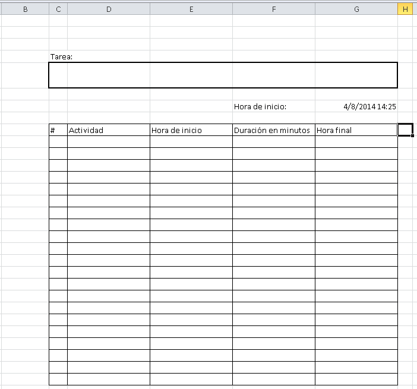

Muy bonita, ¿verdad?

Naa... Sabemos que se ve fea. Al menos de momento.

 

\[pasos paso="3"\]Aplicando el formato.\[/pasos\]

Ahora vamos a embellecerla un poco y para no complicarnos más de la cuenta, usaremos los formatos que ya vienen preestablecidos en Excel 2007 / 2010.

Para las cabeceras de la tabla, usaré este estilo:

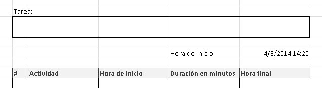

Lo he conseguido, realizando los siguientes pasos:

#### 1.- Hacer clic en la ficha "Inicio".

La encontrarás en la parte superior izquierda de tu pantalla.

#### 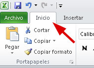2.-Ubica los estilos predefinidos.

Ve hacia la derecha y, en la parte que dice "Estilos", haz clic sobre la flecha que te señalo en la imagen. Haz clic justo ahí.

#### 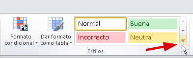3.-Elige el estilo que más te guste.

En mi caso, he elegido el estilo denominado "Salida", como puedes ver en la siguiente imagen:

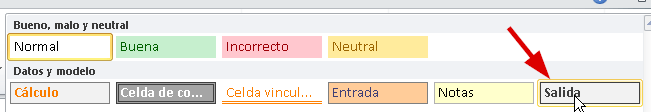

### Repitamos los pasos para el resto de la tabla.

Ahora, vas a seleccionar todo el resto de la tabla y repetirás los mismos pasos; pero esta vez, elegirás el estilo "Notas".

Si sigues los pasos que te he indicado, tu agenda debe lucir algo parecida a esto:

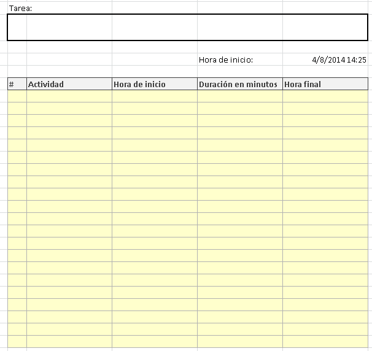

Ya va tomando forma, ¿no te parece?

**Pasemos al encabezado.**

Ahora, haz lo mismo para la parte de arriba, donde va el nombre del evento y de la fecha / hora actual.

Muéstrame que me has prestado atención. :D

A mi me ha quedado así. ¿Cómo te quedo a ti?

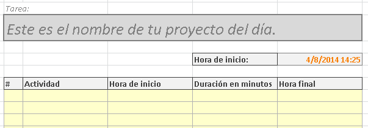

Ya tiene un aspecto mucho más estilizado.

Ahora, quitemos esas líneas de la cuadrícula. Esas que no salen en la hoja impresa; pero que no queremos que se vea en nuestra flamante agenda.

**¿Cómo quitamos las líneas del fondo?**

Ve a la pestaña "Vista" y en la sección "Mostrar" quita la marca de donde dice "Líneas de cuadrícula".

Finalmente, nuestra agenda se ve así:

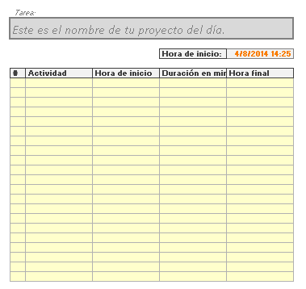

Aquí comienza la mejor parte.

\[aviso tipo="twitter" titulo="Comparte este artículo en Twitter"\]

\[tuitealo\]¡Mira! Estoy aprendiendo Excel de forma fácil y divertida. Tú no te lo puedes perder: http://raymundo.me/2u\[/tuitealo\]

\[/aviso\]

\[pasos paso="4"\]Usar controles de formulario.\[/pasos\]

Los controles de formulario, son objetos que podemos colocar en nuestra hoja de Excel que nos permiten realizar tareas a través de ellos, usando el puntero de nuestro ratón.

Puedes usar, botones de radio, cajas de verificación, entre otros.

Por ejemplo, si tenemos un listado de tareas y ponemos una caja de verificación (un visto, check, palomita... seguro ya sabrás a qué me refiero) para que la tarea automáticamente se muestre tachada, es decir, como completada.

\- ¿No sería cool?

\- ¡Claro!

\- Pero, ¿se puede?

\- Pues sí.

\- Veamos.

**Insertando una caja de verificación.**

Para insertar controles de formulario, primero debemos tener disponible la pestaña "Programador" en nuestro Excel.

¿Puedes ver esa pestaña?

Dale, búscala, te espero.

¿No está?

Ok, hagamos un alto y échale un ojo a este artículo en el que te indico [cómo mostrar la ficha programador](http://raymundoycaza.com/ficha-programador/ "Cómo mostrar la Ficha Programador").

¿Todo bien?

¡Perfecto! Sigamos.

Ahora, ve a la ficha (o pestaña) "Programador" y en la sección "Controles", busca un icono que tiene forma de un martillo con una llave, llamado "Insertar".

Haz clic sobre él y verás aparecer un menú con varios controles.

Deberás elegir el control "Casilla de verificación". En la imagen puedes ver cuál es.

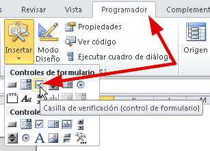

 

Una vez seleccionado el control, vas a hacer un clic justo al lado de la columna "Hora final", a su derecha. En la siguiente imagen te muestro el punto exacto donde debes hacer clic.

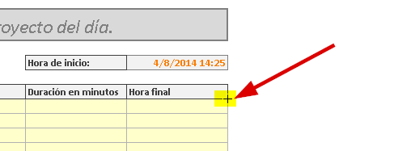

Si lo haces así, verás que te aparece el control Casilla de Verificación justo en la primera fila de tu agenda, a la derecha de donde hiciste clic.

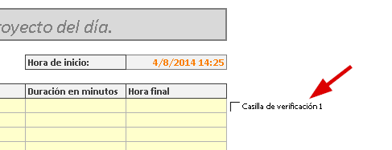

Rápidamente, vas a colocar el puntero sobre el control y harás clic derecho. En el menú que aparece, selecciona la opción "Modificar Texto".

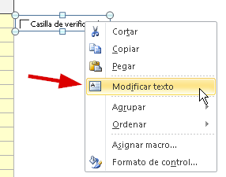

Solo borra el texto. Déjalo en blanco. Así nos quedará una casilla de verificación vacía que nos servirá para marcar como terminadas nuestras tareas.

**El secreto del truco, parte #1**

Para que funcione nuestro truco de tachar automáticamente el texto de la tarea cuando marquemos la casilla de verificación, primero debemos asociar este control de formulario a una celda.

Idealmente, debe ser la celda sobre la que está el control. O lo que es lo mismo, la celda que está "Debajo" de la caja de verificación.

En mi caso, esa celda es la H10.

Entonces, debes indicarle al control [la referencia de la celda](http://raymundoycaza.com/que-es-la-referencia/ "¿Qué es la Referencia?") **H10**.

Haz un clic derecho sobre el control y selecciona la opción "Formato de Control..."

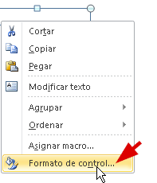

En la ventana que se abre, en la caja de nombre "Vincular con la celda", debes escribir la referencia de la celda.

Fíjate que en este caso, la casilla de verificación está en la columna H, sobre la fila 10.

Entonces la referencia debe ser **H10**.

Pero para que funcione, debes escribir delante el signo igual ( = ) tal y como en la imagen:

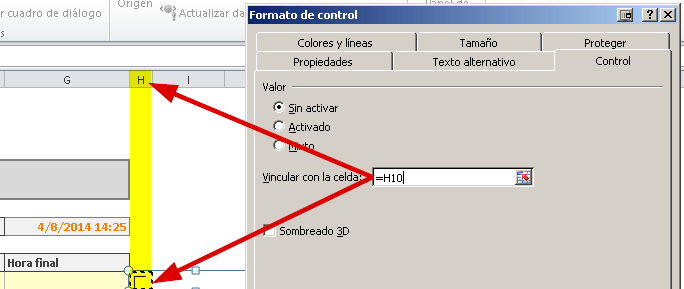

 

Haces clic en aceptar y listo. Ahora cada vez que hagas clic sobre la caja de verificación, se marcará la palomita y además, en la celda a la que hace referencia, se pondrá el valor VERDADERO, cuando está marcada la casilla y FALSO, cuando está desmarcada.

Esto es justamente lo que queríamos lograr.

Finalmente, repite el proceso **para las otras diecinueve filas**. Una por una y con paciencia.

¡Sí! Dale, que eso es practicar. Te espero.

¿Has terminado de insertar todas las casillas? ¡Qué rapidez!

**El ejemplo hasta el momento.**

En mi caso, esto es lo que he logrado hasta el momento. Tu agenda debería verse muy similar.

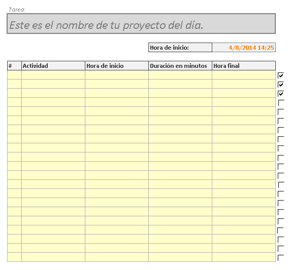

Hemos terminado por ahora con la parte de la presentación. Pasemos un rato a las fórmulas.

\[aviso tipo="twitter" titulo="Comparte este artículo en Twitter"\]

\[tuitealo\]¡Mira! Estoy aprendiendo Excel de forma fácil y divertida. Tú no te lo puedes perder: http://raymundo.me/2u\[/tuitealo\]

\[/aviso\]

\[pasos paso="5"\]Calcular la fecha / hora final, a partir de los minutos de duración.\[/pasos\]

Como se que ya has de ir algo cansad@, seré breve en esta parte; pero mucho ojo. Esto te servirá en varios de tus proyectos futuros con Excel.

**La hora de inicio.**

Aquí no hay ningún misterio. La hora de la primer tarea será la misma que está en "Hora de inicio". Por lo tanto, solo vamos a decirle a Excel que copie la misma fecha / en esta fila.

¿Y cómo lo hacemos, Ray?

Con un simple signo de igual ( = ) así:

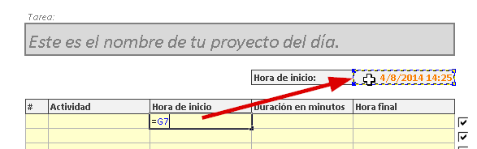

Es decir, escribes el signo igual en la primera fila, de la columna "Hora de inicio" y acto seguido, haces clic sobre la celda que tiene la hora de inicio. Verás que automáticamente aparece la referencia (G7 en mi caso) dentro de la celda. Simplemente presiona la tecla Enter y tendrás una copia exacta de dicha celda.

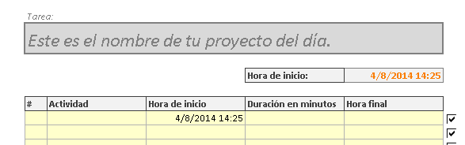

Ahora escribiré una tarea de ejemplo: Sacar a pasear al perro.

Inicia el 8 de abril del 2014 a las 14:25

Como mi perro es muy bien portado y mi tiempo es corto, ya sabe que tiene 30 minutos para disfrutar de su paseo. Entonces anotaré esta tarea con 30 minutos de duración:

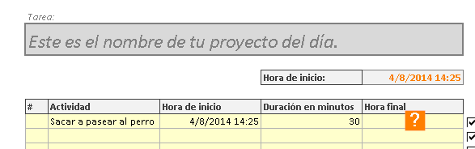

¡Muy bien!

Pero, ¿a qué hora terminará esa tarea?

No tiene sentido estar calculándola mentalmente, para luego escribirla a mano, ¿verdad?

Aquí es donde viene lo bueno: ¿Cómo sumarle 30 minutos a una fecha / hora?

Muchas personas se confunden al trabajar con fechas, porque no tienen [qué son las fechas **para Excel**](http://raymundoycaza.com/que-son-las-fechas-para-excel/ "¿Qué son las fechas para Excel?").

Si tampoco tienes claro cómo Excel maneja las fechas, te recomiendo leer el artículo que te dejé en el enlace de la línea anterior.

Ahora bien, como lo que tenemos en realidad es un número y ese número representa a una fecha o, mejor dicho, a un día concreto... ¿Cómo podríamos sumarle minutos?

Si simplemente le sumamos el valor de 30, lo que estaríamos haciendo sería **¡sumarle 30 días!**

No, no, no...

Tenemos que transformar esos 30 minutos en la fracción de un día.

Entonces... Como los minutos forman parte de una hora, entonces comenzaremos por dividir los 30 minutos entre 60 (porque una hora tiene 60 minutos)

El resultado sería... ¡Exacto! 0.5 horas o lo que es lo mismo, media hora.

Pero ahora son horas, aún no son días.

Entonces, siguiendo el mismo razonamiento, dividimos esos 0.5 entre 24, porque cada día tiene 24 horas.

Entonces, nos quedaría 0.02083

Eso, mi amig@, son 30 minutos para Excel.

Interesante, ¿no?

Entonces, metamos todos estos cálculos en una sola fórmula dentro de la columna "Hora final", así:

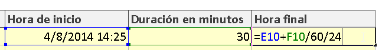

Donde le digo a Excel que a la fecha y hora que está en la celda E10, le sume los 30 minutos que se encuentran en la celda F10; pero dividiéndolos entre 60 y luego entre 24, tal y como te lo expliqué hace un momento.

**¿El resultado?**

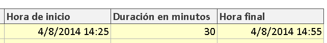

¿Magia?

No. Matemáticas.

Como ves, ahora el resultado es exactamente 30 minutos más que la hora de inicio. No importa si llega a la media noche, automáticamente cambiará el día una vez se superen las 0:00 ya que, como te dije, una fecha para Excel, es un número con muchos decimales.

## Y hasta aquí llegamos por hoy.

¿Te ha gustado este mini-curso de Excel en su versión "Aprende Haciendo"?

Si es así, déjamelo saber en los comentarios y así sabré que estás interesad@ en la segunda parte de este tutorial.

No me dejes remar solo y ayúdame a compartirlo en las redes sociales, usando los botones que encontrarás junto a la entrada. También te he preparado esta caja con un enlace para que compartas en Twitter y hagas que este artículo llegue a más personas.

\[aviso tipo="twitter" titulo="Comparte este artículo en Twitter"\]

\[tuitealo\]¡Mira! Estoy aprendiendo Excel de forma fácil y divertida. Tú no te lo puedes perder: http://raymundo.me/2u\[/tuitealo\]

\[/aviso\]

Listo. Hora de dormir.

¡Nos vemos!
