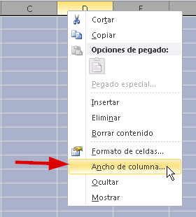
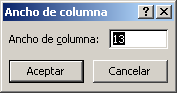
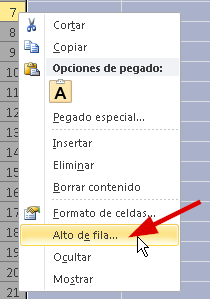
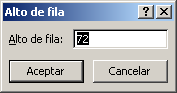
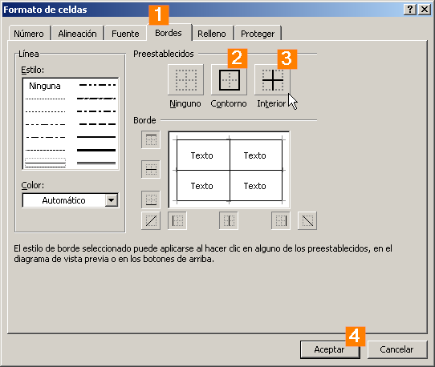
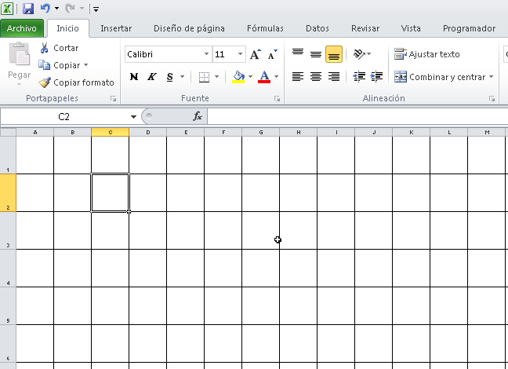

Seguramente en alguna ocasión se te presentará la necesidad de crear una hoja a cuadros o algo similar que requiera de hacer que las celdas tengan la misma medida en su alto y en su ancho.  

Entonces ¿Cómo lo hago con Excel?

Cómo hacer una cuadrícula en Excel: Fácil y rápido.

Selecciona toda tu hoja

O lo que es lo mismo, selecciona todas las celdas. Para hacer esto, puedes dar clic sobre el punto en que se unen las filas y columnas, justo donde te señalo en la siguiente imagen:

Ajusta el ancho de las columnas a 13 puntos

Sin perder la selección, colócate sobre la cabecera de cualquiera de las columnas y haz un clic derecho, seguidamente elige la opción "Ancho de columna" y en el cuadro que aparece, escribe el número 13 (estos son 13 puntos)

Ajusta el alto de las filas a 72 puntos

Ahora repite los mismos pasos, pero esta vez para el alto de las filas. Recuerda que no debes perder la selección (todo debe estar sombreado para que funcione).

Elige la cabecera de cualquiera de las filas y haz clic derecho. Entonces elige la opción "Alto de fila..." y en el cuadro que aparece escribes el número 72 (esto es 72 puntos)

Dibuja los bordes

Como último paso y sin **perder la selección,** vas a dibujar los bordes de la celda.

Solo presiona el siguiente atajo de teclado:

CTRL + 1

Ahora, en la ventana que se abre, selecciona la pestaña "Bordes" y ponle borde externo y bordes internos, así:

## Finalmente, tu cuadrícula está lista.

Ya lo has conseguido. Esa relación de aspecto es la que necesitas para lograr que las celdas luzcan cuadradas y puedas generar tu hoja cuadriculada en pocos pasos.

Ahora solo guarda la plantilla y así tendrás lista y disponible tu cuadrícula para la próxima vez que la necesites.

¡Nos vemos!