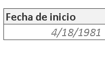
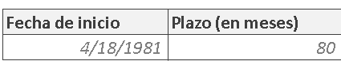
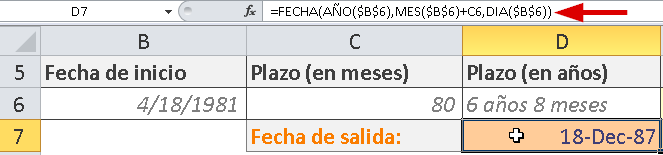
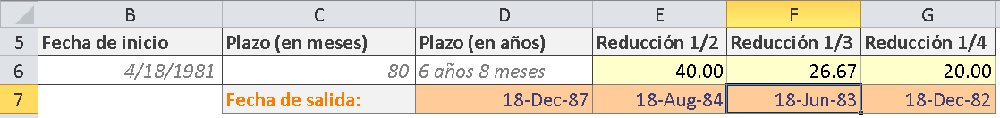

\[resumen\]Esta semana recibí la siguiente consulta de Miguel, uno de mis suscriptores: ¿Cómo calcular el tercio de un rango de fechas? Me pareció un tema interesante para responderlo en una entrada del blog, así que aquí te va:\[/resumen\]

Miguel me dijo que en su hoja de trabajo tenía una fecha inicial y le asignaba una duración en años y meses. Tal como tú podrías calcular el crédito de un artículo o un depósito a plazo fijo.

Para ingresar la duración del plazo, podríamos hacerlo directamente en meses y, usando esta cifra, calcular la duración en años y meses.

¿Cómo?

De varias formas; pero usaré la siguiente:

**Obtener los años.**

Primero, divido la fecha que está en la celda C16 entre 12 (porque son doce meses que tiene el año) y lo redondeo hacia abajo con la función ENTERO.

Este resultado lo concateno con la palabra "años" y ya tengo, redondeado, el tiempo en años.

**Obtener los meses.**

En la misma fórmula, uso la función RESTO, para calcular el residuo que quedaría de dividir el plazo en meses (el número 80 en este caso) entre 12. Esto me da el número de meses que "sobra" luego de sacar los años completos.

**Unir los dos resultados.**

Entonces, concateno con la palabra "meses" y luego concateno el resultado de los años con el de los meses y tengo listo mi plazo en años y meses.

**Calcular la fecha final.**

Ya que tengo muy claro el plazo en meses y después de haberlo formateado para que se vea en años y meses, me toca ver cómo calcular la fecha final. Es decir, el día que se cumple el plazo de 80 meses.

Para esto, utilizo la función FECHA dentro de la cual uso las funciones AÑO, MES y DIA, enviándole  por parámetro la celda en la que se encuentra la fecha inicial. Esto me daría exactamente la misma fecha, si no fuera por que al mes le estoy sumando el valor de la celda C6, es decir, el número de meses que establecimos al principio.

Con esta fórmula, obtengo la fecha exacta en la que se cumplen los 80 meses a partir de la fecha de inicio.

**Obtener el tercio del plazo.**

Ahora bien, la pregunta es: ¿Si de pronto resulta que debo reducir esos 6 años y 8 meses a la mitad? ¿O a la tercera parte?

Entonces me aprovecharé de que tengo el plazo en meses y lo dividiré entre el número de partes que quiero calcular.

Es decir, uso la misma fórmula que usé para calcular la fecha final; pero primero divido los 80 meses entre 3.

Así, puedo calcular la mitad, el tercio o el cuarto de un rango de tiempo, simplemente haciendo la división correspondiente al número de meses.

## Descarga el archivo terminado.

Si quieres descargar el archivo terminado para poder revisar con calma las fórmulas, solo haz clic en el siguiente enlace:

[Descarga el archivo de ejemplo.](http://raymundoycaza.com/wp-content/uploads//calcular-reduccion-plazo.xlsx "Descargar el ejemplo terminado")

**Conclusión.**

El truco está en llevar el plazo a un número que sea claro para ti, sobre el cual puedas trabajar sin problemas. [Recuerda que las fechas son un número para Excel](http://raymundoycaza.com/que-son-las-fechas-para-excel/ "¿Qué son las fechas para Excel?").

¡Nos vemos!

\[firma\]

\[aviso tipo="twitter" titulo="Tuitéalo"\]

Si te ha gustado la entrada, ayúdame a compartirla en las redes sociales usando los botones que están cerca de este lugar. Si prefieres Twitter, te he dejado una caja justo debajo.

\[caja\_tuit\]Si quieres aprender a trabajar con fechas en #Excel, no te puedes perder esto:  [http://bit.ly/1KTxgND](http://bit.ly/1KTxgND)\[/caja\_tuit\]

\[/aviso\]
