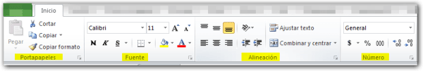
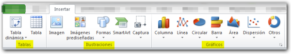
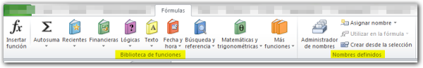
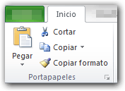
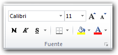
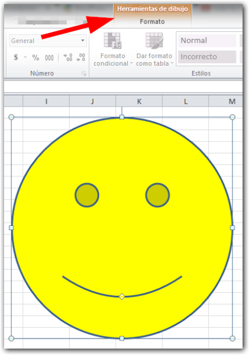
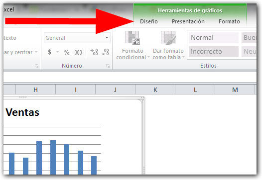
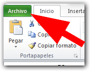

Editada: abril 14 de 2014

Continuando con el [curso gratuito de Excel para principiante](http://raymundoycaza.com/excel-para-principiantes/ "Excel para Principiantes")s, en esta ocasión quiero mostrarte, en menos de 10 minutos, qué es la Cinta de Opciones y cómo está organizada.

<iframe src="http://www.youtube.com/embed/TzrGwMhHLrk" height="315" width="560" allowfullscreen frameborder="0"></iframe>

## La Cinta de Opciones de Excel

Desde la versión 2007 de Excel, la barra de menú ha sido reemplazada por la cinta de opciones.

Esta utiliza un sistema de fichas que organiza todos los comandos de una forma más eficiente.

Normalmente, la primera vez que te encuentres con la cinta de opciones te sentirás un poco 'perdido'; pero si experimentas un poco con ella, te acostumbrarás rápidamente a su nueva forma de organizar los elementos.

La cinta de opciones organiza los comandos en:

- Ficha inicio.
- Ficha insertar.
- Ficha diseño de página.
- Ficha fórmulas.
- Ficha datos.
- Ficha revisar.
- Ficha vista.
- Y otras fichas que aparecerán dependiendo de tu configuración de Excel.

### Los grupos en la cinta de opciones de Excel.

Cada una de estas fichas organiza los comandos en diferentes grupos. Por ejemplo la ficha inicio contiene el grupo Portapapeles, el grupo fuente, el grupo Alineación, el grupo Números, el grupo Estilo, el grupo Celdas y el grupo Modificar.

La ficha Insertar contiene el grupo Tablas, el grupo Ilustraciones, el grupo Gráficos, el grupo Minigráficos, el grupo Filtro, el grupo Vínculos, el grupo Texto y el grupo Símbolos.

En la ficha fórmulas, puedes ver el grupo Biblioteca de funciones (que es uno de los grupos que más utilizarás) el grupo nombres definidos, el grupo Auditoría de fórmulas y el grupo Cálculo.

Así, cada ficha contiene varios grupos. Cada grupo, contiene comandos cuya función se relaciona con el nombre de dicho grupo.

Por ejemplo, **en la ficha inicio**, dentro del grupo portapapeles, tendrás todos los comandos necesarios para manipular el portapapeles. Por ejemplo,el comando cortar, el comando copiar, el comando copiar formato y el comando pegar.

**En el grupo fuente**, tienes todos los comandos necesarios para modificar las características de la fuente actual, tales como el tipo, el tamaño de la fuente, el estilo de la fuente (negrita, cursiva, subrayada), el color de fondo y el color de la fuente misma.

**En el grupo alineación**, tienes todos los comandos necesarios para modificar el tipo de alineación utilizado en el texto actual.

### Las Fichas Contextuales.

Como ya has visto, existe un número determinado de fichas que se muestran en la cinta de opciones; pero también existe un tipo de fichas que aparecerán en un determinado momento. A estas se les denomina **Fichas Contextuales**, porque su aparición depende del contexto actual o también podríamos decir de la situación actual.

Un ejemplo típico es el caso en el que insertas una autoforma en Excel. Inmediatamente después de haber creado la autoforma, aparece la ficha 'formato'.

Esta ficha solo aparece cuando tienes seleccionado un objeto al cual le puedo cambiar su formato de presentación.

Si t;u **de-seleccionas** la forma, verás que la ficha 'formato' desaparece.

Si seleccionas la forma una vez más, aparecerá de nuevo la ficha formato.

En esta ficha tienes todos los comandos necesarios para cambiar el color de la forma, su contorno, cambiar la forma, agregar efectos, etc.

### Las secciones en las fichas contextuales.

Si observas con atención, verás que la ficha formato está agrupada dentro de una sección denominada 'herramientas de dibujo'. Esta sección te permite saber cuál es la función o la finalidad de las pestañas que están dentro de la misma. En este caso, solo tenemos una ficha.

Otro caso en el que aparecen fichas contextuales, es cuando seleccionas un gráfico. Si seleccionas un gráfico, aparece, ahora sí, un grupo de tres pestañas denominado 'Herramientas de Gráficos'.

En esta sección tenemos la **ficha 'Diseño'**, con los comandos que me permiten cambiar el diseÑo de mi gráfico.

La **ficha 'Presentación'**, que tiene los comandos necesarios para cambiar la manera en que se presenta mi gráfico.

Y por último verás que tambíen está la misma **ficha 'formato'** que apareció con la autoforma. Su finalidad es la misma: permitir cambiar el formato del objeto seleccionado, tal como su color, su contorno, darle efectos de sombra, etc.

De igual manera, si yo de-selecciono el gráfico, la sección desaparece junto con las fichas.

\[aviso type="yellow" titulo="Recuerda: "\]

Estas son las fichas contextuales y aparecerán dependiendo de lo que estés haciendo en determinado momento.

\[/aviso\]

### La Ficha 'Archivo'

Por último, tenemos una ficha especial, que está destacada en color verde. Es la ficha 'Archivo'.

En esta ficha es donde se agrupan todos los comandos relacionados con la manipulación de archivos, tales como guardar, abrir, cerrar, ver los archivos recientes y crear un nuevo archivo.

También desde aquí puedo realizar la tarea de impresión y puedo acceder a la ayuda de Excel.

Así mismo, puedes acceder a las opciones de Excel y personalizarlo de acuerdo a tus necesidades.

### ¿Una forma diferente de trabajar?

Como puedes ver, es una forma totalmente nueva de manejar Excel para aquellos que vienen de versiones anteriores y  conviene que te familiarices con este elemento de la interfaz, ya que es el que tiene todas las opciones con las que deberás interactuar a lo largo de las lecciones que encontrarás en el blog.

¿Y tú, ya sabes manejar la cinta de opciones?

¡Nos vemos!

\[firma\]
