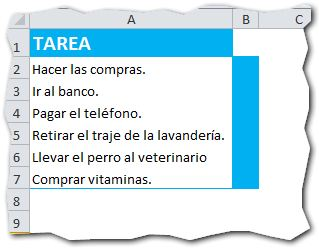
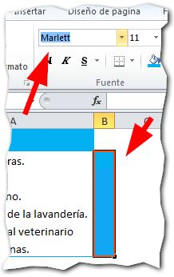
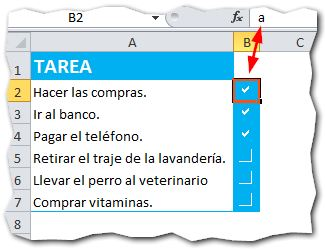

Editado: Abril 16 de 2014

\[resumen\]Hoy te mostraré un consejo rápido: Cómo mostrar una casilla de verificación en las celdas de Excel, usando únicamente letras.\[/resumen\]

¿Te interesa? Pues sigue leyendo.

## Creando una casilla de verificación en dos pasos.

Imagina que tienes una lista de tareas por hacer. Lo normal es que las marques con un 'visto', para controlar cuáles tareas ya están terminadas y cuáles no. ¿Verdad?

Pues bien, para algo tan sencillo, no vas a recurrir a controles de formulario o controles ActiveX. Ni siquiera necesitas programación.

Para crear una casilla de verificación usando solo texto, realiza estos pasos:

1. Crea la columna en la que irá la casilla de verificación para tu lista de tareas.  
2. Selecciona el tipo de letra 'Marlett' para la columna donde irán tus casillas de verificación. 

¡Listo! Ahora solo debes escribir la letra 'a' en todas las celdas en las que quieras que aparezca tu signo de verificación y la letra 'f ', para aquellas casillas vacías con las tareas que aún no se han llevado a cabo.

 

## ¿Qué te ha parecido este truco?

Con este sencillo truco podrás realizar tus formularios sencillos, sin complicarte con controles y sus configuraciones.

¿Y tú, qué utilidad le encontrarías a esta técnica? ¿Cómo realizas tus formularios actualmente?

\[firma\]
