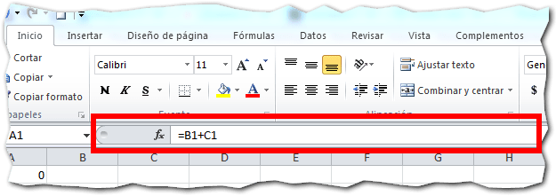
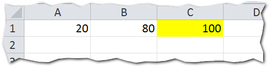
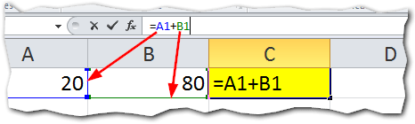
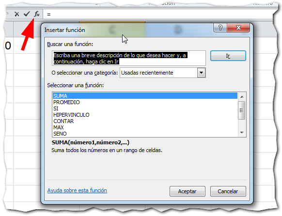

## ¿Qué es la barra de fórmulas?

La Barra de Fórmulas es el espacio en el que aparecen los valores o las expresiones que escribimos en las celdas.

Está ubicada en la parte superior de la hoja, debajo de la cinta de opciones de Excel.

## ¿Para qué sirve?

La función de la Barra de Fórmulas es la de facilitar la visualización y la edición de las fórmulas escritas en una celda.

Recuerda que en el artículo '[¿Qué es una fórmula?](http://raymundoycaza.com/que-es-una-formula-en-excel/)', te decía que las fórmulas no se muestran en las celdas una vez que has terminado de editarlas y en su lugar se muestra el resultado devuelto por dicha fórmula.

## ¿Cómo se usa?

Imagina que tienes una hoja de trabajo, en la que tenemos los siguientes valores:

En la celda A1, tenemos el número 20, en la celda B1, tenemos el número 80; pero en la celda C1 (pintada de amarillo) tenemos una fórmula que suma las otras celdas.

¿Puedes ver cuál es esa fórmula? Correcto. No puedes verla a menos que entres a editar la celda haciendo un doble clic o presionando la tecla F2.

Pero, si te colocas con el puntero en la celda C1, verás que en la Barra de Fórmulas aparece el contenido de esta celda. Podemos ver cuál es la fórmula utilizada y qué [argumentos](http://raymundoycaza.com/que-son-los-argumentos-en-excel/)  utiliza (si los hubiere).

Si pinchas con el ratón en la Barra de Fórmulas, verás cómo se resaltan las celdas que intervienen en la fórmula:

En este momento ya puedes comenzar a editar tu fórmula, de acuerdo a tus necesidades.

### Usando la Barra de Fórmulas para crear una fórmula desde cero.

Si lo que quieres es usar la Barra de Fórmulas para crear una fórmula en una celda vacía, debes seguir estos pasos:

1. Selecciona la celda en la que quieres insertar la fórmula.
2. Pincha en la Barra de Fórmulas.
3. Escribe el signo igual (=).
4. Escribe la fórmula que necesitas, por ejemplo: A1 + B1.
5. Cuando hayas terminado de escribir la fórmula, presiona la tecla Enter.

\[aviso tipo="purple" titulo="¿Sabías que...?"\] _**Si pinchas en el símbolo en forma de F que está al principio de la barra de fórmulas, aparecerá un asistente que te guiará en el proceso de creación de una nueva fórmula en la celda actual?**_ \[/aviso\]

## Usa la barra de fórmulas para analizar tus fórmulas.

Como te has dado cuenta, la Barra de Fórmulas es una gran utilidad para poder dar un vistazo rápido a nuestras fórmulas, sin tener que estar entrando en el modo de edición para cada celda de tu hoja.

No dejes de poner en práctica el uso de la Barra de Fórmulas, vas a necesitarla ahora que comenzarás a trabajar con [las fórmulas en Excel](http://raymundoycaza.com/que-es-una-formula-en-excel/).

¡Nos vemos!
