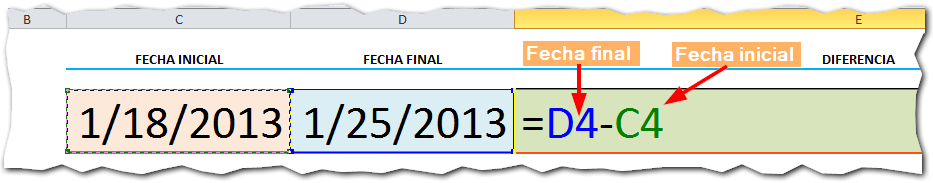
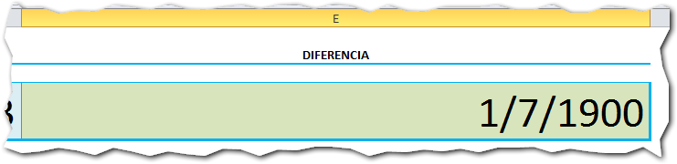
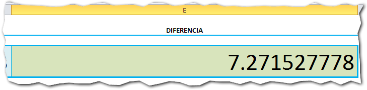
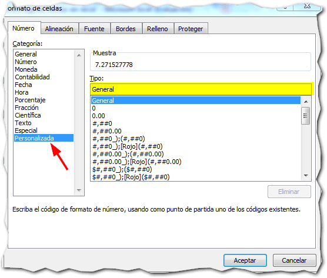
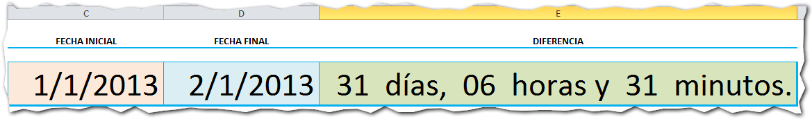

Créditos imagen: [Freeimages](http://www.freeimages.com/photo/1072482 "Freeimages") Editado: Abril 18 de 2014

¿Cansado de buscar entre complejas fórmulas para obtener la **diferencia de fechas en Excel** y que se muestren en días, horas y minutos?

Si tu proyecto no tiene requerimientos muy complejos ni necesitas hacer cálculos muy amplios **(máximo hasta 31 días de diferencia)**, la solución que te propongo puede ahorrarte muchos dolores de cabeza.

¿Será que sí?

¡Averiguémoslo!

## Diferencia de fechas en Excel

Como te conté hace unos días, el procedimiento para [sumar fechas en Excel](http://raymundoycaza.com/articulos/sumar-fechas-en-excel) (ahí también puedes ver las restas) es muy sencillo. Así que ahora vamos a ir directamente al grano y conseguir la diferencia entre dos fechas, así:

 

Lo más probable es que te arroje un resultado parecido a este:

Si cambiaras el formato a "General" o "Número", el resultado aún no nos diría mucho, ¿verdad?

Esto es porque el resultado obtenido es la diferencia en días y sus fracciones en formato decimal. Ahora vamos a ver cómo hacer que esto lo entienda "cualquier cristiano".

## El truco: Formato Personalizado

El truco en esta técnica está en el formato personalizado. Éste se encargará de mostrar la diferencia en un formato que sea fácil de interpretar por tus usuarios.

Veamos paso a paso cómo se hace:

### Entrando al formato de celdas.

Si te colocas sobre la celda en la que tenemos el resultado, en mi caso la celda E4, y presionas la combinación de teclas CTRL + 1 (o clic derecho / formato de celdas), te aparecerá este cuadro de diálogo:

### Seleccionando la opción "Personalizada".

Seguro que ya lo conoces. Es el conocido cuadro de diálogo "Formato de celdas". Aquí vas a seleccionar la opción "Personalizada" que es la que te señalo con una flecha roja.

Esta opción, te permite dar un formato según tu necesidad puntual, en lugar de utilizar uno de los que están preestablecidos en Excel; de ahí su nombre de "Personalizada" y es una de las opciones más útiles para presentación de datos.

La personalización la podemos aplicar, escribiendo nosotros mismos la estructura que usará Excel para presentar los datos.

Para lograrlo, escribiremos un patrón definido por nosotros en la caja de texto que se encuentra resaltada en amarillo, en la imagen anterior.

### Aplicando el patrón que necesitas.

Primero veamos rápidamente los "códigos" que usaremos en nuestro patrón personalizado:

- d = Representa al número de días que existan de diferencia entre las dos fechas. Puedes usar dd si quieres que siempre tenga dos dígitos (ejemplo: 01, 02, 03 etc.)
- hh:mm:ss = Esto representa a las horas (hh), minutos (mm) y segundos (ss). Es uno de los formatos más utilizados y en nuestro caso vamos a usarlos de forma separada.
- MM = Representa la parte de los meses. Si utilizas la forma MMMM mostrará el nombre completo del mes (en inglés a menos que hagas otro cambio)

Y hasta aquí los "códigos" que utilizaremos en nuestro patrón para crear un formato personalizado.

\[aviso titulo="Algo pasa aquí!" tipo="purple"\]

Si has estado atento, te habrás dado cuenta que los minutos y los meses se representan **con las mismas letras** (MM o mm). El 'truco' aquí es que cuando le anteponemos las horas (hh) al código mm, Excel automáticamente los considerará como minutos.\[/aviso\]

El código que utilizaremos en nuestro patrón personalizado es el siguiente:

\[aviso tipo="blue" \]dd " días, " hh " horas y " mm " minutos."\[/aviso\]

#### Explicación

- Estamos utilizando el código dd para mostrar el número de días.
- Seguido, estamos usando el texto " días, ". Nota que está entre comillas para que Excel lo muestre exactamente como lo escribo.
- Luego usamos el código hh para mostrar el número de horas (esto hace que los mm que le siguen sean considerados como minutos y no como meses), también usamos un texto entre comillas " horas y ".
- Finalmente usamos el código mm para mostrar el número de minutos y le anexamos el texto " minutos."

### Muestra tu creación al mundo.

¿El resultado? Una muy bonita forma de presentar la diferencia entre estas dos fechas usando palabras en vez de solo números, como solemos hacerlo:

 

\[aviso tipo="red" titulo="Precaución"\]Haz la prueba y pon dos fechas que tengan más de 31 días de diferencia. El resultado es incorrecto. Esta es una forma sencilla de mostrar la diferencia entre dos fechas y sirve para períodos muy cortos de tiempo.\[/aviso\]

\[aviso tipo="yellow" titulo="Ventaja adicional"\]Una de las ventajas de esta forma de presentar los datos, es que a pesar de mostrarse como si fuera un texto, en realidad sigue siendo un número. Por lo tanto, podrás seguir utilizando este valor para realizar cálculos con él. Esto no se podría realizar si fuera un texto, como en el caso de otras técnicas.\[/aviso\]

## Descarga el archivo terminado

Si deseas ver el ejemplo terminado, descarga el archivo pinchando en el siguiente enlace:

[Descargar](http://static.raymundoycaza.com/diferencia-de-fechas-en-excel.xlsx "Descargar el archivo terminado")

## ¿Conocías esta opción?

¿Ya habías utilizado antes esta técnica? Si es así, me gustaría conocer qué variantes utilizas y en qué escenarios te ha resultado más útil. Anímate a dejar un comentario para extender la conversación.

Y no lo olvides, si te ha parecido interesante esta entrada, compártelo en las redes sociales. Los botones están más abajo. Lo tienes a solo un clic de distancia ;)

¡Nos vemos!

\[firma\]
