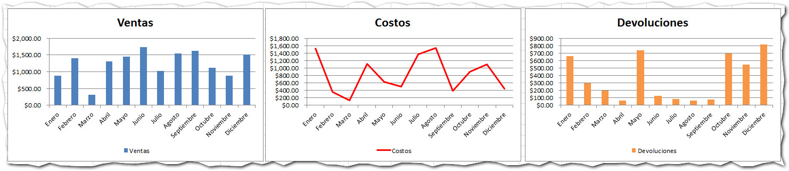
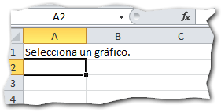
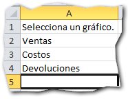
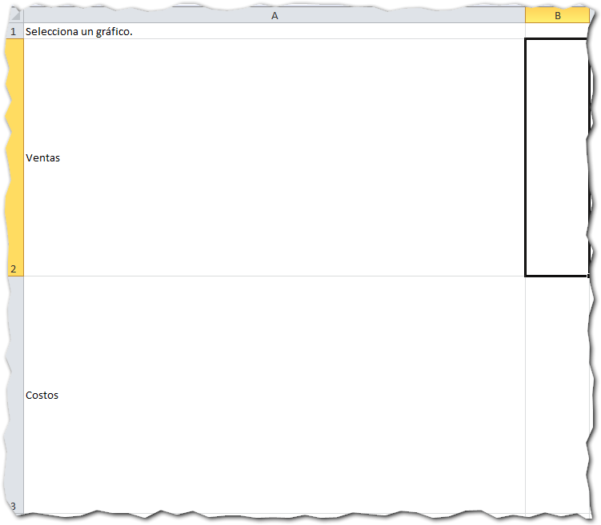
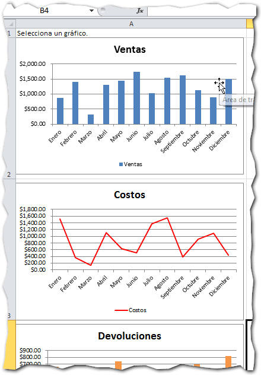
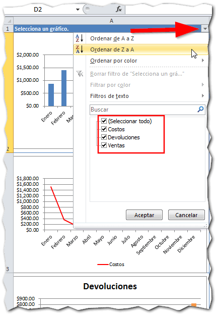
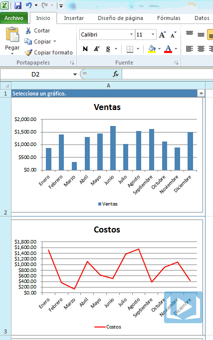

Por **Gráfico Dinámico**, me estoy refiriendo a un gráfico que es capaz de cambiar su forma o su estado en respuesta a una acción del usuario (entiéndase por usuario a tus clientes).

Esto quiere decir que el usuario será capaz de cambiar el tipo de gráfico, sus colores y hasta podrá esconderlo o mostrarlo a voluntad. Todo con un clic de ratón. Hoy te voy a mostrar cómo hacer un gráfico intercambiable en Excel.

¿Aún interesado?  Entonces sigue leyendo.

## Crear un Gráfico Dinámico en Excel

Para crear un **Gráfico Dinámico en Excel**, existen varias técnicas. Yo te voy a mostrar una muy sencilla, en la que podrás tener tu gráfico listo en menos de cinco minutos.

#### _01_ Crea tus gráficos.

Ahora vas a crear tus gráficos [como lo haces normalmente](http://raymundoycaza.com/aprendiendo-excel/como-crear-un-grafico-en-excel) (si es que no lo has hecho ya). Solo crea tres gráficos distintos. Hasta aquí no hay nada diferente a tu rutina.

#### _02_ Prepara el área donde pondrás tus gráficos.

Vas a seleccionar una columna cualquiera. En mi caso será la columna “A”. En la primera fila, es decir en la celda “A1”, colocaré un título que será “Selecciona un gráfico”.

Como hemos creado tres gráficos, utilizaremos tres filas y les pondremos un título a cada una, que se corresponderán con los gráficos que hemos realizado.

Una vez realizado esto, vamos a ajustar el alto de cada una de las filas, de manera que tengan más o menos el mismo alto que los gráficos. Igual procederemos con el ancho de la columna, así:

#### _03_ Coloca tus gráficos en su lugar.

Ahora que le has hecho un lugar para tus gráficos, colócalos ahí. Ubica cada gráfico en el lugar que le corresponde, de acuerdo a cada una de las tres etiquetas que hiciste en el paso anterior.

Tus gráficos deben lucir así:

#### _04_ El Secreto: Usar autofiltros.

Ahora, debes utilizar el autofiltro en la primera fila (la que titulamos “Selecciona un Gráfico”)

Con este truco, podrás mostrar uno o varios de los gráficos que has colocado debajo de esta celda, según te expliqué en el paso anterior.

Haz la prueba y fíjate como los gráficos “desaparecen” dejando visible únicamente a los seleccionados.

#### _05_ Sorprende a tu público.

Ahora podrás realizar tu presentación con un gráfico dinámico y sorprender gratamente a tu público, al no tener que estar cambiando a cada momento de hoja para mostrar un gráfico distinto.

Tu jefe también se sentirá complacido al ver que puede elegir su gráfico "a la carta" según su necesidad puntual.

## El ejemplo en acción

En esta animación puedes ver cómo luce este truco una vez implementado.

## ¿Por qué usar un Gráfico Dinámico?

El uso de un **Gráfico Dinámico en Excel**, puede serte de gran ayuda en esos casos en los que no te decides por un tipo de gráfico en concreto o si quieres ir a esa reunión preparado para cualquier solicitud sorpresa.

También es excelente a la hora de **ahorrarnos espacio en pantalla**, porque en lugar de tener tres o más gráficos, uno junto al otro en la pantalla o en varias hojas, podemos ponerlos todos en un solo lugar dentro del área visible de la pantalla y aprovechar el nuevo espacio disponible para colocar otros datos.

## ¿Cuándo y dónde usar esta técnica?

De acuerdo a lo que te comenté en el punto anterior, esta técnica conviene usarla cuando necesitas tener varias versiones de un mismo gráfico (por ejemplo tener las ventas en versión barras, línea y columnas)

También es conveniente usarla en los **Tableros de Comando** (Dashboards en inglés) debido a su capacidad de ahorrar espacio en pantalla.

## Comparte tu experiencia.

¿Cuál ha sido tu experiencia con los gráficos dinámicos? ¿Has utilizado antes uno, o es la primera vez que te animas a realizarlo?

Sigamos conversando de ello en los comentarios.

¡Hasta la próxima!
