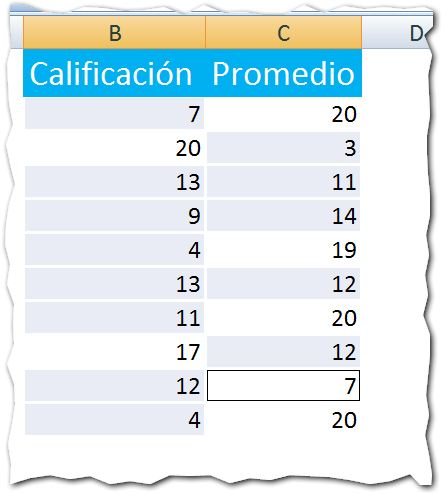

Créditos imagen: [Freeimages](http://www.freeimages.com/photo/176068 "Freeimages").

¿ Cuántas veces al día tocas **la tecla Control en Excel** ?

En ocasiones es ignorada completamente y en otras, no parece tener un verdadero protagonismo en tus tareas cotidianas; pero la tecla Control, es una de las que más a menudo interviene en los atajos de teclado y técnicas de productividad.

Hoy te voy a mostrar rápidamente tres razones por las cuales deberías utilizar más seguido  la tecla Control en Excel.

1. Moverte más rápido por tu hoja de Excel.
    
    Como te comentaba en la entrada de [atajos de teclado](http://raymundo.me/5), la tecla Control te permite moverte mucho más rápido por tu hoja de Excel.
    
    Cuanto tú presionas y mantienes presionada la tecla Control y luego una tecla direccional, ya sea arriba, derecha, abajo o izquierda, la celda activa "saltará" en esa dirección hasta la última celda que tenga algo escrito en ella.
    
    **Consejo adicional:** Si al presionar la tecla Control, también mantienes presionada la tecla Shift (arriba de la tecla Control), entonces al presionar una de las flechas direccionales se realizará una selección completa desde la celda activa, hasta la última fila o columna.
2. Realizar selecciones no continuas.
    
    Imagina que tienes una lista de calificaciones y quieres pintar de rojo todas aquellas que están por debajo de 15. Te pondrías a seleccionar la celda, elegir el color rojo, seleccionar la siguiente y repetir el proceso, ¿verdad?
    
    Pero ¿y qué si las selecciono todas y les cambio el color una sola vez? ¿No ahorraría tiempo así?
    
    Pues eso es lo que te permite hacer la tecla Control. Mantén presionada esta tecla y con el ratón pincha en cada una de las celdas deseadas, verás como se va creando una selección de rangos no continuos y luego podrás realizar el cambio de formato sobre todas las celdas al mismo tiempo. ¡Genial! ¿No lo crees?
    
    
3. Ingreso de datos a gran velocidad.
    
    En la entrada [Insertar un dato en varias celdas](http://raymundo.me/w), te contaba cómo puedes ahorrar tiempo al ingresar un mismo dato en un rango de celdas utilizando la tecla Control.
    
    Solo debes seleccionar un rango y escribir el valor deseado o la fórmula, presionas y mantienes presionada la tecla Control y entonces presionas la tecla Enter.
    
    Tus datos quedarán escritos en todas las celdas del rango.
    
    Combina esta técnica con la número dos y verás cómo empiezas a reducir el tiempo que demoras manipulando tus datos.

Y eso ha sido todo por hoy. Espero que estos tres consejos sean suficientes para convencerte de echar mano más seguido de la tecla Control y aprovecharte de los beneficios que aporta.

Anímate, comienza a utilizar estas técnicas con la tecla control en Excel y ¡Libera tu Productividad!

¡Nos vemos!

\[firma\]
