\[resumen\]쮼stás preparad@ para continuar con nuestra Agenda en Excel, con aviso de eventos? Entonces comencemos que esto está para un buen rato.\[/resumen\]

### 쯈ué nos falta para terminar nuestra Agenda en Excel?

Ya en el [artículo anterior](http://raymundoycaza.com/agenda-en-excel-1/ "Crear una Agenda en Excel"), vimos cómo sentar las bases de nuestra agenda y tenemos casi toda la estructura para darle los toques finales. Con esto ya tuviste una buena práctica si estás recién comenzando con Excel o te estás re-encontrando con él.

Lo que haremos ahora es darle la funcionalidad de la que ya hablamos en el número anterior, así que comenzaremos calentando con las fechas.

\[pasos paso="6"\]Terminar con los cálculos de las fechas.\[/pasos\]

En realidad nos falta poca cosa. Lo único que vamos a hacer, es utilizar una sencilla fórmula que coloque en la fecha de inicio de cada tarea, la fecha final de la anterior (Porque después de cada tarea, nos dedicamos a una nueva)

Entonces, la súper-fórmula que utilizaremos será simplemente el signo igual ( = )

En la fecha hora inicio escribes el igual y seleccionas la fecha hora final de la tarea anterior (similar a como hicimos con la fecha hora de inicio en la primera fila)

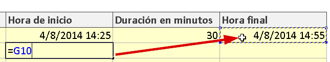

Verás que cuando presiones la tecla "Enter", aparecerá la misma fecha hora.

Lo único que tendrás que hacer a partir de aquí, será copiar la fórmula y pegarla hasta abajo, hasta la última fila. Te deberá quedar así:

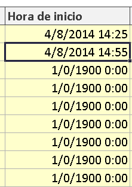

Uuuuh... ¡qué feo!

No te preocupes. Recuerda que en la columna "Hora final" tienes también otra fórmula que hicimos en el capítulo anterior. Solo copia y pega también esa fórmula hacia abajo y verás que te debe quedar así:

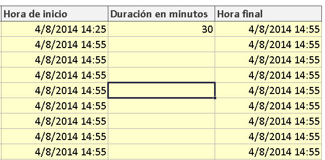

\[pasos paso="7"\]Numerar las filas de nuestro itinerario.\[/pasos\]

Este paso es muy sencillo. Simplemente nos interesa colocar un número en cada fila, dentro de la columna marcada como '#', para darle una apariencia de lista ordenada.

Como son varias líneas, aquí te aprovecharás de una característica de Excel con las listas. Así que escribe los tres primeros números, así:

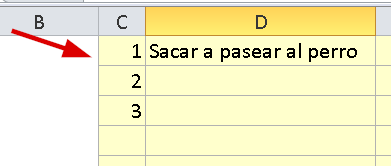

Y para completar tu listado, simplemente vas a "sombrear" esos tres números y te colocarás sobre la esquina inferior derecha de esa selección. Verás que el cursor se transforma en una cruz negra.

Justo en ese momento, haz clic ¡y no lo sueltes!

Ahora que tienes al pez, vas a arrastrar el ratón suavemente hacia abajo, hasta que llegues a la última fila. Verás como Excel automáticamente ha continuado la secuencia y te has ahorrado escribir tú mismo los números.

En esta animación te muestro cómo se hace:

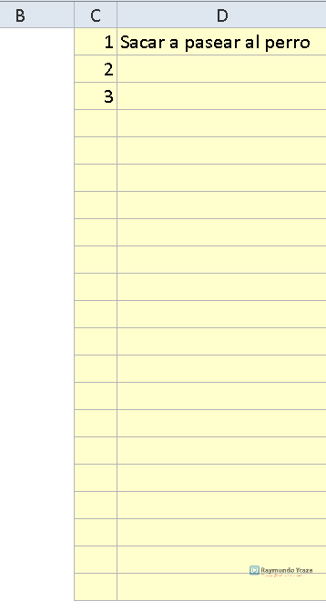

Sencillo y muy útil 쯡o crees?

Ahora, pasemos a otra cosa.

\[pasos paso="7"\]Tachar las tareas terminadas.\[/pasos\]

Y bien, para dar ese efecto de tachado que haríamos en una lista de control hecha "a mano", con Excel tendríamos que hacer lo siguiente:

1.- Seleccionar la celda o las celdas que queremos "tachar".

2.- Presiona el atajo **CTRL + 1** para que aparezca el cuadro de diálogo "Formato de Celdas".

3.- Selecciona la pestaña "Fuente".

4.- Elige el efecto "Tachado".

Si sigues los pasos que te indiqué y te muestro en la siguiente figura, deberías de lograr tu objetivo.

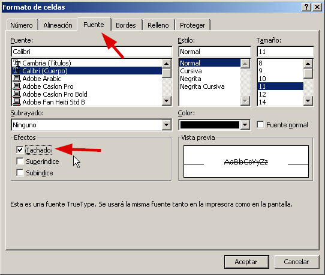

Y el resultado sería el siguiente:

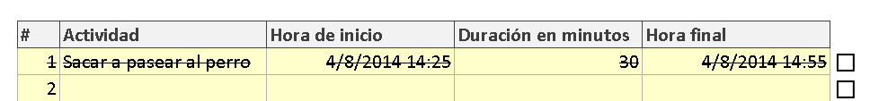

Y estos pasos los tendrías que repetir por cada tarea finalizada.

¡Más que aburrido! Lo se.

Pero nos vamos a aprovechar del formato condicional para poder hacer este proceso son un solo clic. De manera que se comporte como una lista de control en la que marcas con un visto y automáticamente se tachará la tarea.

**El secreto del truco, parte #2**

Veamos:

Primero, vas a seleccionar toda el área amarilla, que es donde estarán las tareas. Una vez que lo tengas "sombreado", te diriges a la pestaña "Inicio" y presionas sobre el botón "Formato Condicional".

En el menú que se abre, selecciona "Nueva Regla".

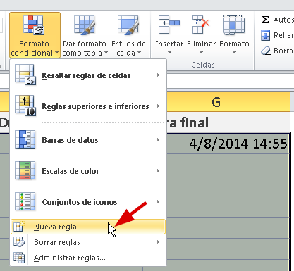

Y en el cuadro que aparece, selecciona la opción "Utilice una fórmula que determine las celdas para aplicar formato".

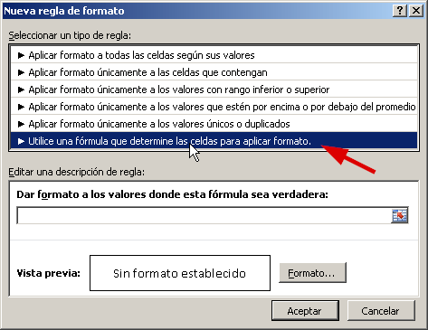

Ahora llegamos al punto donde volveremos a usar fórmulas.

Aquí vamos a hacer uso de [los rangos](http://raymundoycaza.com/que-es-un-rango-en-excel/ "쯈ué es un rango?") para darle las instrucciones a Excel.

En el cuadro que tienes para escribir, vas a colocar la siguiente fórmula:

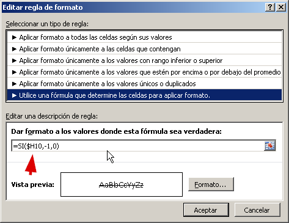

Si lees la instrucción, notarás que si la evaluación de la fórmula que escribas ahí, es verdadera, entonces se ejecutará el formato que le apliques a las celdas, usando el botón que está a la derecha, llamado "Formato..."

Yo he utilizado [la función SI](http://raymundoycaza.com/funcion-si/ "La función SI"), para evaluar si el valor de la celda H10 es verdadero, entonces mi función devuelve verdadero (-1), en caso contrario, devuelve falso (un cero)

¿Recuerdas que en la lección anterior vinculamos las cajas de verificación, cada una con una celda? Pues esta era la razón:

Si una caja de verificación está vinculada con una celda, cada vez que la marques dicha celda tomará el valor de 'verdadero'. Y por el contrario, si le quitas la marca, tomará el valor de 'falso'.

쯏a le vas viendo sentido?

Pero fíjate que utilicé un signo de dólar delante de la H y no delante del 10, esto es porque estoy jugando con [las referencias absolutas y relativas](http://raymundoycaza.com/referencias-absolutas-y-relativas/ "Referencias Absolutas y Relativas"), a mi conveniencia. En palabras cortas, quiero que se desplacen las filas pero no las columnas.

Si pinchas en el botón "Formato..." aparecerá de nuevo el cuadro de diálogo "Formato de Celdas". Aquí harás lo mismo que hiciste anteriormente, es decir, elegir la opción "Tachado".

En la imagen anterior, yo ya hice ese paso y por eso la vista previa te muestra las letras tachadas.

Ahora solo presionas el botón de aceptar y pasamos a hacer las pruebas.

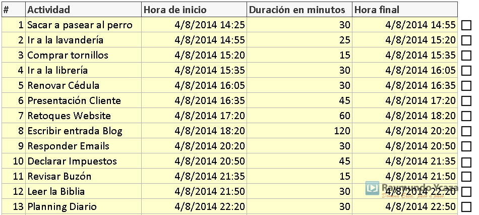

쯌es lo fácil que es?

Con este sencillo truco ya le dimos una buena funcionalidad adicional a nuestra agenda.

Pasemos al siguiente paso.

\[pasos paso="8"\]Resaltar las Tareas Expiradas.\[/pasos\]

Con tantas tareas y tan poco tiempo disponible, nos interesa saber dónde estamos parados o, lo que es lo mismo, saber cómo va nuestra planificación del día.

쯅o lo crees?

Entonces, una buena forma de orientarnos, es saber cuáles son las tareas que ya expiraron. ¡Se me está acabando el día!

쮺칩mo lo logramos?

Nuevamente, con el formato condicional.

Vamos a ver:

Primero, selecciona o "sombrea" toda el área amarilla de tu agenda y vete de nuevo a "Formato Condicional" y luego en "Nueva Regla" tal y como lo hicimos ya hace un rato, en el paso anterior.

La fórmula que he usado en esta ocasión, es la siguiente:

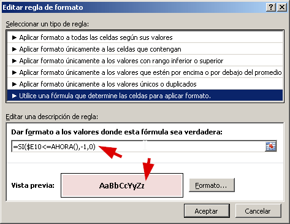

Nuevamente he utilizado [la función SI](http://raymundoycaza.com/funcion-si/ "Función SI") en la regla del formato condicional.

En cristiano, esto significa que si la celda E10 (es decir, la columna de la hora de inicio) **es menor o igual** a la fecha / hora actual, entonces la función devuelve verdadero, en caso contrario, devuelve falso.

Por supuesto, cualquier tarea cuya fecha / hora de inicio sea igual a la fecha / hora actual (o mayor) significa que ya se pasó la hora de iniciarla y por ende, como que estamos atrasados con ella.

Finalmente, presionas sobre el botón "Formato..." y eliges un estilo, el que tú veas más apropiado para una tarea atrasada. En mi caso usé un rojo suave y le puse las letras en negrita, como ves en la imagen.

쮼l resultado?

Si una tarea ha alcanzado su fecha de inicio, de acuerdo al reloj, se marcará con el estilo que le indicamos, así:

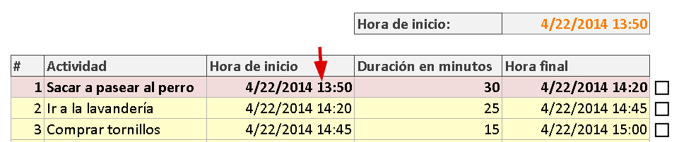

¡Fascinante! 쯈ué opinas?

\[pasos paso="9"\]Avisar de las Tareas Próximas.\[/pasos\]

¡Vaya desafío!

쮺칩mo avisamos de una tarea pendiente en Excel? 쮼n qué estaba pensando yo?

**Guarda tu archivo como un xlsm.**

Veamos, seguramente eso se hace con macros. Así que ahora mismo vas a guardar tu archivo con extensión xlsm, si no lo has hecho ya. Solo presiona la tecla F12 y en tipo de archivo, elige "Libro de Excel habilitado para macros".

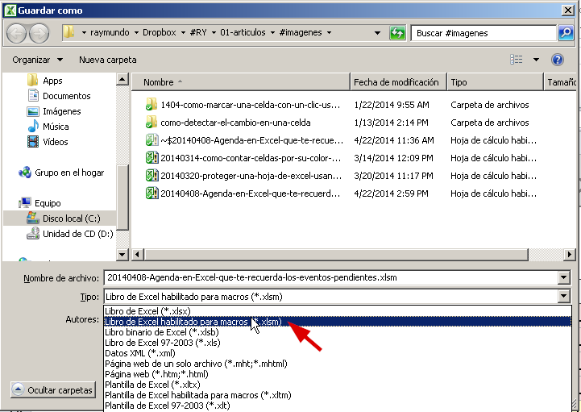

Ahora, pensemos: Necesito revisar cada cierto tiempo la fecha / hora de cada ítem de nuestro listado, para poder verificar si alguno ya está cerca a cumplirse su tiempo.

쯇ero cómo lo hacemos en Excel?

Vamos a usar un ejemplo que ya publiqué anteriormente sobre [cómo repetir una macro cada cierto tiempo](http://raymundoycaza.com/ejecutar-una-macro-periodicamente/ "Cómo ejecutar una macro cada cierto tiempo").

Así, una vez que ya has leído el ejemplo del enlace anterior, ya puedes comprender el código que usaré a continuación (es muy parecido al usado en la entrada de ejemplo)

Option Explicit

Dim Tiempo As Variant
Dim ejecutando As Boolean

Sub programarMacro()
    Tiempo \= Now + TimeValue("00:00:15")
    Application.OnTime Tiempo, "consultarTarea", , True
End Sub

Sub consultarTarea()
    MsgBox " Hola"
    Call programarMacro
End Sub

Sub detenerReloj()
    ejecutando \= False
    Application.OnTime Tiempo, "consultarTarea", , False
End Sub

Sub iniciarReloj()
    ejecutando \= True
    Call programarMacro
End Sub

Si ejecutas la macro "iniciarReloj()" verás cómo, cada 15 segundos, se muestra el mensaje "Hola".

Lo que vamos a hacer ahora, es que en lugar de simplemente decir "Hola", ahora vamos a revisar si existe alguna tarea que ya esté próxima a expirar.

쯏 cuánto es próxima?

Digamos que una tarea próxima, es aquella que esté a diez minutos de expirar. 쯊e parece?

Si tú quieres establecer otro tiempo, puedes hacerlo sin problema.

En este código, he adaptado la macro "consultarTarea" para que revise todas las fechas en la columna "Hora de inicio".

Con el bucle While, estoy haciendo la revisión y utilizo la función DateDiff para obtener la diferencia en minutos. Si está a diez minutos de expirar, entonces muestra un mensaje acorde:

Option Explicit

Dim Tiempo As Variant
Dim ejecutando As Boolean

Sub programarMacro()
    Tiempo \= Now + TimeValue("00:01:00")
    Application.OnTime Tiempo, "consultarTarea", , True
End Sub

Sub consultarTarea()
    Application.ScreenUpdating \= False
    Range("Hoja1!E10").Select
    While ActiveCell.Value <> ""
        If (DateDiff("n", ActiveCell.Value, Now()) \= \-10) Then
            MsgBox "La tarea " & ActiveCell.Offset(0, \-1).Value & " está próxima a expirar.", vbOKCancel + vbInformation
            GoTo Salir
        End If
        ActiveCell.Offset(1, 0).Select
    Wend
Salir:
    Range("Hoja1!C9").Select
    Call programarMacro
    Application.ScreenUpdating \= True
End Sub

Sub detenerReloj()
    ejecutando \= False
    Application.OnTime Tiempo, "consultarTarea", , False
End Sub

Sub iniciarReloj()
    ejecutando \= True
    Call programarMacro
End Sub

No olvides [insertar un módulo](http://raymundoycaza.com/como-insertar-un-modulo-en-excel/ "Insertar un Módulo en Excel") primero y en él, vas a pegar el código anterior.

Pero... No sucede nada. 쯇or qué?

Porque tenemos que lanzar la función "iniciarReloj".

Para hacer esto, nos podemos ayudar del evento Workbook\_Open.

쮺칩mo es que funciona esto?

Para que comprendas cómo trabaja el evento Workbook\_Open, [échale un ojo a esta entrada](http://raymundoycaza.com/macro-al-abrir-excel/ "Ejecutar macro al abrir Excel").

쮼stás list@?

¡Perfecto! Ahora vamos a ver cómo quedaría nuestro código en el evento Workbook\_Open:

Option Explicit

Private Sub Workbook\_Open()
    iniciarReloj
End Sub

Una vez que has colocado este código, solo debes guardar el archivo y lo cierras. Al abrirlo, verás cómo cada minuto se ejecuta la macro y, si hay una tarea que está a diez minutos de Expirar, se mostrará el siguiente mensaje:

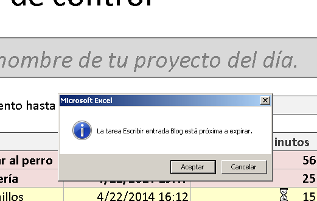

¡Lo logramos!

Sería interesante además poder reproducir un sonido, etc. Pero eso ya queda para ti o lo veremos en otro tutorial.

Sigamos que se nos acaba el tiempo.

\[pasos paso="10"\]Calcular el Cumplimiento del día.\[/pasos\]

Como último paso, vamos a calcular el porcentaje de cumplimiento. Solo como un dato curioso adicional o por si eres de los que lleva todo a los números :D

Primero, vas a seleccionar una celda, por ejemplo, la C7.

En ella escribirás esta fórmula:

\=CONTAR.SI(H10:H30,VERDADERO)/CONTARA(F10:F30)

Revisemos rápidamente de qué se trata.

Primero estoy usando la función CONTAR.SI para contar todas aquellas celdas en el rango H10:H30 que tienen el valor de VERDADERO. Es decir, solo aquellas celdas que hemos marcado con un visto.

Con esto, lo que logramos es contar cuántas filas tachadas tenemos.

La segunda parte, hace uso de la función CONTARA, en la columna "Duración en minutos", para saber cuántas tareas tienen asignadas un tiempo o, lo que es lo mismo, cuántas tareas en total tenemos.

El símbolo de división " / ", hace precisamente eso, dividir el resultado de la primera parte, entre la segunda y con eso tenemos el tanto por ciento de las tareas terminadas.

Simplemente dale un formato de porcentaje a la celda C7 y habrás finalizado.

A mi me quedó así:

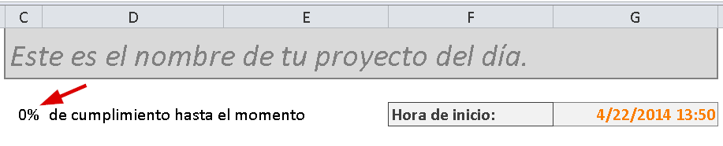

쮺칩mo te quedó a ti?

## Y eso ha sido todo.

Tu agenda ha quedado terminada. ¡Sí que nos ha costado!

Ahora que ya has culminado con este curso express de Excel en el que has practicado con las herramientas más utilizadas de las que dispones en esta aplicación, 쯤ué me puedes decir sobre lo aprendido?

Si te ha gustado el tutorial, déjame tus comentarios y ayúdame a compartirlo en las redes sociales para que más personas tengan acceso a él. No olvides que la práctica es esencial en todo aquello en lo que quieras mejorar, así que ¡a darle duro!

## Descarga el archivo terminado.

Sigue las instrucciones para descargarte el archivo terminado. ¡Es gratis!

[Haz clic para descargar el archivo.](http://raymundoycaza.com/wp-content/uploads//20140408-Agenda-en-Excel-que-te-recuerda-los-eventos-pendientes.xlsm "Descarga el archivo terminado.")

## Nos vemos en la siguiente entrega.

Espero que te resulte de utilidad este ejemplo y que pongas en práctica todas y cada una de las lecciones que están incluidas en este paso a paso, verás cómo se te van grabando el eje y el maneje de cada una de las funciones, ahora que estás realizando tu propio proyecto desde cero en Excel.

¡Nos vemos!

\[firma\]
