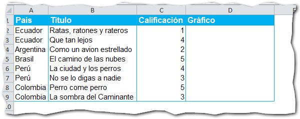
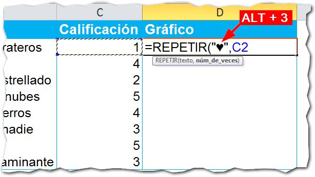
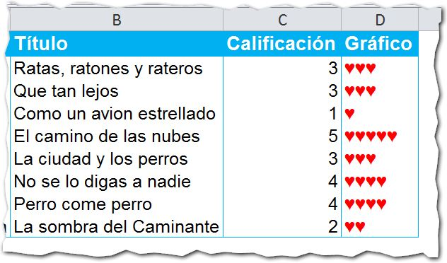

Créditos imagen: [Freeimages](http://www.freeimages.com/photo/360165)

## ¿Qué hace?

La función Repetir, se usa para repetir una cadena de texto el número de veces que le indiques.

Si, por ejemplo, quisieras repetir un texto tres veces, deberás de escribir la fórmula con dos argumentos: el texto a repetir y el número tres.

## ¿Para qué sirve?

Podrías, por ejemplo, utilizarla para hacer mini-gráficos de texto para un cuadro de presentación de datos o un tablero de control.

## ¿Cómo se usa?

Imagina que tienes en Excel una lista de películas a las cuales debes dar una calificación del uno al cinco. En este listado, vamos a utilizar un pequeño gráfico, como el que utilizan en las páginas web: Un pequeño corazón por cada punto obtenido.

Así, cada película tendrá una calificación de entre uno y cinco corazones. Vamos a realizar el ejemplo paso a paso:

1. El cuadro inicial. En esta imagen te muestro el cuadro inicial con el que comienzo el ejemplo. Como ves, tengo el título la calificación y una columna adicional donde haremos nuestro mini-gráfico.  
2. Usar la función Repetir. En la columna 'Gráfico', insertaremos la función Repetir, dándole como primer parámetro el texto que deseamos que se repita. Como te dije, vamos a usar un corazón. Esto lo consigues con la combinación de teclas ALT + 3 (utiliza el teclado numérico). Como segundo parámetro le vamos a pasar la celda en la que escribimos la calificación: 
3. Copiar la fórmula. Ahora copias hacia abajo la fórmula para que realice su trabajo. Le pondrás el color de fuente en rojo y tendrás algo como esto: 

Por supuesto, las calificaciones son al azar y no tienen nada que ver con una calificación real por mi parte. Es solo un ejemplo para mostrarte paso a paso cómo realizar un mini-gráfico de forma rápida y sencilla.

¿Qué te parece? Una forma diferente de mostrar tus datos en Excel, utilizando una fórmula en lugar de un gráfico.

## ¿Y tú, ya usas la función Repetir?

¿De qué forma aprovechas la función repetir? ¿Qué otras aplicaciones le has encontrado tú? Déjame tus comentarios más abajo y seguimos conversando.

¡Nos vemos! \[firma\]

## Descarga el archivo con el ejemplo.

Haz clic en el siguiente enlace para descargarte el archivo terminado.

[Descargar archivo.](http://static.raymundoycaza.com/funcion-repetir.xlsx)
